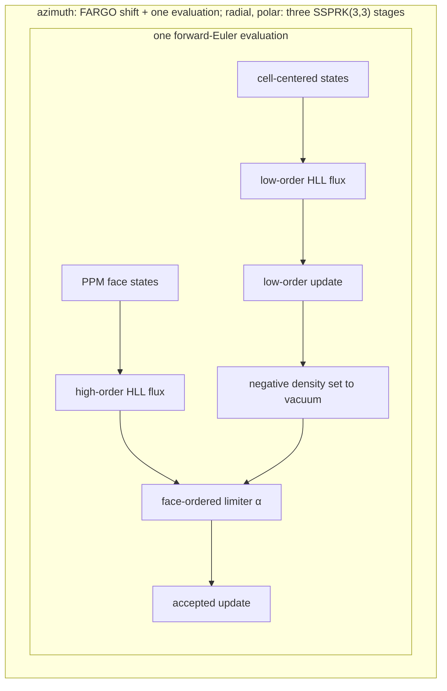
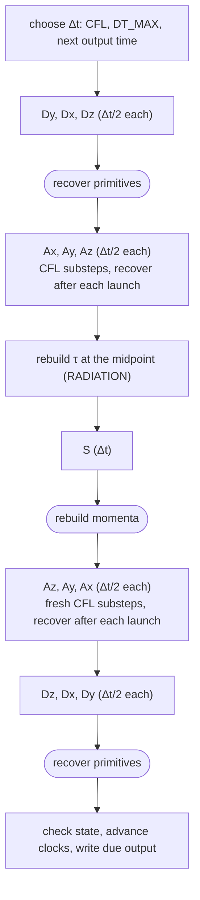

# Eulerian dust-fluid model

This guide states the equations of the Eulerian dust-fluid model, how GameDev discretizes them, and
the numerical properties that decide what a fluid run means. The disk the dust moves in
(coordinates, gas, stopping time, diffusivities, and the shared radiation definitions) is described
once in the [shared disk model](guide_basis.md). Building, configuring, and running a model are
covered in the [user guide](../README.md), and the tests behind each claim in
[`guide_tests.md`](guide_tests.md).

## Contents

1. [Overview](#1-overview)
2. [State and parameters](#2-state-and-parameters)
3. [Initialization](#3-initialization)
4. [Governing equations](#4-governing-equations)
5. [Transport](#5-transport)
6. [Forces and radiation](#6-forces-and-radiation)
7. [Diffusion](#7-diffusion)
8. [Time integration and boundaries](#8-time-integration-and-boundaries)
9. [Accuracy and limitations](#9-accuracy-and-limitations)
10. [Implementation](#10-implementation)
11. [References](#11-references)

## 1. Overview

This section says what the fluid model represents, which configurations it supports, and how it
relates to the swarm model.

### 1.1 The model in brief

The fluid model represents dust of a single grain size as a pressureless continuum on the disk grid:
each cell stores a density and three momenta, and conservative finite-volume operators evolve them.
The gas is prescribed analytically ([shared disk model §3](guide_basis.md#3-gas-disk)) and feels
no back-reaction from the dust ([§3.7](guide_basis.md#37-one-way-coupling)). One step combines
four kinds of operator:

- conservative pressureless transport, one direction at a time ([Section 5](#5-transport));
- a cell-local source update for drag, gravity, spherical geometric forces, and radiation pressure
  ([Section 6](#6-forces-and-radiation));
- optional turbulent diffusion of dust density or dust-to-gas concentration, with a matching
  momentum closure ([Section 7](#7-diffusion));
- a symmetric composition that fixes their order and the timestep
  ([Section 8](#8-time-integration-and-boundaries)).

### 1.2 Supported configurations

The fluid model supports two of the four geometries of the
[shared disk model](guide_basis.md#24-supported-geometries):

- the radial–azimuthal disk, `N_Z == 1`, which evolves the dust surface density $\Sigma_d$;
- the full 3D spherical grid, `N_Z > 1`, which evolves the dust volume density $\rho_d$.

On either grid it provides

- pressureless dust transport;
- gas drag, gravity, spherical geometric forces, and optional radiation pressure;
- optional turbulent diffusion of dust density or dust-to-gas concentration;
- optional viscous gas accretion, available only with diffusion.

Radial–polar and radial-only models are not supported, because `N_X > 1` is required and the
azimuthal dimension is always active. A model with `N_Z > 1` needs `DIFFUSION` to support the dust
layer vertically. The feature flags and their rules are listed in the
[user guide](../README.md#fluid-feature-flags); the compile-time checks are in
[Section 2.4](#24-parameters).

### 1.3 Relation to the swarm model

The two dust models share the disk but approximate the dust distribution differently. The [swarm
model](guide_swarm.md#13-relation-to-the-fluid-model) advances a finite sample of the dust
phase-space distribution; the fluid model advances its low-order moments, density $\rho_d$ and
momentum $\rho_d\boldsymbol u_d$ ([shared disk model
§9](guide_basis.md#9-dust-distribution-and-its-moments)), with one velocity at each point. It
closes the moment hierarchy with a zero pressure tensor, $\boldsymbol P_d=0$, so its momentum flux
is

```math
\boldsymbol\Pi_d=\rho_d\boldsymbol u_d\boldsymbol u_d
```

and contains no velocity-dispersion tensor.

The two models also differ in the coordinate basis of diffusion
([shared disk model §5.3](guide_basis.md#53-why-the-diffusion-bases-differ)) and in their initial
vertical velocity ([Section 3.2](#32-initial-velocity)). The user guide compares all their closures
in one table ([Dust representations](../README.md#dust-representations)).

**Limits.** The closure holds while the dust velocity stays approximately single valued. After
trajectories cross, a kinetic or swarm description keeps several velocities at the same location,
whereas the fluid cannot represent the resulting multistream distribution without an additional
closure. The fluid is also monodisperse, with one Stokes-number profile. In either regime a swarm
or another kinetic representation is required.

## 2. State and parameters

This section defines the stored variables, the mesh quantities the operators use beyond the shared
mesh, the units, and every compile-time parameter.

### 2.1 Stored state

The fluid stores angular variables, not three linear velocities. The primitive arrays `dustvelx`,
`dustvely`, and `dustvelz` hold

```math
(\ell_\phi,v_r,\ell_\theta)
=(Rv_\phi,v_r,rv_\theta),
```

the [stored angular variables](README.md#glossary): the specific angular momentum about the axis,
the spherical radial velocity, and the polar specific angular momentum. The conserved arrays
`dustdens`, `dustmomx`, `dustmomy`, and `dustmomz` hold the density and the three momenta. With
$\varrho_d$ the evolved density ($\Sigma_d$ when `N_Z == 1`, $\rho_d$ otherwise; see
[shared disk model §1.4](guide_basis.md#14-notation)), the state is

```math
\boldsymbol U=
\begin{pmatrix}
\varrho_d\\ m_x\\ m_y\\ m_z
\end{pmatrix}
=\begin{pmatrix}
\varrho_d\\
\varrho_d\ell_\phi\\
\varrho_dv_r\\
\varrho_d\ell_\theta
\end{pmatrix},
\qquad
(\ell_\phi,v_r,\ell_\theta)
=\frac{(m_x,m_y,m_z)}{\varrho_d}.
```

For a 2D disk, $\rho_d$ in any later expression means the evolved surface density.

**Vacuum state.** When $\varrho_d\lt\rho_{\rm vac}$ (`RHO_VAC`), the division is replaced by the
regularized [vacuum state](README.md#glossary)

```math
\ell_\phi=\sqrt{GM_\star R},
\qquad
v_r=0,
\qquad
\ell_\theta=0,
\qquad
m_a=\varrho_du_a,
```

where $u_a$ is the corresponding primitive. It keeps all later arithmetic finite without giving
the velocity of an almost empty cell any scientific meaning. The reset is applied whenever
primitives are recovered from conserved momenta, whenever conserved momenta are rebuilt from
primitives, and at the start of the source update. File output converts $\ell_\phi$ and
$\ell_\theta$ to linear velocities without changing the device state
([Section 10.6](#106-output-and-restart-semantics)).

**Limits.** Because the reset rewrites $m_a$, it can change the stored momenta of near-empty cells
([Section 4.4](#44-conserved-quantities)).

### 2.2 Mesh measures and face areas

The fluid uses the mesh of the [shared disk model](guide_basis.md#22-mesh), uniform in $x$ and
$z$ and logarithmic in $y$ with ratio $a_y$, and its cell measures $\Delta V_y$, $\Delta V_z$, and
$V_{ijk}$ ([§2.3](guide_basis.md#23-cell-measure)), where $d=2$ when `N_Z == 1` and $d=3$
otherwise. This section adds the cell centers and face areas the finite-volume operators use.

The coordinate centers are

```math
y_j=Y_{\min}a_y^{j+1/2},
\qquad
z_k=Z_{\min}+\left(k+\frac12\right)\Delta z,
```

so the radial center is logarithmic, midway between the faces in $\ln y$. Radial fluxes use the
face factor $A_{y,j+1/2}=y_{j+1/2}^{d-1}$. In 3D, the radial contribution to a polar face area is

```math
\Delta A_{z,j}
=\int_{y_{j-1/2}}^{y_{j+1/2}}y\,dy
=\frac{y_{j+1/2}^2-y_{j-1/2}^2}{2},
```

so the separated polar face factor is $A_{z,j,k+1/2}=\Delta A_{z,j}\sin z_{k+1/2}$.

Cells are indexed $(i,j,k)$ as in the [shared disk model](guide_basis.md#14-notation). Where a
later derivation works on one directional line (tridiagonal solves, reconstruction), $i$ denotes a
generic index along that line, not a second radial-index convention.

Every azimuthal domain is periodic. A range shorter than $2\pi$ is therefore a periodic wedge, not
an open sector of a complete disk: transport, [FARGO](README.md#glossary) shifts,
invariant-domain bounds, and azimuthal diffusion all identify its two azimuthal faces.

**Limits.** In a wedge, non-axisymmetric structures repeat with period $X_{\max}-X_{\min}$; this
periodicity is part of the model definition ([Section 8.3](#83-boundary-conditions)).

### 2.3 Units and dimensions

Code units, the orbital scales $t_0$, $v_0$, and $\Omega_0$, the dimensions of every quantity, and
the dimensionless parameters are defined in the
[shared disk model](guide_basis.md#12-units-and-scales) and
[§1.3](guide_basis.md#13-dimensionless-parameters). With the default $G=M_\star=R_0=1$, one orbit
at $R_0$ lasts $2\pi$ code time units. Lengths are in units of $R_0$, times in units of $t_0$, and
angles in radians. The evolved density $\varrho_d$ has dimension $ML^{-2}$ when `N_Z == 1` and
$ML^{-3}$ otherwise; $\ell_\phi$ and $\ell_\theta$ are specific angular momenta ($L^2T^{-1}$), and
$v_r$ is a linear velocity.

### 2.4 Parameters

All parameters are compile-time constants in
[`inc/fluid/const_defs.cuh`](../inc/fluid/const_defs.cuh); a model replaces the complete file with
its own `const_defs.cuh` ([user guide](../README.md#constants)). The type `real` is `double`. A
parameter with a flag in the last column exists only when that flag is defined.

| Constant | Default | Role | Defined when |
|---|---|---|---|
| `G`, `M_S`, `R_0` | 1, 1, 1 | $G$, $M_\star$, and the reference radius $R_0$ | always |
| `N_X`, `X_MIN`, `X_MAX` | 1024, 0, $2\pi$ | azimuthal cell count and periodic range | always |
| `N_Y`, `Y_MIN`, `Y_MAX` | 1024, 0.5, 2.5 | radial cell count and spherical-radius range | always |
| `N_Z`, `Z_MIN`, `Z_MAX` | 1, $\pi/2$, $\pi/2$ | polar cell count and colatitude range | always |
| `SIGMA_0` | $10^{-2}$ | gas surface density $\Sigma_0$ at $R_0$ | always |
| `ASPR_0` | 0.05 | gas aspect ratio $h_0$ at $R_0$ | always |
| `IDX_P`, `IDX_Q` | $-1$, $-0.4$ | power-law indices $p$ of $\Sigma_g$ and $q$ of $T$ | always |
| `METAL_Z` | $10^{-2}$ | initial metallicity $Z_{\rm metal}$ before the edge taper | always |
| `STOKES_0` | $10^{-3}$ | reference midplane Stokes number $\mathrm{St}_0$ at $R_0$ | always |
| `ALPHA` | $10^{-3}$ | turbulent $\alpha$ | `DIFFUSION` without `CONST_NU` |
| `NU` | $10^{-5}$ | constant kinematic viscosity $\nu$ | `DIFFUSION` and `CONST_NU` |
| `SCHMIDT_X`, `SCHMIDT_Y`, `SCHMIDT_Z` | 1, 1, 1 | Schmidt numbers $\mathrm{Sc}_{x,y,z}$ of the spherical basis | `DIFFUSION` |
| `POS_LIMIT` | 0.9 | bound on the CN explicit-side coefficient sum and on the old-donor mass fraction exported per diffusion substep | `DIFFUSION` |
| `BETA_0` | 10 | unattenuated radiation ratio $\beta_0$ | `RADIATION` |
| `KAPPA_0` | $5\times10^{4}$ | opacity $\kappa_0$ | `RADIATION` |
| `T_BETA` | $2\pi$ | radiation ramp time $T_\beta$; a value $\le0$ disables the ramp | `RADIATION` |
| `CFL_DYN` | 0.45 | transport Courant factor, $0\lt$ `CFL_DYN` $\le0.5$ | always |
| `DT_MAX` | 0.1 | ceiling on the global step and on every substep | always |
| `DT_OUT`, `SAVE_MAX` | $2\pi$, 100 | interval between saved frames and final frame index | always |
| `RHO_VAC` | $10^{-30}$ | density below which the vacuum state is used | always |
| `TPB` | 64 | threads per block for elementwise and thread-line kernels | always |

The fluid is monodisperse: its Stokes number has no grain-size factor
([shared disk model §4](guide_basis.md#4-stopping-time-and-stokes-number)). The viscosity $\nu$
([§3.5](guide_basis.md#35-viscosity)) exists only with `DIFFUSION`, from `ALPHA` without
`CONST_NU` and from `NU` with it. Without `DIFFUSION` no viscosity is defined, `CONST_NU` has no
effect, and `VISC_FLOW` is rejected.

The default Schmidt numbers are all 1, so a default `DIFFUSION` build diffuses in all three
directions with the same Stokes-suppressed diffusivity. A large Schmidt number makes the
diffusivity of its direction negligible. The launch constants `N_G = N_X*N_Y*N_Z` and `NB_G`,
`NB_X`, `NB_Y`, `NB_Z` are derived from these values and are not independent parameters.

**Constraints.** The production header rejects unsupported configurations at compile time with
`static_assert`:

- `N_X > 1`, `N_Y > 1`, and `N_Z >= 1`;
- `X_MAX > X_MIN` and $0\lt$ `Y_MIN` $\lt$ `Y_MAX`;
- `Z_MIN > 0` and `Z_MAX` $\lt\pi$;
- `N_Z == 1` requires `Z_MIN == Z_MAX` $=\pi/2$; `N_Z > 1` requires `Z_MAX > Z_MIN`;
- with `N_Z > 1`, a full disk must strictly contain the midplane, `Z_MIN` $\lt\pi/2\lt$ `Z_MAX`,
  while `HALF_DISK` requires `Z_MAX` $=\pi/2$;
- `N_Z > 1` requires `DIFFUSION`;
- $0\lt$ `CFL_DYN` $\le0.5$.

`inc/fluid/fluid_kern.cuh` adds two preprocessor `#error` checks: `DIFFUSE_CONCENTRATION` and
`VISC_FLOW` each require `DIFFUSION`.

The `static_assert` checks live in the constants header, so a build enforces the checks of the
`const_defs.cuh` it compiles. The production models under `mod/` carry the same checks as
`inc/fluid/const_defs.cuh`. The validation header `val/fluid/src/const_defs.cuh` (lines 262 and
265) relaxes them to `N_Y >= 1`, `Z_MIN >= 0`, and `Z_MAX` $\le\pi$, so that fluid tests can run
one-cell radial lines ($N\times1\times1$ and $8\times1\times1$ grids) and a polar hemisphere
$0\le\theta\le\pi/2$ ([`guide_tests.md`](guide_tests.md)). The `#error` checks sit in the
kernel header and apply to every build.

**Limits.** There is no upper bound on `X_MAX - X_MIN`; a range that is not a divisor of $2\pi$
defines a periodic domain with no physical counterpart.

## 3. Initialization

This section builds the initial density and velocity fields from the shared disk profiles. The
steps that differ from the swarm initialization are the vertical embedding, the azimuthal
perturbation, and the polar diffusion velocity.

### 3.1 Dust density profile

The initial dust surface density is the tapered profile $\Sigma_{d,\rm conv}$: the metallicity
profile of [shared disk model §6.1](guide_basis.md#61-metallicity-profile) convolved near the
radial edges as in [§6.2](guide_basis.md#62-edge-taper), which also defines the lower axis bound
$R_{\min,\rm init}$. The host tabulates it on `N_Y + 1` points of a uniform cylindrical-radius axis
from $R_{\min,\rm init}$ to $Y_{\max}$. Each cell takes the linear interpolation of this table at
its center cylindrical radius $R=y_j\sin z_k$; the profile is zero outside
$[R_{\min,\rm init},Y_{\max}]$.

In 2D the interpolated surface density is evolved directly, and its unresolved vertical profile is
assumed to be well mixed with the gas. In 3D it is embedded in a Gaussian dust layer whose height
follows the settling–diffusion balance discussed by
[Youdin & Lithwick (2007)](https://arxiv.org/abs/0707.2975):

```math
H_d=H_g\sqrt{\frac{\alpha_{z,d}}{\mathrm{St}_{\rm mid}+\chi_c\alpha_{z,d}}},
\qquad
\alpha_{z,d}=\frac{\alpha}{\mathrm{Sc}_z(1+\mathrm{St}_{\rm mid}^2)},
\qquad
\chi_c=\left\lbrace\begin{array}{ll}
0,&\text{density diffusion},\\
1,&\text{concentration diffusion},
\end{array}\right.
```

where $\mathrm{St}_{\rm mid}$ is the midplane Stokes number at radius $R$ and $\alpha$ the local
turbulent parameter (the equivalent $\alpha(R)$ under `CONST_NU`). The initial density is

```math
\rho_d(R,Z)
=\frac{\Sigma_{d,\rm conv}(R)}{\sqrt{2\pi}H_d(R)}
\exp\left[-\frac{Z^2}{2H_d(R)^2}\right].
```

Initialization then multiplies the field by an azimuthal perturbation,

```math
\varrho_d(x_i,y_j,z_k)
\leftarrow
\varrho_d(x_i,y_j,z_k)\max(1+0.1\xi_i,0),
\qquad
\xi_i\sim\mathcal N(0,1),
```

with one deviate per azimuthal column, so every radial and polar cell at fixed $x_i$ receives the
same factor. The deviate comes from the vendor generator seeded by the azimuthal index, which makes
each realization reproducible on its backend.

Because neither the edge taper nor the perturbation is renormalized, the initial mass is the
finite-volume integral of the resulting field, not a separately imposed parameter:

```math
M_d=
\left\lbrace\begin{array}{ll}
\displaystyle\int\Sigma_d(R,\phi)R\,dR\,d\phi,&N_Z=1,\\
\displaystyle\int\rho_d(r,\theta,\phi)r^2\sin\theta\,dr\,d\theta\,d\phi,&N_Z>1.
\end{array}\right.
```

**Limits.** $H_d$ is the midplane, small-height settling approximation for the selected flux mode,
not an exact equilibrium of the height-dependent diffusivity. CUDA and ROCm initialize different,
individually reproducible noise realizations, so their initial masses differ.

### 3.2 Initial velocity

The initial velocity is the steady drift of [shared disk model
§7](guide_basis.md#7-steady-drift-velocity), a local no-back-reaction drift relative to the
pressure-supported gas. It uses the effective rotation-support parameter $\eta(R,Z)$ and the gas
azimuthal velocity $v_{\phi,g}$ of [§3.4](guide_basis.md#34-rotation-support), and, with
`VISC_FLOW`, the viscous gas radial velocity $v_{R,g}$ of
[§3.6](guide_basis.md#36-viscous-radial-flow); without `VISC_FLOW`, $v_{R,g}=0$. The drift gives
the cylindrical components $v_{R,d}$ and $v_{\phi,d}$.

In 3D the polar primitive also carries the velocity that approximately balances the initial polar
diffusive flux,

```math
v_{\theta,\mathrm{diff}}
=\frac{D_zw}{r\rho_d}\frac{\partial(\rho_d/w)}{\partial\theta},
```

where $w=1$ for density diffusion and $w=\rho_g$ for concentration diffusion. The derivative uses
one-sided differences at the polar boundaries and centered differences inside.

The fluid adds this polar diffusive-balance velocity but not the swarm's terminal-settling velocity
$`v_Z=-\mathrm{St}\,\Omega_KZ`$ ([`guide_swarm.md`](guide_swarm.md#32-initial-velocity)). The
asymmetry is intentional: the swarm evolves diffusion as a separate stochastic positional operator
and does not encode it in its initial deterministic velocity.

The cylindrical drift and the polar balance are stored as

```math
v_r=v_{R,d}\sin z,
\qquad
\ell_\theta=y\left(v_{R,d}\cos z+v_{\theta,\rm diff}\right),
\qquad
\ell_\phi=Rv_{\phi,d},
```

with $\ell_\theta=0$ when `N_Z == 1`. The conserved momenta are then built as $m_a=\varrho_du_a$,
with the vacuum reset of [Section 2.1](#21-stored-state).

**Limits.** The 3D initializer balances polar advection and the selected diffusion flux only to
discretization error. `test_startup_3d` measures the normalized instantaneous mismatch and its
convergence with polar resolution ([`guide_tests.md`](guide_tests.md#12-fluid-initialization));
later momentum relaxation can still produce a physical startup transient, which is not assumed to
vanish under mesh refinement. The swarm and fluid models therefore do not begin from an identical
vertical dynamical equilibrium.

## 4. Governing equations

This section states the continuum equations the fluid discretizes, how they reduce in each
geometry, what they become in the stored variables, and which discrete quantities the operators
conserve.

### 4.1 Continuum equations

In coordinate-independent conservation form, the default density mode advances

```math
\frac{\partial\varrho_d}{\partial t}
+\nabla\cdot(\varrho_d\boldsymbol v_d)
=\nabla\cdot(\boldsymbol D\nabla\varrho_d)
```

and

```math
\frac{\partial(\varrho_d\boldsymbol v_d)}{\partial t}
+\nabla\cdot(\varrho_d\boldsymbol v_d\boldsymbol v_d)
=\varrho_d\left[
-\frac{GM_\star}{r^2}\boldsymbol e_r
+\boldsymbol a_{\rm rad}
-\frac{\boldsymbol v_d-\boldsymbol v_g}{t_s}
\right]
+\boldsymbol S_{m,D}.
```

The pressure tensor is zero: the advective momentum flux is
$\varrho_d\boldsymbol v_d\boldsymbol v_d$ rather than
$\varrho_d\boldsymbol v_d\boldsymbol v_d+\boldsymbol P_d$. The term $\boldsymbol S_{m,D}$ is the
conservative donor-momentum flux paired with diffusive mass transport ([Section
7.4](#74-donor-momentum-closure)); it vanishes without `DIFFUSION`. In concentration mode,
$\boldsymbol D\nabla\varrho_d$ is replaced by $w\boldsymbol D\nabla(\varrho_d/w)$ throughout the
mass-diffusion operator, with the corresponding donor-momentum flux. Without `RADIATION`,
$\boldsymbol a_{\rm rad}=0$.

### 4.2 Reduced geometries

The coordinate-free equations are common to both supported geometries, but their differential
operators and physical closures differ:

| Model | Density | Meaning of $\nabla\cdot$ | Additional closure |
|---|---|---|---|
| radial–azimuthal 2D | $\varrho_d=\Sigma_d(R,\phi)$ | divergence in the disk plane | vertical integration and a well-mixed unresolved column |
| full 3D | $\varrho_d=\rho_d(r,\theta,\phi)$ | three-dimensional spherical divergence | explicitly resolved polar structure |

The continuity equation of each geometry is written out in the
[shared disk model](guide_basis.md#24-supported-geometries), and the diffusion operators
$\mathcal D_{2D}$ and $\mathcal D_{3D}$ on its right-hand side are expanded in
[Section 7.1](#71-target-equation). There is no production 1D fluid model. The momentum components
are not written again for each geometry: they are the same covariant conservation law, and only the
metric terms and inactive components differ.

### 4.3 Equations in the stored variables

The code evaluates the momentum equation in spherical finite-volume coordinates with the stored
variables $(\ell_\phi,v_r,\ell_\theta)$ of [Section 2.1](#21-stored-state). The centrifugal and
polar connection terms of that basis belong to the source operator. At a fixed cell, the source
part is

```math
\frac{d\ell_\phi}{dt}
=-\frac{\ell_\phi-\ell_{\phi,g}}{t_s},
```

```math
\frac{d\ell_\theta}{dt}
=-\frac{\ell_\theta-\ell_{\theta,g}}{t_s}
+\frac{\ell_\phi^2\cos\theta}{R^2\sin\theta},
```

```math
\frac{dv_r}{dt}
=-\frac{v_r-v_{r,g}}{t_s}
-(1-\beta)\frac{GM_\star}{r^2}
+\frac{\ell_\phi^2}{R^2r}
+\frac{\ell_\theta^2}{r^3},
\qquad
t_s=\frac{\mathrm{St}}{\Omega_K}.
```

Here $\ell_{\phi,g}=Rv_{\phi,g}$ is the gas azimuthal target ([shared disk model
§3.4](guide_basis.md#34-rotation-support)), and $v_{r,g}$ and $\ell_{\theta,g}$ are the spherical
projections of the viscous gas radial velocity ([§3.6](guide_basis.md#36-viscous-radial-flow)),
which vanish without `VISC_FLOW`. The polar torque and $\ell_\theta$ are absent when `N_Z == 1`. The
radiation ratio $\beta$ is defined in [Section 6.2](#62-radiation-pressure-and-optical-depth).

### 4.4 Conserved quantities

For the cell measure $V_{ijk}$, the discrete dust mass and stored momenta are

```math
M_d^h=\sum_{ijk}\varrho_{d,ijk}V_{ijk},
\qquad
Q_a^h=\sum_{ijk}m_{a,ijk}V_{ijk},
\quad
a\in\lbrace x,y,z\rbrace.
```

Every internal transport or diffusive face adds equal and opposite fluxes to its two cells.
Therefore, with periodic or zero-flux boundaries,

```math
\Delta M_d^h=0,
\qquad
\Delta Q_a^h=0
```

during those operators, up to floating-point summation error. Outflow boundaries change these sums
by the computed boundary flux. The source operator preserves density exactly but changes the stored
momenta through drag, gravity, radiation, and spherical geometry.

These statements concern the variables actually stored. $`Q_x^h=\int\rho_d\ell_\phi\,dV`$ is axial
angular momentum, while $Q_y^h$ is radial linear momentum; the prescribed external gas and stellar
forces can break their physical conservation even though their numerical transport is conservative.

**Limits.** The vacuum reset of [Section 2.1](#21-stored-state) and the transport vacuum fallback
of [Section 5.4](#54-invariant-domain-correction) can change the stored momenta of near-empty cells.

## 5. Transport

Transport moves the density and all three momenta conservatively, one direction at a time. Drag and
the other forces are not part of transport; they act in the source update of
[Section 6.1](#61-drag-and-gravity).

### 5.1 Directional finite-volume update

Each [directional operator](README.md#glossary) combines a high-order flux with a robust low-order
one and keeps as much of the high-order correction as positivity and local bounds allow. It uses

1. geometry-aware [PPM](README.md#glossary) reconstruction ([Section 5.2](#52-ppm-reconstruction));
2. a pressureless HLL interface flux ([Section 5.3](#53-pressureless-hll-flux));
3. a first-order cell-centered HLL flux as the invariant-domain base;
4. one conservative coefficient per face that limits the high-minus-low correction
   ([Section 5.4](#54-invariant-domain-correction)).



For a directional coordinate with cell measure $V_i$ and face factor $A_{i+1/2}$, every
forward-Euler transport evaluation has the conservative form

```math
\boldsymbol U_i^{\rm FE}
=\boldsymbol U_i^n
-\frac{\Delta t}{V_i}
\left(A_{i+1/2}\boldsymbol F_{i+1/2}
-A_{i-1/2}\boldsymbol F_{i-1/2}\right).
```

For azimuth, $V_i=\Delta x$ and $A=1$. For radial transport, $V_i=\Delta V_{y,i}$ and
$A_{i+1/2}=y_{i+1/2}^{d-1}$. For polar transport through radial cell $j$, the exact finite-volume
update is

```math
\boldsymbol U_{j,k}^{\rm FE}
=\boldsymbol U_{j,k}^n
-\Delta t\frac{\Delta A_{z,j}}{\Delta V_{y,j}\Delta V_{z,k}}
\left(\sin z_{k+1/2}\boldsymbol F_{k+1/2}
-\sin z_{k-1/2}\boldsymbol F_{k-1/2}\right),
```

with $\Delta A_{z,j}=(y_{j+1/2}^2-y_{j-1/2}^2)/2$ and $\Delta V_{y,j}=(y_{j+1/2}^3-y_{j-1/2}^3)/3$.
Their ratio is the exact radial face-area-to-volume factor, not the approximation $1/y_j$.

The normal transport speeds are the residual angular speed $(\ell_\phi-\ell_{\rm frame})/R^2$ in
azimuth ([Section 5.5](#55-fargo-azimuthal-transport)), $v_r$ radially, and $\ell_\theta/r$ in the
polar direction. The reconstructed quantities are the density and the three primitives
$(\ell_\phi,v_r,\ell_\theta)$.

### 5.2 PPM reconstruction

The reconstruction is the piecewise parabolic method (PPM) of
[Colella & Woodward (1984)](<https://doi.org/10.1016/0021-9991(84)90143-8>). It builds face values
that are exact for smooth data, then limits the parabola inside each cell so that no new extrema
appear.

**Face values.** On the uniform azimuthal mesh, the unlimited four-cell face estimate is

```math
q_{i+1/2}^{*}
=\frac{7(q_i+q_{i+1})-(q_{i-1}+q_{i+2})}{12}.
```

On the logarithmic radial and spherical polar meshes, the host precomputes four face weights $w_m$
from exact cubic moment constraints in the finite-volume coordinates

```math
s_y=\frac{y^d}{d},
\qquad
s_z=-\cos z,
```

and the face value is

```math
q_{i+1/2}^{*}=\sum_{m=-1}^{2}w_m\bar q_{i+m}.
```

If $s_f$ is the target face, $L$ a local stencil scale, and $t=(s-s_f)/L$, the weights solve

```math
\sum_{m=-1}^{2}w_m
\frac{1}{t_{m,+}-t_{m,-}}
\int_{t_{m,-}}^{t_{m,+}}t^n\,dt
=\delta_{n0},
\qquad n=0,1,2,3,
```

so the weighted cell averages reproduce the value at $t=0$ for every polynomial up to cubic degree.

Internal faces next to a boundary, where no complete four-cell stencil exists, use two-cell linear
interpolation. With $s_L$ and $s_R$ the arithmetic centers of the adjacent cells in the volume
coordinate and $s_f$ their common face,

```math
\omega=\frac{s_f-s_L}{s_R-s_L},
\qquad
q_f=(1-\omega)\bar q_L+\omega\bar q_R.
```

The physical boundary faces take the value of their single adjacent cell. Every face value, on every
mesh, is clipped to $[\min(q_i,q_{i+1}),\max(q_i,q_{i+1})]$.

**Cell profiles.** Inside one cell, PPM represents the parabola by its left and right face values
$q_L,q_R$ and

```math
\Delta q=q_R-q_L,
\qquad
q_6=6\bar q-3(q_L+q_R).
```

The monotonicity correction is

```math
(q_R-\bar q)(\bar q-q_L)\le0
\quad\Longrightarrow\quad
q_L=q_R=\bar q.
```

Otherwise,

```math
\Delta q\,q_6>(\Delta q)^2
\quad\Longrightarrow\quad
q_L=3\bar q-2q_R,
```

```math
-\Delta q\,q_6>(\Delta q)^2
\quad\Longrightarrow\quad
q_R=3\bar q-2q_L.
```

The code recomputes $\Delta q$ and $q_6$ after either correction. These conditions remove a newly
created internal extremum and keep the parabola where it is locally monotone.

**Upwind states.** Integrating the corrected profile over a fraction $c\in[0,1]$ of the cell next
to the right or left face gives the time-averaged upwind states

```math
q_R^{\rm tr}=q_R-\frac{c}{2}
\left[\Delta q-\left(1-\frac{2c}{3}\right)q_6\right],
```

```math
q_L^{\rm tr}=q_L+\frac{c}{2}
\left[\Delta q+\left(1-\frac{2c}{3}\right)q_6\right].
```

Azimuthal FARGO transport uses a nonzero tracing fraction $c$, because one conservative orbital
advection update spans its requested substep. Radial and polar transport pass $c=0$ and obtain
their temporal order from the three SSPRK flux evaluations of
[Section 5.6](#56-radial-and-polar-time-integration); applying both characteristic tracing and
SSPRK time centering would count the time evolution twice. Reconstructed interface densities are
clipped at zero before the flux is evaluated.

### 5.3 Pressureless HLL flux

The interface flux is the two-wave HLL construction of
[Harten, Lax & van Leer (1983)](https://doi.org/10.1137/1025002), which stays bounded for the weakly
hyperbolic pressureless system. In one direction, the density and normal-momentum subsystem is

```math
\frac{\partial}{\partial t}
\begin{pmatrix}\rho\\ \rho u\end{pmatrix}
+\frac{\partial}{\partial x}
\begin{pmatrix}\rho u\\ \rho u^2\end{pmatrix}=0.
```

Its flux Jacobian has the repeated eigenvalue

```math
\lambda_1=\lambda_2=u,
```

so pressureless Euler is only weakly hyperbolic. Separating states can create vacuum, and converging
characteristics can form a singular concentration in the ideal pressureless Riemann problem.

For a complete pressureless state $\boldsymbol U$ transported at normal speed $a$, the physical flux
is $\boldsymbol F=a\boldsymbol U$. With

```math
s_L=\min(a_L,a_R),
\qquad
s_R=\max(a_L,a_R),
```

the two-wave branch is

```math
\boldsymbol F_{\rm HLL}
=\frac{s_R\boldsymbol F_L-s_L\boldsymbol F_R
+s_Ls_R(\boldsymbol U_R-\boldsymbol U_L)}{s_R-s_L}.
```

If both interface speeds are nonnegative, the code uses $\boldsymbol F_L$; if both are nonpositive,
it uses $\boldsymbol F_R$. The high-order flux $\boldsymbol F^H$ evaluates this formula with the PPM
interface states and their normal speeds; the low-order flux $\boldsymbol F^L$ evaluates it with the
two adjacent cell-centered states.

**Limits.** The finite-volume code does not represent an exact delta shock. HLL replaces the local
interaction by a bounded two-wave numerical fan, which is robust but adds numerical diffusion. The
invariant-domain correction of [Section 5.4](#54-invariant-domain-correction) keeps this regularized
flux from creating negative density or unbounded primitive ratios.

### 5.4 Invariant-domain correction

The [invariant-domain correction](README.md#glossary) keeps the density nonnegative and every
momentum-to-density ratio within local bounds. The same limited face flux enters the two
neighboring cells with opposite signs, so the update stays conservative.

Each forward-Euler evaluation first applies the complete low-order update with $\boldsymbol F^L$.
Any cell whose low-order density is negative becomes exact vacuum: its density and all three
momentum components are set to zero. This fallback prevents a residual negative density from
producing an undefined vacuum velocity; it does not replace the conservative limiter.

Let $\delta\boldsymbol F=\boldsymbol F^H-\boldsymbol F^L$ be the antidiffusive PPM correction at an
internal face. Proceeding face by face in increasing index order, each face applies

```math
\boldsymbol U_i\leftarrow
\boldsymbol U_i-\lambda_i\alpha\,\delta\boldsymbol F,
\qquad
\boldsymbol U_{i+1}\leftarrow
\boldsymbol U_{i+1}+\lambda_{i+1}\alpha\,\delta\boldsymbol F
```

to the current state, where $\lambda_i=\Delta t A_{i+1/2}/V_i$ and one shared $0\le\alpha\le1$ is
the largest scale that satisfies

```math
\varrho_d\ge0,
\qquad
u_{a,\min}\varrho_d\le m_a\le u_{a,\max}\varrho_d
```

in both adjacent cells for $u_a\in\lbrace\ell_\phi,v_r,\ell_\theta\rbrace$. The bounds
$u_{a,\min}$ and $u_{a,\max}$ are the minimum and maximum of $u_a$ over the cell and its immediate
neighbors along the line (periodic in azimuth, truncated at radial and polar edges), taken from the
primitive state before the update and widened by $10^{-12}\max(1,|u_{a,\min}|,|u_{a,\max}|)$.
Radial and polar boundary faces carry no correction.

Every condition is an affine inequality $g(\boldsymbol U)\ge0$. If the proposed correction changes
it by $\Delta g$, the admissible coefficient shrinks only when $\Delta g\lt0$:

```math
\alpha\leftarrow
\min\left[
\alpha,
(1-10^{-12})\frac{g(\boldsymbol U)}{-\Delta g}
\right],
```

and $\alpha=0$ when $g(\boldsymbol U)\le0$ and $\Delta g\lt0$. The face coefficient is the minimum
over density and the lower and upper bounds of all three primitive ratios in both cells, clipped to
$[0,1]$.

**Limits.** The vacuum fallback should stay inactive when the CFL and invariant-domain assumptions
hold. Because a face sees the corrections already applied at earlier faces, the result depends on
the face order; both GPU implementations use the same serial order.

### 5.5 FARGO azimuthal transport

Azimuthal transport uses the FARGO orbital-advection decomposition of
[Masset (2000)](https://arxiv.org/abs/astro-ph/9910390): an exact integer shift of each ring by its
mean orbital displacement, plus PPM transport of the small residual. For a ring of $N_X$ cells at
fixed $(r,\theta)$,

```math
\bar\ell_\phi=\frac{1}{N_X}\sum_{i=0}^{N_X-1}\ell_{\phi,i},
\qquad
\delta n=\frac{\bar\ell_\phi\Delta t}{R^2\Delta x},
\qquad
n=\mathrm{round}(\delta n).
```

The conserved arrays are first shifted periodically by $n$ cells. The angular speed of that integer
frame and the residual speed are

```math
\Omega_{\rm frame}=\frac{n\Delta x}{\Delta t},
\qquad
\ell_{\rm frame}=R^2\Omega_{\rm frame},
\qquad
\Omega_i^{\rm res}=\frac{\ell_{\phi,i}-\ell_{\rm frame}}{R^2}.
```

PPM traces with

```math
c_i=\frac{|\Omega_i^{\rm res}|\Delta t}{\Delta x},
```

and the HLL normal speeds are the reconstructed residual angular speeds. PPM therefore transports
the residual, including the fractional part of the ring-mean displacement. The whole decomposition
is a periodic integer translation followed by conservative residual transport, applied as one
forward-Euler update with the correction of [Section 5.4](#54-invariant-domain-correction).

The timestep bounds each cell's displacement relative to the ring mean by `CFL_DYN`
([Section 8.2](#82-timestep-control)). The nearest-integer frame can differ from the mean by at
most half a cell per step, so the actual tracing fraction is bounded by `CFL_DYN + 0.5 <= 1`, not
by `CFL_DYN` alone.

### 5.6 Radial and polar time integration

Radial and polar transport are method-of-lines operators: PPM supplies the spatial reconstruction
and the three-stage TVD Runge–Kutta scheme of
[Shu & Osher (1988)](https://doi.org/10.1016/0021-9991(88)90177-5), SSPRK(3,3), the time
integration. If $L(\boldsymbol U)$ is one limited flux-divergence evaluation, the stages are

```math
\boldsymbol U^{(1)}
=\boldsymbol U^n+\Delta tL(\boldsymbol U^n),
```

```math
\boldsymbol U^{(2)}
=\frac34\boldsymbol U^n
+\frac14\left[\boldsymbol U^{(1)}+\Delta tL(\boldsymbol U^{(1)})\right],
```

```math
\boldsymbol U^{n+1}
=\frac13\boldsymbol U^n
+\frac23\left[\boldsymbol U^{(2)}+\Delta tL(\boldsymbol U^{(2)})\right].
```

Each bracket is a complete low-order update with invariant-domain correction, and the convex
combinations preserve nonnegative density and the primitive bounds of their parts.

**Limits.** SSPRK(3,3) is third order only for an isolated sweep; the composed scheme is second
order ([Section 9.1](#91-accuracy)). The boundary fluxes these stages use are first order
([Section 8.3](#83-boundary-conditions)).

## 6. Forces and radiation

The source update advances each cell's primitives under drag, gravity, radiation pressure, and the
spherical geometric forces. It holds the density fixed and runs once per step, at the center of the
composition ([Section 8.1](#81-operator-composition)).

### 6.1 Drag and gravity

The source update integrates drag relaxation exactly for a frozen stopping time and weights the
other forces so that stiff drag suppresses stale values. At a fixed cell, each primitive satisfies

```math
\frac{d\boldsymbol u}{dt}
=-\frac{\boldsymbol u-\boldsymbol u_g}{t_s}
+\boldsymbol F(\boldsymbol u,t),
```

where the nondrag forces are central gravity, reduced by radiation when enabled, the radial
centrifugal acceleration, and the polar geometric torque ([Section
4.3](#43-equations-in-the-stored-variables)). Cells below $\rho_{\rm vac}$ are set to the vacuum
state of [Section 2.1](#21-stored-state) and skip the update.

Set

```math
\tau=\frac{\Delta t}{t_s},
\qquad
E=e^{-\tau},
\qquad
Q=1-E.
```

If a component obeys

```math
\frac{du}{dt}=-\frac{u-u_g}{t_s}+F(t)
```

and the nondrag force varies linearly from $F^n$ to $F^{n+1}$ during the step, the update is

```math
u^{n+1}=Eu^n+Qu_g+w_nF^n+w_{n+1}F^{n+1},
```

with

```math
w_{n+1}=t_s\frac{\tau-Q}{\tau},
\qquad
w_n=t_sQ-w_{n+1}.
```

These weights recover trapezoidal force integration as $\tau\rightarrow0$ and suppress the old force
exponentially when drag is stiff. Direct evaluation subtracts nearly equal numbers for small $\tau$,
so for $\tau\lt10^{-4}$ the code uses

```math
w_n=\Delta t\left(
\frac12-\frac{\tau}{3}+\frac{\tau^2}{8}-\frac{\tau^3}{30}
\right)+O(\tau^4),
```

```math
w_{n+1}=\Delta t\left(
\frac12-\frac{\tau}{6}+\frac{\tau^2}{24}-\frac{\tau^3}{120}
\right)+O(\tau^4),
```

and it always evaluates $Q$ as $-\mathrm{expm1}(-\tau)$.

The components are updated in sequence. Azimuthal angular momentum has no nondrag force, so

```math
\ell_\phi^{n+1}=E\ell_\phi^n+Q\ell_{\phi,g}.
```

The code then evaluates the old and new polar torques with $\ell_\phi^n$ and $\ell_\phi^{n+1}$,
advances $\ell_\theta$, re-evaluates the centrifugal force with both updated angular momenta, and
finally advances $v_r$. This order gives $F^n$ and $F^{n+1}$ their precise meaning: they are
sequential endpoint approximations inside one cell-local solve, not forces from two separate
hydrodynamic states.

**Limits.** The stopping time and gas targets are frozen over the step, and the nonlinear forces are
evaluated sequentially; these supply the remaining source error ([Section 9.1](#91-accuracy)).

### 6.2 Radiation pressure and optical depth

With `RADIATION`, the radial radiation pressure of the geometric-optics prescription reviewed by
[Burns, Lamy & Soter (1979)](https://doi.org/10.1016/0019-1035(79)90050-2) weakens gravity by the
factor $1-\beta$. The fluid is monodisperse, so its radiation ratio has no grain-size factor:

```math
\beta(t,\tau)=\beta_0f_\beta(t)e^{-\tau}.
```

The startup ramp $f_\beta$ and the combined acceleration $\boldsymbol a_{\rm grav+rad}$ are defined
in [shared disk model §8.1](guide_basis.md#81-radiation-ratio-and-startup-ramp). The optical
depth is the [outer-face optical depth](README.md#glossary) of
[§8.2](guide_basis.md#82-radial-optical-depth). The fluid computes each cell's increment
$\Delta\tau=\kappa_0\rho_{\rm ext}\Delta r$ directly from its density (`optdepth_calc`), with
$\rho_{\rm ext}=\rho_d$ in 3D and the well-mixed extinction density in 2D, whose gas scale height
$H_g$ it evaluates at the logarithmic cell center $y_j$. The inclusive radial prefix sum
(`optdepth_csum`) then stores the cumulative value at every outer radial face.

The source update needs $\tau$ at cell centers. It interpolates the two face values of its own
radial cell,

```math
\tau_c=\tau_{\rm in}+\frac{\tau_{\rm out}-\tau_{\rm in}}{\sqrt{a_y}+1},
```

which is exact when the optical depth is linear in physical radius within the logarithmic cell, and
applies the attenuation $e^{-\tau_c}$. The optical depth is rebuilt from the density at the midpoint
of the symmetric step, so radiation sees the centered mass distribution rather than the state at
only the beginning or end of the step.

**Limits.** In 2D the well-mixed closure converts surface density to extinction density with the gas
scale height, without a Stokes-dependent dust scale height. The optical depth assumes no material
inside `Y_MIN` ([Section 8.3](#83-boundary-conditions)).

## 7. Diffusion

Diffusion spreads dust density, or dust-to-gas concentration, with an implicit solve in each
direction and moves momentum with the diffused mass. It is compiled only with `DIFFUSION`.

### 7.1 Target equation

The fluid solves the density or concentration equation of
[shared disk model §5.2](guide_basis.md#52-density-and-concentration-diffusion) with the
directional diffusivities $D_x$, $D_y$, and $D_z$ of
[§5.1](guide_basis.md#51-directional-diffusivities), a diagonal tensor in the spherical
$(x,y,z)=(\phi,r,\theta)$ basis with Schmidt numbers `SCHMIDT_X`, `SCHMIDT_Y`, and `SCHMIDT_Z`. The
default is density diffusion; `DIFFUSE_CONCENTRATION` selects concentration diffusion, whose gas
weight $w$ is the analytic gas surface density in 2D and volume density in 3D, up to a common
normalization ([Section 7.3](#73-concentration-diffusion)).

In the vertically integrated radial–azimuthal disk, the density operator is

```math
\frac{\partial\Sigma_d}{\partial t}
=\frac{1}{R^2}\frac{\partial}{\partial\phi}
\left(D_x\frac{\partial\Sigma_d}{\partial\phi}\right)
+\frac{1}{R}\frac{\partial}{\partial R}
\left(RD_y\frac{\partial\Sigma_d}{\partial R}\right).
```

In 3D spherical coordinates it is

```math
\frac{\partial\rho_d}{\partial t}
=\frac{1}{r^2\sin^2\theta}\frac{\partial}{\partial\phi}
\left(D_x\frac{\partial\rho_d}{\partial\phi}\right)
+\frac{1}{r^2}\frac{\partial}{\partial r}
\left(r^2D_y\frac{\partial\rho_d}{\partial r}\right)
+\frac{1}{r^2\sin\theta}\frac{\partial}{\partial\theta}
\left(\sin\theta D_z\frac{\partial\rho_d}{\partial\theta}\right).
```

Both modes use the local Stokes number. The Schmidt numbers describe gas mixing before Stokes
suppression. The disk profiles that set $\nu$ depend on cylindrical $R$; this does not change the
coordinate basis of the operator.

**Limits.** Because $D_y$ acts along spherical radius, the fluid and swarm radial diffusion agree
only where $r=R$ ([shared disk model §5.3](guide_basis.md#53-why-the-diffusion-bases-differ)).

### 7.2 Crank–Nicolson solve

Each direction uses the second-order implicit trapezoidal method of
[Crank & Nicolson (1947)](https://doi.org/10.1017/S0305004100023197) (CN) in finite-volume form,
subcycled so that the explicit half of each substep stays positive. The periodic azimuthal system is
reduced with the rank-one inverse update of
[Sherman & Morrison (1950)](https://doi.org/10.1214/aoms/1177729893); the radial and polar systems
have zero diffusive flux at their physical boundaries.

For a one-dimensional finite-volume line, define the outward diffusive face flux

```math
\mathcal F_{i+1/2}=-A_{i+1/2}D_{i+1/2}
\frac{\rho_{i+1}-\rho_i}{\delta l_{i+1/2}}
```

and the discrete operator

```math
(L\rho)_i=-\frac{\mathcal F_{i+1/2}-\mathcal F_{i-1/2}}{V_i}.
```

One CN substep of length $\delta t$ is

```math
\left(I-\frac{\delta t}{2}L\right)\rho^{n+1}
=\left(I+\frac{\delta t}{2}L\right)\rho^n.
```

With

```math
c_i^-=\frac{\delta t}{2}
\frac{A_{i-1/2}D_{i-1/2}}{V_i\delta l_{i-1/2}},
\qquad
c_i^+=\frac{\delta t}{2}
\frac{A_{i+1/2}D_{i+1/2}}{V_i\delta l_{i+1/2}},
```

the directional geometry is

| Direction | CN face coupling |
|---|---|
| azimuthal | $c^-_i=c^+_i=\delta tD_x/[2(R\Delta x)^2]$, with $D_x$ at the ring center |
| radial | $A_{i+1/2}=y_{i+1/2}^{d-1}$, $V_i=\Delta V_{y,i}$, $D$ at the radial face, $\delta l$ the distance between neighboring radial centers |
| polar | $A_{k+1/2}=\sin z_{k+1/2}$, $V_k=y\Delta V_{z,k}$, $D$ at the polar face, $\delta l=y\Delta z$ |

The radial and polar Thomas algorithm solves the row

```math
-c_i^-\rho_{i-1}^{n+1}
+(1+c_i^-+c_i^+)\rho_i^{n+1}
-c_i^+\rho_{i+1}^{n+1}
=c_i^-\rho_{i-1}^{n}
+(1-c_i^- - c_i^+)\rho_i^{n}
+c_i^+\rho_{i+1}^{n}.
```

At a physical boundary the missing coefficient is zero, which is the discrete $\mathcal F=0$
condition. In azimuth,

```math
c=\frac{\delta t}{2}\frac{D_x}{(R\Delta x)^2},
```

and the same equation is cyclic, with the first and last rows coupled. Sherman–Morrison reduces the
cyclic system to two ordinary tridiagonal solves without changing the matrix. For the rank-one form
$A+\boldsymbol u\boldsymbol v^T$,

```math
(A+\boldsymbol u\boldsymbol v^T)^{-1}\boldsymbol b
=A^{-1}\boldsymbol b
-\frac{A^{-1}\boldsymbol u\,\boldsymbol v^TA^{-1}\boldsymbol b}
{1+\boldsymbol v^TA^{-1}\boldsymbol u}.
```

The two tridiagonal solves give $A^{-1}\boldsymbol b$ and $A^{-1}\boldsymbol u$; the rest is a
scalar correction.

**Positivity subcycling.** For a requested interval $\Delta t$, each line forms its full-step
coefficients and chooses

```math
N_{\rm sub}
=\max\left(1,
\left\lceil\frac{\max_i(c_i^-+c_i^+)}{\mathrm{POS\_LIMIT}}\right\rceil
\right),
\qquad
\delta t=\frac{\Delta t}{N_{\rm sub}},
```

separately for every line; for the periodic azimuthal line this is based on
$2c=\Delta tD_x/(R\Delta x)^2$. The subdivision keeps the explicit CN right-hand side nonnegative;
linear stability alone would not prevent negative density oscillations. Each substep solves the
density, reconstructs and limits the face mass fluxes, and transports momentum
([Section 7.4](#74-donor-momentum-closure)) before the next substep begins. This is the
[positivity subcycling](README.md#glossary) that `POS_LIMIT` controls.

**Limits.** CN is linearly stable but not unconditionally positive, as emphasized for diffusion
discretizations by [Higueras & Roldán (2023)](https://arxiv.org/abs/2301.01066); the subcycling
supplies the positivity. Where the donor limiter of [Section 7.4](#74-donor-momentum-closure)
activates, the accepted update differs from the exact CN solution.

### 7.3 Concentration diffusion

In concentration mode the radial and polar solves use $q_i=\rho_{d,i}/w_i$ as the unknown, with
$w_i=\rho_{g,i}$ up to an arbitrary common normalization:

```math
\mathcal F_{i+1/2}=-A_{i+1/2}D_{i+1/2}w_{i+1/2}
\frac{q_{i+1}-q_i}{\delta l_{i+1/2}},\qquad
c_i^\pm=\frac{\delta t}{2}\frac{A_{i\pm1/2}D_{i\pm1/2}w_{i\pm1/2}}
{V_i\delta l_{i\pm1/2}w_i}.
```

The tridiagonal row of [Section 7.2](#72-cranknicolson-solve) then applies to $q$. Gas weights and
diffusivities are evaluated at the corresponding centers and faces, and the positivity subcycling
uses these weighted coefficients. The final mass and donor-momentum updates use the conservative
face flux, which preserves a constant-concentration equilibrium. Because the gas is axisymmetric,
the azimuthal concentration operator equals its density form. Initialization uses the selected flux
in the polar velocity balance ([Section 3.2](#32-initial-velocity)), and its small-height dust scale
height includes the midplane Stokes suppression and the gas weighting
([Section 3.1](#31-dust-density-profile)).

### 7.4 Donor-momentum closure

The [donor-momentum closure](README.md#glossary) moves momentum with the diffused mass: each face
transports the donor cell's $(\ell_\phi,v_r,\ell_\theta)$ with the diffusive mass flux. This
conserves the stored momenta across internal faces and never changes density while leaving momentum
stale. It is an intentional generalized-property closure, not the spherical-coordinate expansion of
a complete Reynolds-averaged momentum tensor ([Section 7.5](#75-why-not-a-reynolds-stress-closure)).

**Mass flux.** After solving the density, the code reconstructs the time-centered integrated mass
flux

```math
\mathcal F_{\rho,i+1/2}^{n+1/2}
=-\frac{A_{i+1/2}D_{i+1/2}}{2\delta l_{i+1/2}}
\left[(\rho_{i+1}^{n}-\rho_i^{n})
+(\rho_{i+1}^{n+1}-\rho_i^{n+1})\right].
```

**Donor limiter.** A positive CN density does not by itself make the old-state donor rule below a
nonnegative mixture: opposing face transfers can each exceed the donor's old mass while the net
density stays positive. The code therefore limits the face transfers before density or momentum is
accepted. Let

```math
M_i^n=V_i\max(\rho_i^n,0),
\qquad
O_i=\delta t\left[
\max(\mathcal F_{\rho,i+1/2},0)
+\max(-\mathcal F_{\rho,i-1/2},0)
\right]
```

be the old cell mass and its total raw outward transfer. The donor factor is

```math
\theta_i=
\begin{cases}
1, & O_i=0,\\[3pt]
\min\!\left(1,
\dfrac{\mathrm{POS\_LIMIT}\,M_i^n}{O_i}\right), & O_i>0.
\end{cases}
```

Each face is scaled exactly once, by the cell that supplies its mass:

```math
\widehat{\mathcal F}_{\rho,i+1/2}=
\begin{cases}
\theta_i\mathcal F_{\rho,i+1/2},
&\mathcal F_{\rho,i+1/2}\ge0,\\[3pt]
\theta_{i+1}\mathcal F_{\rho,i+1/2},
&\mathcal F_{\rho,i+1/2}<0.
\end{cases}
```

All donor factors are computed from the unchanged raw fluxes before any face is scaled. The
accepted density follows conservatively,

```math
M_i^{n+1}=M_i^n-\delta t
\left(\widehat{\mathcal F}_{\rho,i+1/2}
-\widehat{\mathcal F}_{\rho,i-1/2}\right).
```

Because at most `POS_LIMIT` of each donor's old mass can leave during one substep,

```math
M_i^n-\theta_iO_i
\ge (1-\mathrm{POS\_LIMIT})M_i^n\ge0.
```

This includes an exactly empty cell: every outward transfer from a zero-mass donor is suppressed.
Internal faces stay conservative because the same accepted value enters both cells with opposite
signs. When every $\theta_i=1$, the accepted density is the CN solution. Reducing the timestep alone
could not guarantee a strict old-donor check, because an empty cell can receive and pass on an
implicit CN transfer at every finite step; the face limiter enforces the bound directly, including
at zero old mass.

**Momentum flux.** For each stored primitive $u_a\in\lbrace\ell_\phi,v_r,\ell_\theta\rbrace$, the
momentum flux is

```math
\mathcal F_{m_a,i+1/2}
=\widehat{\mathcal F}_{\rho,i+1/2}u_{a,\rm donor},
\qquad
u_{a,\rm donor}=
\left\lbrace\begin{array}{ll}
u_{a,i},&\mathcal F_{\rho,i+1/2}\ge0,\\
u_{a,i+1},&\mathcal F_{\rho,i+1/2}<0,
\end{array}\right.
```

followed by

```math
m_{a,i}^{n+1}=m_{a,i}^n
-\frac{\delta t}{V_i}
\left(\mathcal F_{m_a,i+1/2}-\mathcal F_{m_a,i-1/2}\right).
```

The donor primitive comes from the old substep state, with the vacuum values of
[Section 2.1](#21-stored-state) for a donor below $\rho_{\rm vac}$. Internal diffusive transfers
therefore conserve mass and every stored momentum exactly up to roundoff. More strongly, the update
can be written

```math
(M q)_i^{n+1}
=(M_i^n-\theta_iO_i)q_i^n
+\sum_j\widehat I_{ji}q_j^n,
```

where every retained and incoming mass weight is nonnegative and their sum is $M_i^{n+1}$. A
nonempty cell's new primitive thus lies in the convex hull of its old primitive and the old
primitives of its face donors. For any convex function $\eta(q)$, in particular $q^2$, the mixture
also obeys

```math
\sum_iM_i^{n+1}\eta(q_i^{n+1})
\le\sum_iM_i^n\eta(q_i^n)
```

under periodic or zero-flux boundaries.

**Limits.** Where the limiter activates, the update is a nonlinear conservative correction and not
exactly time-centered CN locally. The invariants above do not give second-order momentum accuracy
for spatially varying primitives: the mass flux is time-centered when unlimited, but the transported
primitive is the old upwind value. The constant-primitive eigenmode tests exercise CN density
accuracy and consistent momentum scaling; the nonuniform-front tests establish bounds and
conservation, not general momentum order ([`guide_tests.md`](guide_tests.md#11-fluid-diffusion)).

### 7.5 Why not a Reynolds-stress closure

The mass equation fixes the total transport flux but not which momentum an unresolved diffusive
exchange carries; GameDev resolves this with the donor closure and keeps the unresolved stress at
zero. The default density-diffusion flux is

```math
\boldsymbol J=-\boldsymbol D\cdot\boldsymbol\nabla\varrho_d,
```

and concentration mode uses $\boldsymbol J=-w\boldsymbol D\cdot\nabla(\varrho_d/w)$; the same
closure applies to either. The mass equation fixes $\varrho_d\boldsymbol v_d+\boldsymbol J$. GameDev
treats each stored generalized velocity

```math
q_a\in\lbrace\ell_\phi,v_r,\ell_\theta\rbrace
```

as a parcel property carried by the net diffusive mass flux:

```math
\frac{\partial(\varrho_d q_a)}{\partial t}
+\boldsymbol\nabla\cdot(\boldsymbol Jq_a)=0
\qquad\text{during an isolated diffusion step}.
```

A spatially uniform $q_a$ therefore stays uniform while density diffuses. Conversely, if
$\boldsymbol J=0$, the closure mixes no momentum even when $q_a$ varies in space. This is a
deliberate pressureless-model statement: unresolved counter-streaming exchanges with zero net mass
flux are omitted.

A Reynolds-averaged interpretation is a different continuum model. With unresolved stress
$\mathcal R_{ij}$, its conserved momentum and flux would be

```math
P_j=\varrho_dv_j+J_j,
\qquad
T_{ij}=\varrho_dv_iv_j+J_iv_j+v_iJ_j+\mathcal R_{ij}.
```

Adapting this structure to density diffusion would require the corrected momentum state
$\varrho_d\boldsymbol v_d+\boldsymbol J$, both cross fluxes, all cylindrical or spherical
tensor-divergence terms, the transverse components of $\boldsymbol J$ at each face, and consistent
primitive recovery, initialization, source, boundary, and restart semantics. Adding only $v_iJ_j$ to
the present diffusion kernel would omit $\partial_tJ_j$ and create an inconsistent hybrid. The donor
and complete Reynolds closures can both be Galilean invariant when their states and fluxes are
transformed consistently, but they conserve different definitions of momentum and need not agree at
finite diffusivity.

The unresolved tensor $\mathcal R_{ij}$ is independent of whether density or concentration is
diffused. Setting it to zero removes turbulent dust pressure and shear stress; this is a closure
choice, not a mathematical consequence of Fickian diffusion. Derivations of conservative mean dust
momentum include [Huang & Bai (2022)](https://arxiv.org/abs/2206.01023), whose published model
diffuses dust concentration; GameDev supports that mass flux but keeps its own donor-momentum
closure.

**Limits.** The closure is coordinate dependent: net diffusive mass carries the donor values of
$(\ell_\phi,v_r,\ell_\theta)$, and momentum exchange at zero net mass flux is omitted. It must not
be described as a complete Reynolds-averaged momentum tensor. A Reynolds option would be a separate
physical model, implemented and verified as a complete system, not a correction term added to the
present kernels.

## 8. Time integration and boundaries

This section fixes the order of the operators in one step, how the step and substeps are chosen, and
the boundary condition each operator applies.

### 8.1 Operator composition

One step uses the symmetric second-order composition of
[Strang (1968)](https://doi.org/10.1137/0705041), a palindromic sequence of
[directional operators](README.md#glossary) around the source update $S$:

```math
D_y^{1/2}D_x^{1/2}D_z^{1/2}
A_x^{1/2}A_y^{1/2}A_z^{1/2}
S
A_z^{1/2}A_y^{1/2}A_x^{1/2}
D_z^{1/2}D_x^{1/2}D_y^{1/2},
```

where $D_a$ is diffusion and $A_a$ transport in direction $a$, and the superscript $1/2$ marks a
half step.



Inactive diffusion, polar, and radiation operations are skipped without changing the order of the
rest. Primitive velocities are recovered after every advection launch and after each group of three
diffusion directions; the diffusion solves work directly on density and conserved momenta and do not
use primitive velocities between their launches. Each diffusion half-step is one launch per
direction with its own positivity subcycling ([Section 7.2](#72-cranknicolson-solve)). After the
source update the conserved momenta are rebuilt from the updated primitives.

**Advection subcycling.** Each directional advection half-interval is subcycled on its own. Before
every advection launch the global CFL rate is recomputed from the current synchronized state, so a
source step or an earlier sweep cannot leave a later sweep with stale velocities. For a requested
directional interval $h$, the driver repeatedly chooses

```math
\delta t_m=\min\left[
h-\sum_{n\lt m}\delta t_n,
\frac{\mathrm{CFL\_DYN}}{\max_{ijk}\lambda_{ijk}},
\mathrm{DT\_MAX}
\right]
```

and advances that direction until $\sum_m\delta t_m=h$, recovering the state and recomputing
$\lambda_{ijk}$ between launches. Different directions may use different substep partitions, but all
end at the same composition time before the next operator begins.

### 8.2 Timestep control

The global step is limited by the explicit transport rate and by `DT_MAX`; diffusion and the source
update impose no bound of their own. The cell rate is

```math
\lambda_{ijk}=\max\left[
\frac{|\ell_\phi-\bar\ell_\phi|}{R^2\Delta x},
|v_r|\frac{A_{y,j+1/2}}{\Delta V_{y,j}},
\left|\frac{\ell_\theta}{r}\right|
\frac{\Delta A_{z,j}}{\Delta V_{y,j}}
\frac{\max_{z\in[z_{k-1/2},z_{k+1/2}]}\sin z}
{\Delta V_{z,k}}
\right],
```

where $\bar\ell_\phi$ is the ring mean of [Section 5.5](#55-fargo-azimuthal-transport) and the
maximum sine is one if the polar cell straddles the midplane. With `VISC_FLOW`, the same radial and
polar rates are also evaluated for the gas target velocity, which stiff drag can transfer to the
dust within one step. Vacuum cells contribute zero. For finite states the host reduction gives

```math
\Delta t=\min\left(
\frac{\mathrm{CFL\_DYN}}{\max_{ijk}\lambda_{ijk}},
\mathrm{DT\_MAX}
\right),
```

and $`\Delta t=\mathrm{DT\_MAX}`$ when every rate is zero. The global step is computed from the
state at the beginning of the step and shortened when necessary to land exactly on the next output
time. Diffusion and the source update use this global step; only the advection half-intervals are
subdivided.

`CFL_DYN <= 0.5` is required by the nearest-integer FARGO shift and enforced at compile time.
Diffusion is not in the explicit bound because it is solved implicitly with positivity subcycling,
and the source update has no restriction because drag relaxation is integrated exponentially;
`DT_MAX` is the only limit on the source step when transport rates are small.

**Limits.** The allowed endpoint `CFL_DYN = 0.5` can make the FARGO tracing fraction $c_i=1$
exactly when the half-cell frame offset and the bounded residual displacement align. This stays
within the PPM tracing domain but leaves no roundoff margin at the one-cell limit. The default
`CFL_DYN = 0.45` is a safety margin, not a correction to the method; 0.5 remains a supported edge
case.

### 8.3 Boundary conditions

Transport lets material leave the domain, while diffusion is confined by a reflecting wall:

| Boundary | Transport | Diffusion |
|---|---|---|
| azimuthal | periodic | periodic |
| inner and outer radial | outflow only | zero normal flux |
| full-disk polar | outflow only | zero normal flux |
| `HALF_DISK` midplane at `Z_MAX` | reflecting | zero normal flux |
| `HALF_DISK` high-latitude edge at `Z_MIN` | outflow only | zero normal flux |

Periodicity identifies

```math
\boldsymbol U(X_{\min})=\boldsymbol U(X_{\max}),
```

including in a periodic wedge ([Section 2.2](#22-mesh-measures-and-face-areas)). The zero-flux
diffusion condition is

```math
\boldsymbol n\cdot\boldsymbol D\nabla\varrho_d=0.
```

**Outflow.** At an outflow-only boundary, with $a_n$ the outward normal speed of the adjacent
cell-centered state, the boundary mass flux is

```math
F_\varrho=
\left\lbrace\begin{array}{ll}
a_n\max(\varrho_d,0),&a_n\text{ points out of the domain},\\
0,&a_n\text{ points into the domain},
\end{array}\right.
\qquad
F_{m_a}=F_\varrho u_a.
```

This flux is first order: it uses the adjacent cell average, not a reconstructed face state.

**Reflecting midplane.** At a `HALF_DISK` midplane, every normal flux component is zero. Here
"reflecting" means an impermeable finite-volume symmetry wall: the operator does not move a parcel
through the face and then reverse its polar momentum. Reflection-symmetric continuum states instead
have zero normal velocity at the midplane, which is the case the validation suite exercises
([`guide_tests.md`](guide_tests.md#10-fluid-transport)).

The optical depth additionally assumes no unresolved material inside the radial domain,
$\tau(Y_{\min})=0$ ([shared disk model §8.2](guide_basis.md#82-radial-optical-depth)).

**Limits.** The transport and diffusion boundaries differ on purpose: an advected parcel may leave
the modeled disk, whereas turbulent diffusion is held back by a numerical wall. Mass and radiation
shielding near the inner edge therefore depend on the chosen radial domain. The azimuthal domain is
always periodic, so a range shorter than $2\pi$ imposes periodicity on every non-axisymmetric
structure.

## 9. Accuracy and limitations

This section states the formal accuracy of the composed scheme and indexes every limitation stated
in the sections above.

### 9.1 Accuracy

For a smooth transport and source problem whose component updates are second order, a mesh scale
$h$, and timestep $\Delta t$, the intended deterministic truncation error is

```math
\|e\|\lesssim C_xh^p+C_t\Delta t^2+C_{\rm split}\Delta t^2,
```

where PPM is nominally third order in smooth one-dimensional regions and Strang splitting limits the
composed time order to second order. PPM is formally high order on smooth fields, but the Strang
composition limits the multidimensional transport claim to second order, and SSPRK(3,3) does not
make the full scheme third order in time. The accuracy of the complete solver also depends on the
boundary fluxes, limiter activation, and the old-donor diffusion-momentum closure. The estimate is
not established for general variable-primitive momentum diffusion.

| Operator | Smooth-region property | Main reduction |
|---|---|---|
| azimuthal FARGO–PPM | exact integer shift plus high-order residual reconstruction | PPM limiting lowers the order near extrema and sharp fronts |
| radial and polar PPM with SSPRK(3,3) | third-order time integration for an isolated sweep | the multidimensional Strang composition limits the global claim to second order |
| drag and source response | exact frozen linear drag and second-order endpoint force weighting | coefficient freezing and sequential nonlinear force evaluation |
| CN density diffusion | second order in time and centered in space where the donor limiter is inactive | positivity subcycling keeps the CN operator; donor limiting changes it locally |
| diffusive momentum transport | conservative old-donor mixing with primitive bounds and convex-quadratic nonincrease | constant-primitive tests do not establish general second-order accuracy |
| optical-depth quadrature | exact cell integral for cellwise constant extinction and linear face interpolation | density discretization and radial interpolation set the error |

At a limiter activation, a vacuum reset, or an outflow boundary, the local order can fall to first
order. After pressureless caustics form, refinement need not converge to a single-valued continuum
solution, because the physical closure itself has failed; that is distinct from a discretization
error.

### 9.2 Known limitations

Each item links to the Limits paragraph that explains it. Limitations shared with the swarm model
are summarized in the [user guide](../README.md#current-limitations); untested regimes are listed in
[`guide_tests.md`](guide_tests.md#16-limits).

- [Section 1.3](#13-relation-to-the-swarm-model): pressureless, monodisperse closure with no
  multistreaming.
- [Section 2.1](#21-stored-state), [Section 4.4](#44-conserved-quantities): the vacuum reset
  changes the momenta of near-empty cells.
- [Section 2.2](#22-mesh-measures-and-face-areas), [Section 8.3](#83-boundary-conditions): every
  azimuthal domain is periodic.
- [Section 2.4](#24-parameters): no upper bound on the azimuthal range.
- [Section 3.1](#31-dust-density-profile): the initial dust scale height is a small-height
  approximation, and the initial noise depends on the backend.
- [Section 3.2](#32-initial-velocity): the 3D startup balance holds only to discretization error.
- [Section 5.3](#53-pressureless-hll-flux): HLL regularizes delta shocks with numerical diffusion.
- [Section 5.4](#54-invariant-domain-correction): the limiter result depends on the face order.
- [Section 5.6](#56-radial-and-polar-time-integration): SSPRK(3,3) is third order only per sweep;
  boundary fluxes are first order.
- [Section 6.1](#61-drag-and-gravity): source coefficients are frozen over the step.
- [Section 6.2](#62-radiation-pressure-and-optical-depth): 2D extinction ignores dust settling; no
  material inside `Y_MIN`.
- [Section 7.1](#71-target-equation): fluid and swarm radial diffusion differ off the midplane.
- [Section 7.2](#72-cranknicolson-solve): CN positivity relies on subcycling.
- [Section 7.4](#74-donor-momentum-closure): donor momentum is first order in the transported
  primitive.
- [Section 7.5](#75-why-not-a-reynolds-stress-closure): the diffusion-momentum closure is a parcel
  model, not a Reynolds tensor.
- [Section 8.2](#82-timestep-control): `CFL_DYN = 0.5` leaves no roundoff margin.
- [Section 8.3](#83-boundary-conditions): outflow transport against zero-flux diffusion walls.
- [Section 10.2](#102-parallel-mapping): block kernels keep serial line recurrences.
- [Section 10.6](#106-output-and-restart-semantics): restart is not bitwise.

## 10. Implementation

This section maps the operators to source files and GPU kernels and records the properties that
depend on the implementation rather than on the discrete equations: work decomposition, precision,
memory, checks, and output.

### 10.1 Source map

Shared headers and application sources live under `inc/fluid/` and `src/fluid/`; `inc/gpu.cuh`
selects the CUDA or HIP runtime and random-number APIs.

| Scientific operation | Implementation |
|---|---|
| grid measures and disk profiles | `inc/fluid/param_grid.cuh`, `inc/fluid/param_phys.cuh` |
| convolved profile, PPM geometry weights, CFL reduction, and file conversion | `inc/fluid/fluid_host.cuh` |
| PPM, HLL, invariant-domain, and vacuum-recovery helpers | `inc/fluid/_transport.cuh` |
| drag weights, flag checks, and kernel declarations | `inc/fluid/fluid_kern.cuh` |
| density and velocity initialization | `src/fluid/init_rho_calc.cu`, `src/fluid/init_vel_calc.cu` |
| conservative transport | `src/fluid/advection_[xyz]{th,bl}.cu` |
| transport rate | `src/fluid/cfl_rate_calc.cu` |
| drag, gravity, geometry, and radiation | `src/fluid/source_update.cu` |
| density and donor-momentum diffusion | `src/fluid/diffusion_[xyz]{th,bl}.cu` |
| optical-depth increment and prefix sum | `src/fluid/optdepth_calc.cu`, `src/fluid/optdepth_csum.cu` |
| primitive and conserved conversion | `src/fluid/momentum_getv.cu`, `src/fluid/momentum_setv.cu` |
| nonfinite-state check | `src/fluid/inf_cell_flag.cu` |
| operator driver and output clock | `src/fluid/fluid_runtime.cu` |

Each production model is a compile-time specialization: its `const_defs.cuh` supplies the
constants, and its `flags.mk` the feature flags and optionally the sweep, so changing either
requires recompiling. The model files and build variables are described in the
[user guide](../README.md#configuring-a-model).

### 10.2 Parallel mapping

The same PPM/HLL and CN discretizations have two compile-time GPU implementations of the six
directional kernels, selected by the Makefile variable `FLUID_SWEEP`
([user guide](../README.md#make-variables)); all other kernels are shared and use one thread per
cell or per line. In the thread [sweep](README.md#glossary) one GPU thread owns a complete line; in
the block sweep (`FLUID_BLOCK_SWEEP`) one cooperative block owns it.

| Property | `FLUID_SWEEP=thread` | `FLUID_SWEEP=block` |
|---|---|---|
| kernels | `advection_[xyz]th`, `diffusion_[xyz]th` | `advection_[xyz]bl`, `diffusion_[xyz]bl` |
| work unit and launch | one thread per line; `NB_X`, `NB_Y`, or `NB_Z` blocks of `TPB` threads | one block of `TPB_BLOCK` threads per line; $N_{\rm line}$ blocks |
| line storage | thread-local arrays of line length | 12 full-grid workspace fields for advection; dynamic shared memory for diffusion |

For directional sweeps, the independent line counts are

```math
N_{{\rm line},x}=N_YN_Z,
\qquad
N_{{\rm line},y}=N_XN_Z,
\qquad
N_{{\rm line},z}=N_XN_Y.
```

The thread implementation is the reference transcription and performs every step of a line
serially. In the block implementation the threads of a block share

- loads and stores, face reconstruction, HLL fluxes, the low-order update, and the SSPRK
  combinations in advection;
- donor factors, face scaling, and momentum fluxes in diffusion;

while one thread of the block performs the steps that must stay in line order: the FARGO ring mean,
the face-ordered invariant-domain pass, the subcycle count, and the Thomas or Sherman–Morrison
recurrence. This preserves the discrete ordering of [Section 5.4](#54-invariant-domain-correction)
and [Section 7.2](#72-cranknicolson-solve).

Eleven advection workspace fields hold the conserved state, the recovered primitives, and the
antidiffusive fluxes; the twelfth stages the low-order density so cells can advance cooperatively
without reading a density another thread has already overwritten. Both implementations keep the old
density until all three momentum components have used it, and the block kernels synchronize factor
construction, face scaling, and workspace reuse; the donor factors of
[Section 7.4](#74-donor-momentum-closure) reuse existing line storage. The two sweeps are one
numerical method with two memory layouts, and the validation campaign runs the complete fluid matrix
with both ([`val/README.md`](../val/README.md#running-a-complete-campaign)).

**Limits.** The block diffusion kernels execute each Thomas or Sherman–Morrison recurrence serially
within its line, and the block advection kernels keep a serial face-ordered correction pass. A more
parallel replacement would have to preserve the conservation and positivity properties of
[Section 5.4](#54-invariant-domain-correction) and [Section 7.4](#74-donor-momentum-closure), for
example through a face-budget limiter and a batched tridiagonal solve, and would need the full
analytical suite and profiler evidence.

### 10.3 Precision and backends

All fluid arithmetic uses `real = double`, and both backends compute the same discrete equations.
They compile the same `.cu` files, ROCm with `hipcc -x hip`; `inc/gpu.cuh` maps runtime allocation,
copy, error, Thrust-policy, and random-number APIs to CUDA/cuRAND or HIP/hipRAND, and builds neither
invoke HIPIFY nor generate HIP sources. Explicit backend branches remain only where the hardware
differs:

- the block-sweep width `TPB_BLOCK`: 32 threads on CUDA, one 64-lane wavefront on ROCm;
- dynamic shared memory: an opt-in on CUDA versus an LDS capacity check on ROCm
  ([Section 10.4](#104-memory-footprint)).

Elementwise and thread-line kernels use `TPB = 64` on both backends. Both backends compile with
`-O2` and without blanket fast-math flags, whose finite-only assumptions could invalidate the
nonfinite-state checks of [Section 10.5](#105-finite-state-checks). The azimuthal density
perturbation uses the vendor generator, so CUDA and ROCm start from different noise realizations
([Section 3.1](#31-dust-density-profile)). Cross-backend validation therefore compares metric
records within tolerances, excluding the backend-dependent initial mass of `test_startup_3d`, rather
than requiring byte-identical fields
([`guide_tests.md`](guide_tests.md#153-comparing-cuda-and-rocm)).

**Trace builds.** The global CFL reduction is quiet by default: it keeps the nonfinite-state check
but skips the three diagnostic velocity copies, the ring-velocity reduction, and the printout of the
limiting cell. Defining `CUDA_SYNC_TRACE` or `HIP_SYNC_TRACE` (both set `GPU_SYNC_TRACE`) enables
them. Trace builds also synchronize and report after every kernel launch, and print the CFL-limiting
cell after each opening diffusion direction and before every advection launch. What the user sees
is described under [Console output](../README.md#console-output) and
[Troubleshooting](../README.md#troubleshooting).

### 10.4 Memory footprint

Every build allocates eight full-grid `real` device arrays: density, three primitives, three
conserved momenta, and the CFL rate. `RADIATION` adds one device array for the optical depth. Four
pinned host arrays (five with `RADIATION`) stage output and restart transfers, and the radial and
polar PPM weights add $4(N_Y+1)+4(N_Z+1)$ values. The block sweep adds its persistent advection
workspace

```math
M_{\rm adv,work}=12N_G\,\mathrm{sizeof}(\mathtt{real}).
```

In double precision one full-grid array is 8 MiB at $1024^2$ and 16 MiB at $128^3$, so

| Grid | Base device arrays | `RADIATION` | Block workspace |
|---|---|---|---|
| $1024\times1024\times1$ | 64 MiB | +8 MiB | +96 MiB |
| $128^3$ | 128 MiB | +16 MiB | +192 MiB |

The pinned host buffers take 32 MiB (+8 MiB with `RADIATION`) at $1024^2$ and 64 MiB (+16 MiB) at
$128^3$. The user-level rule of thumb is in the [user guide](../README.md#gpu-memory).

**Block diffusion.** Each block diffusion kernel needs dynamic shared memory

```math
M_{{\rm sh},x}=4N_X\,\mathrm{sizeof}(\mathtt{real}),
\qquad
M_{{\rm sh},y}=6N_Y\,\mathrm{sizeof}(\mathtt{real}),
\qquad
M_{{\rm sh},z}=6N_Z\,\mathrm{sizeof}(\mathtt{real}).
```

On CUDA the host opts each block diffusion kernel in to this size at startup; on ROCm it checks the
device LDS capacity and the kernel's static-plus-dynamic allocation before any launch. A request
beyond the device limit aborts at startup. In double precision a six-array line of length 1366
already exceeds a 64-KiB limit.

**Thread kernels.** The thread kernels declare line-length arrays per thread:

| Kernel | Declared `real` values per thread | At line length 1024 |
|---|---|---|
| `advection_xth` | $21N_X$ | 168 KiB |
| `advection_yth`, `advection_zth` | $15N+4$ | 120 KiB |
| `diffusion_xth` | $6N_X$ | 48 KiB |
| `diffusion_yth`, `diffusion_zth` | $9N$ | 72 KiB |

These are source-level footprints assuming all arrays stay distinct. Compiler lifetime reuse can
shrink them, so compiler resource reports (for example `-Xptxas -v` through `CUDA_FLAGS`, or
`RESOURCE_REPORT` on ROCm) and profiler local-memory traffic are the authoritative measures.

### 10.5 Finite-state checks

The driver never retries or rolls back a step; two state checks abort the run instead, and negative
densities are not treated as failures. The messages and exit status are listed under
[Failure behavior](../README.md#failure-behavior).

- **CFL check.** Every CFL evaluation, before each global step and before every advection launch,
  marks a complete azimuthal ring with infinite rate if any of its densities, conserved momenta, or
  primitives is nonfinite; the host then reports the limiting cell index $(i,j,k)$.
- **Full-grid check.** `inf_cell_flag` tests density, conserved momenta, primitives, and, with
  `RADIATION`, the optical depth. It runs after initialization or restart, after the midpoint
  optical-depth rebuild, at the end of every accepted step, and after the optical-depth rebuild for
  output, and it reports one offending cell.

Transport turns a negative low-order density into exact vacuum
([Section 5.4](#54-invariant-domain-correction)), and diffusion cannot produce one
([Section 7.4](#74-donor-momentum-closure)). A failed read or write of a frame file also aborts.
After an abort, the most recent saved frame is the restart point
([user guide](../README.md#restarting-a-simulation)).

### 10.6 Output and restart semantics

Each frame holds the state at an output time; the driver shortens the last step of each interval so
that the model time lands on that output time to floating-point precision, and no interpolation is
needed. The output cadence and file layout are in the user guide ([output
times](../README.md#output-times-and-checkpoints), [file contents](../README.md#file-contents)). The
saved fields mean

| Field | Saved quantity |
|---|---|
| `dustdens` | evolved density $\varrho_d$: $\Sigma_d$ when `N_Z == 1`, $\rho_d$ when `N_Z > 1` |
| `dustvelx` | $v_\phi=\ell_\phi/R$ at the cell center |
| `dustvely` | $v_r$ |
| `dustvelz` | $v_\theta=\ell_\theta/r$ at the cell center, zero when `N_Z == 1` |
| `optdepth` | cumulative outer-face optical depth $\tau_{i,j+1/2,k}$, not the center value $\tau_c$ |

The velocity conversion happens in host memory, so output never overwrites the angular variables
evolving on the GPU. Vacuum cells carry the regularized velocity of [Section 2.1](#21-stored-state).
The saved optical depth is rebuilt from the end-of-step density just before the frame is written; it
is not the midpoint optical depth used by the preceding source update.

**Restart.** On restart from a frame, the model time is reset to that frame's output time
([user guide](../README.md#restarting-a-simulation)), and the saved linear velocities are converted
back with

```math
\ell_\phi=Rv_\phi,
\qquad
\ell_\theta=rv_\theta.
```

Then $m_a=\varrho_du_a$ rebuilds all conserved arrays, with the vacuum reset of
[Section 2.1](#21-stored-state), before the next operator runs. The optical depth is rebuilt when
radiation is active, and the restored state passes the full-grid check of
[Section 10.5](#105-finite-state-checks). Frames hold no conserved momenta and no random state; the
fluid evolution itself is deterministic.

**Limits.** Floating-point evaluation of $R(\ell_\phi/R)$ and $r(\ell_\theta/r)$ need not reproduce
the original angular momentum bit for bit, so restart validation must use explicit state and
conservation tolerances rather than require byte-identical evolved fields.

### 10.7 Choosing a sweep

The two sweeps agree to rounding error and each is validated against the same acceptance criteria,
so the choice changes only work decomposition, memory, and speed. The default for each backend and
the gfx942 linker limit behind the ROCm default are in the
[user guide](../README.md#make-variables). The trade-offs are:

- **Exposed parallelism.** A thread-sweep directional launch runs only $N_{\rm line}$ threads, 1024
  for a $1024^2$ disk, a small fraction of a modern GPU's resident-thread capacity. The block sweep
  runs `TPB_BLOCK` times as many threads and reads contiguous azimuthal cells in its azimuthal
  kernels, whereas neighboring thread-sweep azimuthal threads read addresses $N_X$ cells apart.
- **Serial fraction.** In the block sweep one thread per line performs the invariant-domain pass and
  the tridiagonal recurrence while the other lanes wait. The thread sweep performs every step
  serially but keeps all lanes busy on different lines.
- **Per-thread memory.** The thread sweep's local arrays grow with line length
  ([Section 10.4](#104-memory-footprint)).
- **Global and shared memory.** The block sweep needs $12N_G$ additional device values, and its
  dynamic shared memory limits the diffusion line length to the device's per-block maximum.

Use the block sweep on ROCm and whenever the thread sweep's per-thread arrays exceed the compiler's
or device's limits. Otherwise performance depends on the grid and the machine: benchmark both sweeps
on the intended production grid and GPU before fixing one for a campaign, and record the selection
with the run. Sweep performance is not part of the validation suite.

## 11. References

- Burns, Lamy & Soter (1979), [radiation forces on small
  particles](https://doi.org/10.1016/0019-1035(79)90050-2)
- Colella & Woodward (1984), [PPM](<https://doi.org/10.1016/0021-9991(84)90143-8>)
- Crank & Nicolson (1947), [implicit trapezoidal
  diffusion](https://doi.org/10.1017/S0305004100023197)
- Harten, Lax & van Leer (1983), [HLL flux](https://doi.org/10.1137/1025002)
- Higueras & Roldán (2023), [Crank–Nicolson positivity](https://arxiv.org/abs/2301.01066)
- Huang & Bai (2022), [multifluid dust algorithms](https://arxiv.org/abs/2206.01023)
- Masset (2000), [FARGO](https://arxiv.org/abs/astro-ph/9910390)
- Sherman & Morrison (1950), [rank-one inverse update](https://doi.org/10.1214/aoms/1177729893)
- Shu & Osher (1988), [TVD Runge–Kutta time
  integration](https://doi.org/10.1016/0021-9991(88)90177-5)
- Strang (1968), [symmetric operator splitting](https://doi.org/10.1137/0705041)
- Youdin & Lithwick (2007), [particle stirring and settling](https://arxiv.org/abs/0707.2975)

The disk-model references (Epstein 1924; Kanagawa et al. 2017; Nakagawa, Sekiya & Hayashi 1986;
Shakura & Sunyaev 1973; Takeuchi & Lin 2002) are listed in the
[shared disk model](guide_basis.md#10-references).
