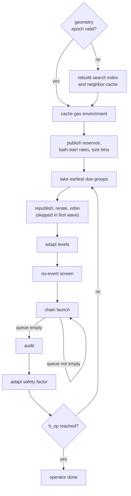
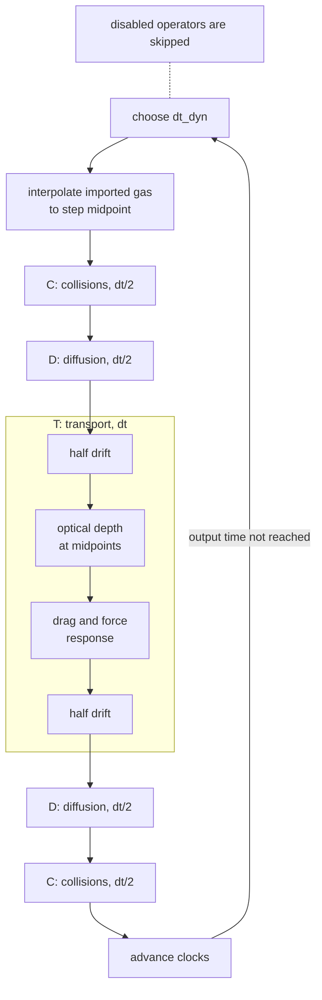

# Lagrangian swarm model

This guide derives the equations of the Lagrangian dust model and explains how the code discretizes
and integrates them, including the representative-particle collisions and the nearest-neighbor
search that finds collision partners. The disk that the dust moves in (coordinates, gas, stopping
time, diffusivity, radiation definitions) is described once for both dust models in
[`guide_basis.md`](guide_basis.md). How to build, configure, and run a model is in the
[user guide](../README.md), and the tests that check this model, including the collision code, are
in [`guide_tests.md`](guide_tests.md). Project terms are collected in the
[glossary](README.md#glossary).

## Contents

1. [Overview](#1-overview)
2. [State and parameters](#2-state-and-parameters)
3. [Initialization](#3-initialization)
4. [Governing equations](#4-governing-equations)
5. [Transport](#5-transport)
6. [Forces and radiation](#6-forces-and-radiation)
7. [Diffusion](#7-diffusion)
8. [Collisions](#8-collisions)
9. [Nearest-neighbor search](#9-nearest-neighbor-search)
10. [Time integration and boundaries](#10-time-integration-and-boundaries)
11. [Accuracy and limitations](#11-accuracy-and-limitations)
12. [Implementation](#12-implementation)
13. [References](#13-references)

## 1. Overview

### 1.1 The model in brief

The swarm model represents dust by computational
[representative particles](README.md#glossary). Each one carries a position, a velocity and, in
multisize models, one grain size and the number of physical grains it stands for. The gas is
prescribed analytically or imported from files and does not feel the dust
([one-way coupling](guide_basis.md#37-one-way-coupling)).

Up to four processes advance the particles:

- **transport** integrates trajectories under gravity, gas drag, and radiation
  ([Sections 5](#5-transport) and [6](#6-forces-and-radiation));
- **diffusion** displaces particles stochastically to represent turbulent mixing
  ([Section 7](#7-diffusion));
- **collisions** change grain size and grain number ([Section 8](#8-collisions)), with partners
  found by an exact nearest-neighbor search ([Section 9](#9-nearest-neighbor-search));
- **radiation** attenuates the stellar radiation pressure by the optical depth of the dust itself
  ([Section 6.2](#62-radiation-pressure-and-optical-depth)).

One dynamics step composes them symmetrically ([Section 10.1](#101-operator-composition)). The
source files are listed in [Section 12.1](#121-source-map).

### 1.2 Supported configurations

The swarm runs in all four geometries of
[the shared disk model](guide_basis.md#24-supported-geometries): radial-only, radial–azimuthal,
radial–polar, and full 3D. The grid alone selects the geometry; the radial-only case has its own
closure ([Section 2.5](#25-radial-only-closure)). Which operators exist in an executable is fixed
at compile time by the feature flags listed, with their dependencies, in
[Swarm feature flags](../README.md#swarm-feature-flags). A flag decides which equations are
compiled; it does not switch an operator on or off during a run.

The tests that establish each configuration, including the radial analytical cases, are described
in [`guide_tests.md`](guide_tests.md).

### 1.3 Relation to the fluid model

Both dust models share the disk of [`guide_basis.md`](guide_basis.md) and differ in how they
approximate the dust distribution. The fluid model evolves the first two
[moments of the distribution](guide_basis.md#9-dust-distribution-and-its-moments) and closes them
by setting the velocity dispersion $\boldsymbol P_d$ to zero
([fluid model, Section 1.3](guide_fluid.md#13-relation-to-the-swarm-model)). The swarm instead
approximates the whole mass distribution $f_d(\boldsymbol x,\boldsymbol v,s,t)$ by the empirical
measure

```math
f_d^{N_P}(\boldsymbol x,\boldsymbol v,s,t)
=\sum_{p=1}^{N_P}W_p
\,\delta(\boldsymbol x-\boldsymbol x_p)
\,\delta(\boldsymbol v-\boldsymbol v_p)
\,\delta(s-s_p),
```

where $W_p$ is the physical mass that particle $p$ represents. Several particles with different
velocities may occupy the same position, so the swarm continues through trajectory crossing
(multistreaming), which a single-valued fluid velocity cannot represent. Its errors are
finite-$`N_P`$ sampling noise and, with collisions, the variance of the collision estimator, in
place of the fluid model's closure error.

The two models also diffuse along different radial directions: the swarm along cylindrical radius,
the fluid along spherical radius. [Why the diffusion bases
differ](guide_basis.md#53-why-the-diffusion-bases-differ) explains the consequence. A
side-by-side comparison of the two representations is in [Dust
representations](../README.md#dust-representations).

## 2. State and parameters

### 2.1 Stored state

Each particle stores its position in the
[computational coordinates](guide_basis.md#21-computational-coordinates) and three velocity
variables chosen so that the drift of the angles is a simple ratio:

```math
\boldsymbol q=(x,y,z)=(\phi,r,\theta),
\qquad
\boldsymbol u=(\ell_\phi,v_r,\ell_\theta)
=(Rv_\phi,v_r,rv_\theta).
```

These are the [stored angular variables](README.md#glossary): $\ell_\phi$ and $\ell_\theta$ are
specific angular momenta and $v_r$ is the spherical radial velocity. A multisize build
(`MULTISIZE`) adds the grain diameter $s_p$ (`par_size`) and the number of physical grains $N_p$
(`par_numr`), so that the [represented mass](README.md#glossary) is

```math
W_p=N_p\,m_g(s_p),
\qquad
m_g(s)=\frac{\pi}{6}\rho_0s^3.
```

A monodisperse build stores neither; every particle has $s_p=S_0$ and the implicit equal weight
$W_p=M_{\rm dust}/N_P$ ([Section 3.3](#33-dust-mass-in-the-domain)).

Inactive dimensions are handled exactly. When `N_Z == 1`, the code uses $R=y$ and $Z=0$ directly and
keeps every particle at $z=\pi/2$ with $\ell_\theta=0$. When `N_X == 1`, the single azimuthal cell
represents the complete ring and every particle sits at the center
$x=(X_{\min}+X_{\max})/2$. The radial-only model still evolves $v_R$ and $\ell_\phi$
([Section 2.5](#25-radial-only-closure)).

### 2.2 Mesh measures and particle–mesh transfer

The mesh is used only to interpolate fields to particles and to deposit particle quantities (density
and extinction) onto cells. Its spacing, faces, and cell measures are defined in
[Mesh](guide_basis.md#22-mesh) and [Cell measure](guide_basis.md#23-cell-measure); this
section gives the swarm-specific parts.

**Cell measure.** Deposition divides by the exact cell measure, with $d=2$ for a vertically
integrated disk and $d=3$ when the polar dimension is active:

```math
V_{ijk}=\Delta\phi_{\rm cell}
\frac{y_{j+1/2}^{d}-y_{j-1/2}^{d}}{d}
\left\lbrace\begin{array}{ll}
1,&N_Z=1,\\
\cos z_{k-1/2}-\cos z_{k+1/2},&N_Z>1,
\end{array}\right.
\qquad
\Delta\phi_{\rm cell}=
\left\lbrace\begin{array}{ll}
\Delta x,&N_X>1,\\
2\pi,&N_X=1.
\end{array}\right.
```

The $2\pi$ branch makes an axisymmetric radial or radial–polar cell a complete ring, not a wedge of
the numerical width $X_{\max}-X_{\min}$.

**Radial cell location.** A cell value is placed at the centroid of its measure,

```math
\bar y_j
=\frac{d}{d+1}
\frac{y_{j+1/2}^{d+1}-y_{j-1/2}^{d+1}}
{y_{j+1/2}^{d}-y_{j-1/2}^{d}},
```

which lies slightly off the geometric midpoint of a logarithmic cell. Cell selection uses the
continuous logarithmic coordinate $\xi_y=\ln(y/Y_{\min})/\ln a_y$, while the interpolation weight is
linear in physical $y$ between neighboring centroids. Azimuth and polar angle use uniform
coordinates with cell centers at half-integer positions.

**Stencil.** A particle at continuous grid coordinates $(\xi_x,\xi_y,\xi_z)$ interacts with the
eight cell centers around it. With one-dimensional fractions $(f_x,f_y,f_z)$ toward the neighboring
centers, the weights are

```math
w_{abc}=f_x^a(1-f_x)^{1-a}
f_y^b(1-f_y)^{1-b}
f_z^c(1-f_z)^{1-c},
\qquad a,b,c\in\lbrace 0,1\rbrace,
\qquad \sum_{abc}w_{abc}=1.
```

Azimuth wraps periodically. An inactive dimension has fraction zero. Between a radial or polar edge
and the center of the adjacent cell, the fraction in that direction is set to zero, so the whole
weight stays in the edge cell. Deposition scatters $w_{pc}q_p$ into cell $c$; interpolation gathers
$\sum_c w_{pc}g_c$ from a cell field $g$. The same stencil serves the density diagnostic, the
extinction deposit ([Section 6.2](#62-radiation-pressure-and-optical-depth)), and imported gas
fields. With `HALF_DISK`, a particle exactly on the midplane face uses the last polar cell.

**Limits.** The edge rule keeps deposited mass inside the domain but makes the edge cells one-sided
averages.

### 2.3 Units and dimensions

The dynamics uses the orbital code units of [Units and
scales](guide_basis.md#12-units-and-scales), and the dimensionless disk parameters are defined in
[Dimensionless parameters](guide_basis.md#13-dimensionless-parameters). The swarm adds these
quantities:

| Quantity | Symbol | Dimension |
|---|---|---|
| represented mass of one particle | $W_p$ | $M$ |
| physical grains per particle | $N_p$ | $1$ |
| grain diameter | $s$ | $L$ |
| compact-grain material density | $\rho_0$ | $M L^{-3}$ |
| physical collision kernel | $K=\sigma\Delta v$ | $L^3T^{-1}$ |
| pair rate, owner rate | $\lambda_{ij}$, $\lambda_i$ | $T^{-1}$ |

`CODE_UNIT` changes only the calibration of the collision microphysics ([Section
8.4.3](#843-relative-velocities)), not the orbital units: it prescribes the Reynolds number through
`REYNOLDS_0` and drops Brownian motion. Without `CODE_UNIT`, `M_MOL` and `X_SEC` are in grams and
square centimeters, so the gas density must be in cgs units too. A physical interpretation must
convert every quantity that enters one dimensional formula consistently ([Section
6.3](#63-poyntingrobertson-drag) gives the example of `C_LIGHT`).

### 2.4 Parameters

All parameters are `constexpr` constants in
[`inc/swarm/const_defs.cuh`](../inc/swarm/const_defs.cuh). A model's own `const_defs.cuh` replaces
the whole file ([Configuring a model](../README.md#configuring-a-model)). The defaults below are
those of the shared header; a parameter marked with a flag exists only when that flag is defined.

| Code parameter | Default | Role |
|---|---|---|
| `G`, `M_S`, `R_0` | `1.0`, `1.0`, `1.0` | $G$, $M_\star$, reference radius $R_0$ |
| `S_0`, `RHO_0` | `1.0`, `1.0` | reference grain diameter $S_0$, material density $\rho_0$ |
| `N_P` | `10'000'000` | number of particles $N_P$ |
| `N_X`, `X_MIN`, `X_MAX` | `100`, $-\pi$, $+\pi$ | azimuthal cells and range |
| `N_Y`, `Y_MIN`, `Y_MAX` | `100`, `0.5`, `1.5` | logarithmic radial cells and range |
| `N_Z`, `Z_MIN`, `Z_MAX` | `1`, $\pi/2$, $\pi/2$ | polar cells and range |
| `SIGMA_0`, `ASPR_0` | `1.0e-02`, `0.05` | $\Sigma_0$ and $h_0$ |
| `IDX_P`, `IDX_Q` | `-1.0`, `-0.4` | power-law indices $p$ and $q$ |
| `METAL_Z`, `STOKES_0` | `1.0e-02`, `1.0e-03` | $Z_{\rm metal}$ and $\mathrm{St}_0$ |
| `ALPHA` or `NU` (`DIFFUSION` or `COLLISION`) | `1.0e-04` or `1.0e-05` | constant $\alpha$, or constant $\nu$ with `CONST_NU` |
| `SCHMIDT_X`, `SCHMIDT_R` (`DIFFUSION`) | `1.0`, `1.0` | cylindrical $\mathrm{Sc}_\phi$ and $\mathrm{Sc}_R$ |
| `SCHMIDT_Z` (`DIFFUSION` or `COLLISION`) | `1.0` | vertical $\mathrm{Sc}_Z$ |
| `INIT_SMIN`, `INIT_SMAX` (`MULTISIZE`) | `1.0`, `1.0` | initial size range $[s_{\min},s_{\max}]$; $s_{\min}$ is also the fragment floor |
| `BETA_0`, `KAPPA_0`, `T_BETA` (`RADIATION`) | `1.0e+01`, `1.0`, $2\pi$ | $\beta_0$, $\kappa_0$, ramp time $T_\beta$ |
| `C_LIGHT` (`PR_EFFECT`) | `1.0e+04` | light speed in units of $v_0$ |
| `CFL_DYN`, `DT_MAX` (`TRANSPORT`) | `0.45`, `0.1` | dynamics Courant factor and timestep ceiling |
| `DT_OUT`, `SAVE_MAX` | `1.0`, `100` | output-interval scale and final output index |
| `LOG_BASE` or `LIN_BASE` | `10` or `1` | base for `LOGTIMING`/`LOGOUTPUT`, or linear particle-checkpoint stride |
| `TPB` | `64` | threads per block of the one-thread-per-particle kernels |

The viscosity, and therefore `ALPHA` or `NU`, exists when diffusion or collisions need it; the fluid
model defines it only with `DIFFUSION`. The Schmidt numbers are named after the cylindrical
directions of the swarm diffusion ([Section 7.1](#71-target-equation)). The collision and search
constants (`COAG_KERNEL`, `N_K`, `H_SEARCH`, `V_FRAG`, `COL_*`, `MORTON_*`, and the unit constants
`REYNOLDS_0`, `M_MOL`, `X_SEC`) and their compile-time checks follow below. The flag dependencies
checked at compile time are in [Swarm feature flags](../README.md#swarm-feature-flags), and the
commonly changed constants in [Constants](../README.md#constants).

**Collision and search parameters.** The collision and search constants live in the same header
and follow the same rules; the viscosity and the fragment floor `INIT_SMIN` are in the table above.

| Parameter | Default | Exists when | Role |
|---|---|---|---|
| `COAG_KERNEL` | `0` | `COLLISION` | kernel: constant `0`, additive `1`, product `2`, physical `3` ([Section 8.4.1](#841-collision-kernels)) |
| `N_K` | `200` | `COLLISION` | neighbors retained per owner |
| `H_SEARCH` | `1.0` | `COLLISION` | search cap in local gas scale heights $H_g$ |
| `V_FRAG` | `1.0` | `COLLISION` | fragmentation threshold speed, in model velocity units |
| `REYNOLDS_0` | `1.0e+08` | `COLLISION` with `CODE_UNIT` | turbulent Reynolds number at $R_0$ |
| `M_MOL` | `2.3*1.66054e-24` | `COLLISION` without `CODE_UNIT` | gas molecular mass (g) |
| `X_SEC` | `2.0e-15` | `COLLISION` without `CODE_UNIT` | molecular cross section (cm²) |
| `COL_BATH_MAX` | `0.05` | `COLLISION` | longest bath duration |
| `COL_BATH_EPS` | `0.02` | `COLLISION` | refresh and distribution-audit tolerance |
| `COL_BATH_ALPHA` | `1.0e-03` | `COLLISION` | family-wise tail probability of the audit envelopes |
| `COL_BIN_X`, `COL_BIN_Y`, `COL_BIN_Z` | `8`, `4`, `2` | `COLLISION` | controller groups in azimuth, radius, and polar angle |
| `COL_BIN_S` | `8` | `COLLISION` | logarithmic size bins per group |
| `COL_BIN_MIN` | `64` | `COLLISION` | target minimum owners per merged size bin |
| `COL_BATH_TPB` | `64` (CUDA), `128` (ROCm) | `COLLISION` | threads per owner block in the rate and chain kernels |
| `COL_EVENT_CAP` | `32` | `COLLISION` | accepted events per owner and chain launch |
| `MORTON_TPB` | `64` | Morton search | threads per Morton query block |
| `MORTON_LEAF_TARGET` | `128` | Morton search | target records per adaptive leaf |
| `MORTON_MAX_LEVEL` | `20` | Morton search | deepest subdivision level |

The collision search is chosen with the Makefile variable `COLLISION_SEARCH`
([make variables](../README.md#make-variables)); "Morton search" means
`COLLISION_SEARCH := morton`.

**Constant checks.** The headers reject inconsistent values at compile time:

- `0 < COL_BATH_TPB <= 1024`, `COL_EVENT_CAP > 0`, positive `COL_BIN_X`, `COL_BIN_Y`, `COL_BIN_Z`,
  `COL_BIN_S`, and `COL_BIN_MIN`, `COL_BATH_MAX > 0`, `0 < COL_BATH_EPS < 1`, and
  `0 < COL_BATH_ALPHA < 1` (`inc/swarm/swarm_kern.cuh`);
- a power-of-two `TPB` in collision builds, for the event-statistics reduction
  (`src/swarm/col_event_sum.cu`);
- `N_P <= INT_MAX/3` (715 827 882), because each neighbor code packs a particle index and an image
  index into one 32-bit integer ([Section 9.5](#95-periodic-images); `inc/swarm/_col_image.cuh`);
- `0 < N_K <= 4096` in KD-tree builds, for the candidate heap
  (`inc/swarm/kdtree/index_heap.cuh`);
- in Morton builds, a `MORTON_TPB` that is a multiple of 32 must not exceed 1024
  (`inc/swarm/morton/morton_index.cuh`).

At run time the Morton builder rejects `MORTON_MAX_LEVEL` outside 1 to 20 and a nonpositive
`MORTON_LEAF_TARGET` with `std::invalid_argument`.

**Limits.** A polar range reaching a coordinate pole ($z=0$ or $\pi$) is not a meaningful
configuration and is not fully guarded. Neither is `N_K == 1`, which is not a scientifically
meaningful collision configuration.

### 2.5 Radial-only closure

The radial-only model describes an axisymmetric, vertically integrated disk with a single radial
line of cells. The grid alone selects it,

```math
N_X=1,\qquad N_Y>1,\qquad N_Z=1;
```

the code tests `N_X == 1 && N_Z == 1`, and there is no separate flag. Dust and gas densities are
surface densities $\Sigma_d$ and $\Sigma_g$, and drag, gravity, radiation, and particle dynamics are
evaluated at the midplane $Z=0$. The particles sample the radial mass distribution; they are not
rigid rings.

The active state is

```math
R,\qquad v_R,\qquad \ell_\phi=Rv_\phi,
```

and the inactive variables keep exact values:

```math
x=\frac{X_{\min}+X_{\max}}{2},\qquad
z=\frac{\pi}{2},\qquad
\ell_\theta=v_\theta=0.
```

Azimuth is spatially inactive, but $\ell_\phi$ remains dynamical because it supplies the centrifugal
support, the azimuthal drag, the collision velocity, and the Poynting–Robertson damping.
[Section 4.5](#45-radial-only-equations) gives the equations; the file layout is described in
[Section 12.8](#128-output-and-restart-semantics).

## 3. Initialization

The initializer builds a finite particle sample of a prescribed dust distribution.
[Sections 3.1](#31-dust-density-profile) and [3.2](#32-initial-velocity) give the target density
and velocity; [Sections 3.3](#33-dust-mass-in-the-domain) to [3.6](#36-imported-gas) describe how
the sample realizes them.

### 3.1 Dust density profile

The target is a settled Gaussian layer whose surface density follows the tapered profile
$\Sigma_{d,\rm conv}(R)$ of [Edge taper](guide_basis.md#62-edge-taper), interpolated linearly
from its tabulated axis. A vertically integrated model uses $\Sigma_{d,\rm conv}$ directly. With a
resolved polar dimension, the dust scale height of a grain of size $s$ follows the
settling–diffusion balance of [Youdin & Lithwick (2007)](https://arxiv.org/abs/0707.2975),

```math
H_d(R,s)=H_g(R)
\sqrt{\frac{\alpha_Z}{\mathrm{St}_{\rm mid}(R,s)}},
\qquad
\alpha_Z=\frac{\alpha}{\mathrm{Sc}_Z},
```

where $\mathrm{St}_{\rm mid}$ is the midplane Stokes number (with its size factor, and without the
radial power law under `CONST_ST`). The spatial template for one size is

```math
\rho_d(R,Z\mid s)
=\frac{\Sigma_{d,\rm conv}(R)}{\sqrt{2\pi}H_d(R,s)}
\exp\left[-\frac{Z^2}{2H_d(R,s)^2}\right].
```

This is one full-column template shared by all sizes; the mass spectrum $f_M(s)$ of
[Section 3.3](#33-dust-mass-in-the-domain) supplies the fraction of each size.

The spherical domain cuts each vertical line. At fixed cylindrical radius $R$, the polar faces
require

```math
R\cot Z_{\max}\le Z\le R\cot Z_{\min},
```

and the outer shell requires

```math
|Z|\le\sqrt{Y_{\max}^2-R^2}.
```

If $R\lt Y_{\min}$, the inner shell removes

```math
|Z|\lt\sqrt{Y_{\min}^2-R^2},
```

so the allowed set can split into a lower and an upper interval. A retained interval $[Z_a,Z_b]$
holds the Gaussian fraction

```math
\Delta\Phi(R,s;Z_a,Z_b)
=\Phi\left(\frac{Z_b}{H_d(R,s)}\right)
-\Phi\left(\frac{Z_a}{H_d(R,s)}\right),
```

where $\Phi$ is the standard normal CDF. The code evaluates it with `erf` or `erfc` branches chosen
to avoid subtracting two nearly equal tail probabilities.

**Limits.** This layer is not an equilibrium of the evolved diffusion operator. Unlike the fluid
initializer ([fluid model, Section 3.1](guide_fluid.md#31-dust-density-profile)), $H_d$ has no
finite-Stokes suppression factor $(1+\mathrm{St}^2)$ and does not change with
`DIFFUSE_CONCENTRATION`.

### 3.2 Initial velocity

Particles start with the steady drift of dust in a gas disk without back-reaction, given in
[Steady drift velocity](guide_basis.md#7-steady-drift-velocity), evaluated at each particle's
position and Stokes number. With `VISC_FLOW`, the gas radial velocity of that drift is the viscous
flow of [Viscous radial flow](guide_basis.md#36-viscous-radial-flow). A resolved polar dimension
adds terminal settling,

```math
v_Z=-\mathrm{St}\,\Omega_KZ,
```

and the cylindrical velocities are stored as

```math
\ell_\phi=Rv_{\phi,d},
\qquad
v_r=v_{R,d}\sin z+v_Z\cos z,
\qquad
\ell_\theta=y(v_{R,d}\cos z-v_Z\sin z).
```

The swarm adds terminal settling but no velocity that balances its diffusive flux; the fluid does
the opposite ([fluid model, Section 3.2](guide_fluid.md#32-initial-velocity)). This difference
is intended: swarm diffusion stays a separate stochastic operator and is not folded into a
deterministic velocity. The two models therefore do not start from the same vertical dynamical
state.

With `IMPORTGAS`, the same drift formula uses the imported Stokes number
([Section 3.6](#36-imported-gas)) together with the analytic $\eta$, $v_K$, and zero gas radial
velocity; the imported gas velocity does not enter the initial state.

**Limits.** The initial velocity contains no diffusive-balance drift. An imported run starts from
the analytic gas rotation, not from the imported gas velocity, so it begins with a drag transient
wherever the two differ.

### 3.3 Dust mass in the domain

The initial mass is the mass that the dust profile places inside the finite domain; there is no
separate dust-mass parameter. For one grain size,

```math
I(s)=\int_{\mathcal D}\rho_d(\boldsymbol{x}\mid s)\,dV
```

is the mass of the template inside the domain $\mathcal D$. Integrating the vertical Gaussian
analytically over the allowed intervals of [Section 3.1](#31-dust-density-profile) leaves the
radial marginal

```math
\frac{dI}{dR}
=\Delta\phi\,R\,\Sigma_{d,\rm conv}(R)
\sum_k\Delta\Phi_k(R,s),
```

with $\Delta\phi=X_{\max}-X_{\min}$ for an active azimuth and $2\pi$ otherwise. The code integrates
it with the trapezoidal rule on $\max(2048,4N_Y)$ uniform intervals from $R_{\min,\rm init}$
(defined in [Edge taper](guide_basis.md#62-edge-taper)) to $Y_{\max}$. The table of $I(s)$ over
size, the [mass bank](README.md#glossary), has 128 entries on a logarithmic size axis when
size-dependent 3D settling is active (multisize, analytic gas, `N_Z > 1`, and
$s_{\min}\ne s_{\max}$) and one entry otherwise. Neither resolution depends on the polar grid, so a
layer thinner than a polar cell ($H_d\ll y\Delta z$) neither loses mass nor collapses onto cell
centers.

The initial number spectrum is the power law of
[Mathis, Rumpl & Nordsieck (1977)](https://ui.adsabs.harvard.edu/abs/1977ApJ...217..425M),

```math
\frac{dN}{ds}\propto s^{-3.5},
```

so for $s_{\min}\lt s_{\max}$ the normalized mass spectrum is

```math
f_M(s)=
\frac{s^{-1/2}}
{2\left(\sqrt{s_{\max}}-\sqrt{s_{\min}}\right)},
\qquad
\int_{s_{\min}}^{s_{\max}}f_M(s)\,ds=1.
```

The dust mass in the domain is

```math
M_{\rm dust}
=\int_{s_{\min}}^{s_{\max}}f_M(s)I(s)\,ds
=\frac{1}{u_{\max}-u_{\min}}
\int_{u_{\min}}^{u_{\max}}I(u^2)\,du,
\qquad
u=\sqrt{s}.
```

The code evaluates the last form with the Simpson rule on $N_q=1024$ intervals,
$u_n=u_{\min}+n\Delta u$, $\Delta u=(u_{\max}-u_{\min})/N_q$:

```math
M_{\rm dust}\approx\frac{1}{u_{\max}-u_{\min}}
\frac{\Delta u}{3}
\left[
I(u_0^2)+I(u_{N_q}^2)
+4\sum_{\substack{n=1\\ n\ \mathrm{odd}}}^{N_q-1}I(u_n^2)
+2\sum_{\substack{n=2\\ n\ \mathrm{even}}}^{N_q-2}I(u_n^2)
\right].
```

Because $\Delta u/(u_{\max}-u_{\min})=1/N_q$, this is the weighted bracket divided by $3N_q$.
Between mass-bank entries, $I$ is interpolated linearly in $(\log s,\log I)$ when both entries are
positive and linearly in $I$ otherwise. This interpolation differs from the arithmetic interpolation
of radial CDFs used for sampling ([Section 3.5](#35-spatial-sampling)).

| Case | Mass used by the code |
|---|---|
| monodisperse | $M_{\rm dust}=I(S_0)$ |
| vertically integrated | $`I(s)=\Delta\phi\int R\,\Sigma_{d,\rm conv}(R)\,dR`$ for every size, so $M_{\rm dust}=I$ |
| finite radial–polar or 3D domain | $`M_{\rm dust}=\int f_M(s)I(s)\,ds`$ with the vertical containment above |
| vertically complete 3D domain | $I(s)$ tends to the common full-column value, and so does $M_{\rm dust}$ |
| imported gas | $M_{\rm dust}=I(S_0)$ from the analytic reference disk; the imported field sets only the shape ([Section 3.6](#36-imported-gas)) |

Grain counts, opacity, the density diagnostic, and the collision normalizations all use this
$M_{\rm dust}$. It is written to `variables.txt` as `TOTAL_DUST_MASS`.

### 3.4 Grain sizes and representative weights

Grain sizes are drawn from a proposal law $q(s)$ and corrected by importance weights, so that the
represented masses follow $f_M(s)$ exactly while the sample spends its particles where they matter.
Without radiation the proposal is the mass spectrum itself:

```math
q_{\rm mass}(s)=f_M(s),
\qquad
w(s)=\frac{f_M(s)}{q_{\rm mass}(s)}=1.
```

With radiation, the [equal-area proposal](README.md#glossary) gives each particle the same
full-column geometric cross section, so that small grains, which dominate the extinction, are well
sampled:

```math
q_{\rm area}(s)
=\frac{s^{-3/2}}
{2\left(s_{\min}^{-1/2}-s_{\max}^{-1/2}\right)},
\qquad
w_{\rm area}(s)
=\frac{f_M(s)}{q_{\rm area}(s)}
=s\,
\frac{s_{\min}^{-1/2}-s_{\max}^{-1/2}}
{\sqrt{s_{\max}}-\sqrt{s_{\min}}}.
```

Positions are then drawn from $p(\boldsymbol{x}\mid s,\boldsymbol{x}\in\mathcal D)=\rho_d/I(s)$
([Section 3.5](#35-spatial-sampling)), so a finite sample uses, with $i$ and $j$ labeling
particles here,

```math
\widetilde W_i=w(s_i)I(s_i),
\qquad
\mathcal N_M=
\frac{N_PM_{\rm dust}}{\sum_j\widetilde W_j},
```

```math
W_i=\frac{\mathcal N_M}{N_P}\widetilde W_i
=M_{\rm dust}\frac{\widetilde W_i}{\sum_j\widetilde W_j},
\qquad
N_i=\frac{W_i}{m_g(s_i)}.
```

$\mathcal N_M$ is the code variable `mass_norm` and $N_i$ is stored as `par_numr`. The construction
gives $\sum_iW_i=M_{\rm dust}$ to roundoff.

Both proposals are sampled by inverse transformation. For $q(s)\propto s^a$ with $a\ne-1$ and
$U\sim\mathcal U(0,1)$,

```math
s=\left[s_{\min}^{a+1}
+U\left(s_{\max}^{a+1}-s_{\min}^{a+1}\right)
\right]^{1/(a+1)},
```

with $a=-1/2$ for the mass proposal and $a=-3/2$ for the equal-area proposal. Sizes are drawn before
positions, so the position of each particle can depend on its size.

### 3.5 Spatial sampling

Each particle's position is drawn from the template of its own size restricted to the domain:
first the cylindrical radius from the radial marginal, then the height from the exact truncated
Gaussian. The physical vertical distribution is therefore independent of the polar cells, and the
cylindrical Jacobian $R$ enters once, in the radial marginal.

For one tabulated size, the normalized cylindrical-radius CDF is

```math
P_R(R\mid s)
=\frac{\displaystyle
\int_{R_{\min,\rm init}}^R R'\Sigma_{d,\rm conv}(R')F(R',s)\,dR'}
{\displaystyle
\int_{R_{\min,\rm init}}^{Y_{\max}}R'\Sigma_{d,\rm conv}(R')F(R',s)\,dR'},
```

where $F(R,s)=\sum_k\Delta\Phi_k$ is the vertical containment. A uniform deviate $U_R$ is inverted
in a linearly interpolated CDF bin. For a size $s$ between the logarithmic knots $s_a$ and $s_b$ of
the mass bank, the two neighboring CDFs are averaged arithmetically:

```math
P_R(R\mid s)=(1-f_s)P_R(R\mid s_a)+f_sP_R(R\mid s_b),
\qquad
f_s=\frac{\ln s-\ln s_a}{\ln s_b-\ln s_a}.
```

After drawing $R$, interval $k$ is chosen with probability

```math
P(k\mid R,s)=\frac{\Delta\Phi_k(R,s)}{F(R,s)},
```

and a second deviate $U_Z$ gives the truncated-normal height, evaluated with the particle's own
size rather than a knot size:

```math
Z=H_d\Phi^{-1}\left[
\Phi\left(\frac{Z_{k,a}}{H_d}\right)
+U_Z\Delta\Phi_k
\right].
```

$\Phi^{-1}$ uses the rational approximation of Acklam (2000). Finally,

```math
y=\sqrt{R^2+Z^2},
\qquad
z=\mathrm{atan2}(R,Z),
```

and $x$ is uniform over the active azimuthal range or centered when azimuth is inactive. A
monodisperse model, a model without a resolved polar dimension, or one with $s_{\min}=s_{\max}$
uses a single CDF.

No azimuthal density perturbation is added, unlike in the fluid initializer. The random sampling
supplies the finite-$`N_P`$ seed fluctuations. The initialization tests are described in
[Initialization](guide_tests.md#5-swarm-initialization).

### 3.6 Imported gas

With `IMPORTGAS`, the dust starts in the shape of the imported gas density times an imported
dust-to-gas ratio $\epsilon$, while its total mass is still $M_{\rm dust}$ from the analytic
reference disk ([Section 3.3](#33-dust-mass-in-the-domain)). The file formats are described in
[Imported gas input](../README.md#imported-gas-input).

A cell $c$ is chosen with probability

```math
P_c=\frac{\epsilon_c\rho_{g,c}V_c}
{\sum_m\epsilon_m\rho_{g,m}V_m},
```

where $\rho_g$ is a surface density when `N_Z == 1` and $V_c$ is the cell measure of
[Section 2.2](#22-mesh-measures-and-particlemesh-transfer). Every imported density and dust-to-gas
ratio must be finite and nonnegative, every cell mass finite, and the total strictly positive;
otherwise initialization stops before sampling. Individual empty cells are valid and are never
chosen.

Inside the chosen cell the position is uniform in the volume coordinates

```math
s_y=\frac{y^d}{d},
\qquad
s_z=-\cos z,
```

so with independent $U_x,U_y,U_z\sim\mathcal U(0,1)$,

```math
x=x_{i-1/2}+U_x\Delta x,
\qquad
y=\left[y_{j-1/2}^d+U_y
\left(y_{j+1/2}^d-y_{j-1/2}^d\right)\right]^{1/d},
```

```math
z=\cos^{-1}\left[
\cos z_{k-1/2}-U_z
\left(\cos z_{k-1/2}-\cos z_{k+1/2}\right)
\right].
```

An active azimuth is sampled uniformly across the cell width $\Delta x$ (`_get_dx()`); inactive
coordinates take their centered values. One spatial distribution serves all sizes.

The imported density also sets the Stokes number. When `N_Z == 1` the imported field is $\Sigma_g$,
and

```math
\mathrm{St}(R,s)
=\mathrm{St}_0\frac{s}{S_0}\frac{\Sigma_0}{\Sigma_g(R)}.
```

When `N_Z > 1` the imported field is $\rho_g$, and `STOKES_0` refers to the analytic reference
midplane:

```math
\mathrm{St}(R,Z,s)
=\mathrm{St}_0\frac{s}{S_0}
\frac{\rho_{g,0}H_{g,0}}{\rho_g(R,Z)H_g(R)},
\qquad
\rho_{g,0}=\frac{\Sigma_0}{\sqrt{2\pi}H_{g,0}},
\qquad
H_{g,0}=h_0R_0.
```

The imported density is assumed to be calibrated to that reference disk, so a gap raises the
local Stokes number above `STOKES_0`. Because the imported density sets the Stokes number,
`CONST_ST` is an analytic-gas option and cannot be combined with `IMPORTGAS`. The imported density
is interpolated with the stencil of [Section 2.2](#22-mesh-measures-and-particlemesh-transfer) and
must be finite and positive at every particle.

The imported fields replace only the gas density and velocity. The aspect ratio $h_g$, the
Keplerian frequency $\Omega_K$ (and with it $t_s=\mathrm{St}/\Omega_K$), and the $\eta$ of the
initial drift ([Section 3.2](#32-initial-velocity)) stay analytic.

## 4. Governing equations

### 4.1 Continuum equations

The swarm solves the characteristics of a kinetic equation for the mass distribution
$f_d(\boldsymbol x,\boldsymbol v,s,t)$. In the default density-diffusion mode it reads

```math
\frac{\partial f_d}{\partial t}
+\nabla_{\boldsymbol x}\cdot(\boldsymbol v f_d)
+\nabla_{\boldsymbol v}\cdot(\boldsymbol a f_d)
=\nabla_{\boldsymbol x}\cdot
 (\boldsymbol D\nabla_{\boldsymbol x}f_d)
+\mathcal C_s[f_d],
```

where $\boldsymbol a$ contains gravity, gas drag, radiation pressure, and Poynting–Robertson drag,
$\boldsymbol D$ is the cylindrical diffusion tensor ([Section 7](#7-diffusion)), and $\mathcal C_s$
is the collision operator of [Section 8](#8-collisions). Disabled physics removes
its term. In concentration mode, $\boldsymbol D\nabla f_d$ becomes $w\boldsymbol D\nabla(f_d/w)$
with $w$ the gas density ([Section 7.3](#73-concentration-diffusion)). The diffusivity depends on
grain size through the Stokes number.

With the velocity dispersion and the mass-weighted acceleration

```math
\boldsymbol P_d
=\int(\boldsymbol v-\boldsymbol u_d)(\boldsymbol v-\boldsymbol u_d)f_d\,d^3v\,ds,
\qquad
\rho_d\overline{\boldsymbol a}
=\int\boldsymbol a f_d\,d^3v\,ds,
```

the zeroth and first velocity moments of a monodisperse population in density mode are

```math
\frac{\partial\rho_d}{\partial t}
+\nabla\cdot(\rho_d\boldsymbol u_d)
=\nabla\cdot(\boldsymbol D\nabla\rho_d),
```

```math
\frac{\partial(\rho_d\boldsymbol u_d)}{\partial t}
+\nabla\cdot
 (\rho_d\boldsymbol u_d\boldsymbol u_d+\boldsymbol P_d)
=\rho_d\overline{\boldsymbol a}
+\nabla\cdot
 [\boldsymbol D\nabla(\rho_d\boldsymbol u_d)].
```

The moments themselves are defined in
[Dust distribution and its moments](guide_basis.md#9-dust-distribution-and-its-moments).

With several sizes, the diffusivity stays inside the size integrals: the mass and momentum diffusion
terms are $`\nabla\cdot\int\boldsymbol D(s)\nabla f_d\,d^3v\,ds`$ and
$`\nabla\cdot\int\boldsymbol v\boldsymbol D(s)\nabla f_d\,d^3v\,ds`$, with the concentration
gradient in concentration mode. A collision event keeps each particle's represented mass and
velocity, so $\mathcal C_s$ has zero mass and momentum moments while it moves mass in size space.
Drag and radiation depend on size, so $\overline{\boldsymbol a}$ contains size–velocity correlations
that $\rho_d$ and $\boldsymbol u_d$ cannot express, and $\boldsymbol P_d$ need not vanish after
trajectory crossing. The swarm samples these unclosed moments instead of evolving a momentum
equation on a mesh.

### 4.2 Reduced geometries

One coordinate-free system covers every geometry once the evolved density $\varrho_d$ and the
dynamical closure are fixed:

| Model | Density | Reduction | Dynamical closure |
|---|---|---|---|
| full 3D | $\rho_d(r,\theta,\phi)$ | full spherical divergence | resolved vertical dynamics |
| radial–polar | $\rho_d(r,\theta)$ | $\partial_\phi=0$, $u_\phi$ retained | axisymmetric resolved vertical dynamics |
| radial–azimuthal | $\Sigma_d(R,\phi)$ | vertical integration of the 3D moments | midplane forces, well-mixed column |
| radial-only | $\Sigma_d(R)$ | vertical integration and $\partial_\phi=0$ | midplane radial dynamics, $u_\phi$ retained |

The continuity equation of each geometry is in
[Supported geometries](guide_basis.md#24-supported-geometries). Vertical integration changes the
evolved density and requires a midplane closure, so the reduced models are not identical physics
even though one set of particle equations serves all four.

### 4.3 Equations in the stored variables

Between diffusion displacements and collision events, every active particle follows

```math
\frac{d\boldsymbol r}{dt}=\boldsymbol v,
```

```math
\frac{d\boldsymbol v}{dt}
=-\frac{GM_\star}{r^2}\boldsymbol e_r
-\frac{\boldsymbol v-\boldsymbol v_g}{t_s}
+\boldsymbol a_{\rm rad+PR}.
```

Without radiation, $\boldsymbol a_{\rm rad+PR}=0$. With radiation but without `PR_EFFECT`, it is the
attenuated outward acceleration $\beta GM_\star\boldsymbol e_r/r^2$
([Section 6.2](#62-radiation-pressure-and-optical-depth)); [Section 6.3](#63-poyntingrobertson-drag)
adds the Poynting–Robertson terms. In the stored variables the centrifugal and polar geometric
terms appear explicitly:

```math
\frac{d\ell_\phi}{dt}
=-\frac{\ell_\phi-\ell_{\phi,g}}{t_s}-\gamma_{\rm PR}\ell_\phi,
```

```math
\frac{d\ell_\theta}{dt}
=-\frac{\ell_\theta-\ell_{\theta,g}}{t_s}
+\frac{\ell_\phi^2\cos\theta}{R^2\sin\theta}
-\gamma_{\rm PR}\ell_\theta,
```

```math
\frac{dv_r}{dt}
=-\frac{v_r-v_{r,g}}{t_s}
-(1-\beta)\frac{GM_\star}{r^2}
+\frac{\ell_\phi^2}{R^2r}
+\frac{\ell_\theta^2}{r^3}
-2\gamma_{\rm PR}v_r.
```

Here $\gamma_{\rm PR}=0$ unless `PR_EFFECT` is enabled, and $\beta=0$ without `RADIATION`. For
`N_Z == 1`, $\ell_\theta=\ell_{\theta,g}=0$ and the polar equation is dropped.

Diffusion and collisions are separate operators, not terms of these equations: diffusion moves the
position while keeping the Cartesian velocity ([Section 7.4](#74-velocity-reprojection)), and
collisions change grain properties at a fixed position.

### 4.4 Conserved quantities

The represented mass is conserved exactly by every operator except an absorbing boundary.
Integrating the empirical measure over velocity and size gives the represented density

```math
\rho_d^{N_P}(\boldsymbol x,t)
=\sum_{p=1}^{N_P}W_p\delta(\boldsymbol x-\boldsymbol x_p),
```

or its surface-density analogue in 1D and 2D. The active mass is

```math
M_{d,\rm active}^{N_P}=\sum_{p\in\mathcal A}W_p,
```

where $\mathcal A$ excludes [absorbed particles](README.md#glossary), those that left through an
absorbing boundary ([Section 10.3](#103-boundary-conditions)). Transport and diffusion move
particles without changing $W_p$. Collisions change size and grain number so that

```math
W_p=N_pm_g(s_p)=\text{constant}
```

at every event. The sampled collision partner is not consumed
([Section 8.1](#81-representative-particles)).

Deposition onto the mesh is a diagnostic projection of this measure. If every stencil weight stays
inside the domain and $\sum_cw_{pc}=1$, then

```math
\sum_c\rho_{d,c}V_c=\sum_{p\in\mathcal A}W_p.
```

**Limits.** The deposited total matches the particle total only up to atomic-addition roundoff.

### 4.5 Radial-only equations

In the radial-only closure ([Section 2.5](#25-radial-only-closure)) the surface density obeys

```math
\frac{\partial\Sigma_d}{\partial t}
+\frac{1}{R}\frac{\partial}{\partial R}(R\Sigma_dv_R)
=\frac{1}{R}\frac{\partial}{\partial R}
\left(RD_R\frac{\partial\Sigma_d}{\partial R}\right),
```

where the particle characteristics carry the transport and stochastic diffusion represents the
right-hand side. The midplane characteristics satisfy

```math
\frac{dR}{dt}=v_R,
```

```math
\frac{d\ell_\phi}{dt}
=-\frac{\ell_\phi-\ell_{\phi,g}}{t_s}-\gamma_{\rm PR}\ell_\phi,
```

```math
\frac{dv_R}{dt}
=\frac{\ell_\phi^2}{R^3}
-(1-\beta)\frac{GM_\star}{R^2}
-\frac{v_R-v_{R,g}}{t_s}
-2\gamma_{\rm PR}v_R.
```

## 5. Transport

Transport moves each particle along its deterministic trajectory for one dynamics step. The step is
split into two position drifts around a velocity update; this section gives the drifts and the
interpolation of imported gas in time, and [Section 6.1](#61-drag-and-gravity) gives the velocity
update (drag and forces).

### 5.1 Staggered update

The staggered update drifts the position for half a step with the old velocity, updates the velocity
at that midpoint with an exact drag response, and drifts the second half with the new velocity.
Treating drag exponentially at the midpoint removes the stopping time as a stability limit and
keeps the step second-order accurate.

For an initial state $i$, a midpoint position $1$, and a final state $j$ (state labels, not grid
indices), the first drift is

```math
y_1=y_i+\frac{\Delta t}{2}v_{r,i},
```

```math
z_1=z_i+\frac{\Delta t}{2}
\frac{\ell_{\theta,i}}{y_iy_1},
\qquad
x_1=x_i+\frac{\Delta t}{2}
\frac{\ell_{\phi,i}}{y_iy_1\sin z_i\sin z_1}.
```

For a vertically integrated model, $z_1=\pi/2$ and the azimuthal drift reduces to
$x_1=x_i+\ell_{\phi,i}\Delta t/(2y_iy_1)$; in the radial-only model $x_1$ stays fixed. The product
of old and new metric factors is the exact angular drift of the stored angular momentum at constant
radial velocity; there is no integer-cell remap.

At the midpoint, [Section 6.1](#61-drag-and-gravity) turns $\boldsymbol u_i$ into $\boldsymbol u_j$.
The second drift then uses the new velocity:

```math
y_j=y_1+\frac{\Delta t}{2}v_{r,j},
```

```math
z_j=z_1+\frac{\Delta t}{2}
\frac{\ell_{\theta,j}}{y_1y_j},
\qquad
x_j=x_1+\frac{\Delta t}{2}
\frac{\ell_{\phi,j}}{y_1y_j\sin z_1\sin z_j}.
```

The response and the second drift share one device function, `_ssa_advance`, which the orbit and
drag-path tests reuse with their own forcing ([Section 12.1](#121-source-map)). Boundary rules are
applied after the first drift and again after the full step ([Section
10.3](#103-boundary-conditions)). With radiation, the first drift is a separate kernel so that the
optical depth can be rebuilt at the midpoint positions ([Section 10.1](#101-operator-composition)).
The accuracy of the scheme is discussed in [Section 11.1](#111-accuracy), and the trajectory tests
in [Deterministic trajectories](guide_tests.md#3-swarm-trajectories).

### 5.2 Imported-gas time interpolation

Imported gas is given as snapshots at the output times. So that the gas does not stay constant over
a whole output interval, the code interpolates the two bracketing snapshots $g_n$ and $g_{n+1}$
linearly to the midpoint of each dynamics step,

```math
g(f)=(1-f)g_n+fg_{n+1},
\qquad
f=\frac{t_m-t_n}{t_{n+1}-t_n},
```

where $t_m$ is the step midpoint. The working field already holds the value at the previous
fraction $f_{\rm old}$, so the kernel applies the incremental blend

```math
b=\frac{f-f_{\rm old}}{1-f_{\rm old}},
\qquad
g\leftarrow(1-b)g+b g_{n+1},
```

which is algebraically identical to the direct form. It acts on the gas density and on all three
gas velocity components. At the end of each output interval the working field is replaced by the
exact snapshot $g_{n+1}$. A collision-only build interpolates once, to the midpoint of its single
collision operator.

**Limits.** Between snapshots the gas is linear in time, so its accuracy depends on the snapshot
cadence.

## 6. Forces and radiation

This section gives the velocity update of the staggered step: gas drag with gravity and the
geometric forces, radiation pressure attenuated by the dust's own optical depth, and
Poynting–Robertson drag.

### 6.1 Drag and gravity

At the midpoint position of [Section 5.1](#51-staggered-update), the velocity update integrates drag
exactly for coefficients frozen at that point. The stopping time is $t_s=\mathrm{St}/\Omega_K(R)$
with the Stokes number of [Stopping time and Stokes
number](guide_basis.md#4-stopping-time-and-stokes-number), including its size factor $s/S_0$.
`CONST_ST` keeps only that size factor, $`\mathrm{St}=\mathrm{St}_0\,s/S_0`$; imported gas uses the
variants of [Section 3.6](#36-imported-gas).

The drag targets are the gas velocities in the stored variables. For analytic gas,

```math
\ell_{\phi,g}=Rv_{\phi,g},
```

with the gas rotation $v_{\phi,g}$ of [Rotation support](guide_basis.md#34-rotation-support), and
$v_{r,g}=\ell_{\theta,g}=0$ unless `VISC_FLOW` supplies the projected viscous flow of
[Viscous radial flow](guide_basis.md#36-viscous-radial-flow). Imported gas velocities are linear
velocities; they are interpolated to the particle and converted by $\ell_{\phi,g}=Rv_{\phi,g}$ and
$\ell_{\theta,g}=yv_{\theta,g}$, while $\Omega_K$ in $t_s$ stays analytic.

Without Poynting–Robertson drag, define

```math
\mathcal R(h)=1-e^{-h/t_s}.
```

For a component with frozen non-drag force $F$, the exact response over a time $h$ is

```math
u(h)=u_i+\left(u_g+t_sF-u_i\right)\mathcal R(h).
```

The forces per component are the radial gravity, reduced by radiation, plus the centrifugal terms,

```math
F_r=-(1-\beta)\frac{GM_\star}{y^2}+\frac{\ell_\phi^2}{R^2y}+\frac{\ell_\theta^2}{y^3},
\qquad
F_\theta=\frac{\ell_\phi^2\cos z}{R^2\sin z},
\qquad
F_\phi=0,
```

all evaluated at the midpoint position. The centrifugal terms depend on the velocity, so the code
uses two stages. It evaluates forces $F_1$ with the initial angular momenta and forms a midpoint
velocity with $h=\Delta t/2$. It then reevaluates the forces $F_2$ with those midpoint angular
momenta and computes the full velocity from the original state:

```math
u_j=u_i+\left(u_g+t_sF_2-u_i\right)\mathcal R(\Delta t).
```

The radiation ratio $\beta$ ([Section 6.2](#62-radiation-pressure-and-optical-depth)) and the gas
targets are the same in both stages.

**Limits.** The exponential factor is exact only for frozen $t_s$, gas target, and force; the
error comes from freezing their spatial variation at the midpoint and from approximating the
nonlinear centrifugal force by the midpoint angular momenta. Stiff drag is not a stability limit,
but the timestep must still resolve the variation of the coefficients
([Section 10.2](#102-timestep-control)).

### 6.2 Radiation pressure and optical depth

With `RADIATION`, the stellar radiation pressure pushes each grain outward with a strength that
falls with grain size and with the optical depth of the dust between it and the star. The
definitions of the radiation ratio, its startup ramp $f_\beta$, and the radial optical depth are in
[Radiation ratio and startup ramp](guide_basis.md#81-radiation-ratio-and-startup-ramp) and
[Radial optical depth](guide_basis.md#82-radial-optical-depth). The swarm-specific parts are the
size factor, the deposit that builds the optical depth from particles, and the interpolation back
to particles.

For geometric opacity $\kappa\propto s^{-1}$, each particle's radiation ratio is

```math
\beta(s,t,\tau)
=\beta_0\frac{S_0}{s}\,f_\beta(t)\,e^{-\tau},
```

with the startup ramp $f_\beta$ of
[Radiation ratio and startup ramp](guide_basis.md#81-radiation-ratio-and-startup-ramp).

**Extinction deposit.** Particle $p$ represents the mass

```math
W_p=
\left\lbrace\begin{array}{ll}
m_g(s_p)N_p,&\text{multisize},\\
M_{\rm dust}/N_P,&\text{monodisperse},
\end{array}\right.
```

and carries the extinction weight

```math
Q_p=\kappa_0W_p\frac{S_0}{s_p}.
```

In a vertically integrated model this becomes the midplane-equivalent weight

```math
Q_p^{\rm 2D}=\frac{Q_p}{\sqrt{2\pi}H_g(R_p)},
```

which applies the [well-mixed closure](README.md#glossary): every size shares the gas vertical
profile, with $H_g$ evaluated at each particle's own radius $R_p$. With $\widehat Q_p=Q_p^{\rm 2D}$
when `N_Z == 1` and $\widehat Q_p=Q_p$ otherwise, the stencil of
[Section 2.2](#22-mesh-measures-and-particlemesh-transfer) deposits

```math
E_c=\sum_p w_{pc}\widehat Q_p
```

into cell $c=(i,j,k)$, and, with the cell measure $V_c$ of
[Section 2.2](#22-mesh-measures-and-particlemesh-transfer) ($2\pi$ in place of $\Delta x$ for an
inactive azimuth), the radial increment is

```math
\Delta\tau_c=\frac{E_c}{V_c}\Delta r_j,
\qquad
\Delta r_j=y_{j-1/2}(a_y-1).
```

Because $Q_p$ already contains $\kappa_0$, $E_c/V_c$ is the product $\kappa_0\rho_{\rm ext}$ of the
shared notation $\Delta\tau=\kappa_0\rho_{\rm ext}\Delta r$, with $\rho_{\rm ext}$ the size-weighted
density $V_c^{-1}\sum_pw_{pc}W_pS_0/s_p$ (divided by $\sqrt{2\pi}H_g$ in 2D), which reduces to the
dust density for grains of size $S_0$. The shared inclusive prefix sum over radius
([Radial optical depth](guide_basis.md#82-radial-optical-depth)) then gives the optical depth
$\tau_{i,j+1/2,k}$ at every outer radial face, with $\tau_{i,-1/2,k}=0$ at the inner boundary.

**Interpolation to the particle.** A particle interpolates the face values of its own radial cell,
linearly in physical radius. If its logarithmic coordinate is $\xi_y=j+\delta$ with
$0\le\delta\lt1$, its fraction toward the inner face is

```math
f_{\rm in}=\frac{a_y-a_y^\delta}{a_y-1},
```

and

```math
\tau(y)=(1-f_{\rm in})\tau_{j+1/2}+f_{\rm in}\tau_{j-1/2},
```

with $\tau_{-1/2}=0$ inserted for $j=0$. Azimuth and polar angle use the cell-centered fractions of
[Section 2.2](#22-mesh-measures-and-particlemesh-transfer). The optical depth is rebuilt from the
midpoint positions of every step, so $\beta$ is evaluated at the same position as drag and gravity
([Section 10.1](#101-operator-composition)).

**Limits.** In 2D the extinction ignores size-dependent settling (the well-mixed closure). The
deposit keeps the full weight in the edge cell for particles between a radial or polar boundary and
the adjacent cell center ([Section 2.2](#22-mesh-measures-and-particlemesh-transfer)).

### 6.3 Poynting–Robertson drag

With `PR_EFFECT`, the same attenuated, size-dependent $\beta$ also supplies the first-order
Poynting–Robertson drag of
[Burns, Lamy & Soter (1979)](<https://doi.org/10.1016/0019-1035(79)90050-2>), which damps the motion
relative to the star at the rate

```math
\gamma_{\rm PR}=\frac{\beta GM_\star}{C_{\rm LIGHT}y^2}.
```

The implemented first-order acceleration is

```math
\boldsymbol a_{\rm grav+rad}
=-\frac{GM_\star}{y^2}\boldsymbol e_y
+\beta\frac{GM_\star}{y^2}
\left[
\left(1-\frac{v_y}{C_{\rm LIGHT}}\right)\boldsymbol e_y
-\frac{\boldsymbol v}{C_{\rm LIGHT}}
\right],
```

or equivalently

```math
\boldsymbol a_{\rm grav+rad}
=-(1-\beta)\frac{GM_\star}{y^2}\boldsymbol e_y
-\gamma_{\rm PR}
\left(
v_x\boldsymbol e_x+2v_y\boldsymbol e_y+v_z\boldsymbol e_z
\right).
```

The tangential variables $\ell_\phi$ and $\ell_\theta$ are damped at $\gamma_{\rm PR}$ and the
radial velocity at $2\gamma_{\rm PR}$. Gas drag and Poynting–Robertson drag are integrated together
in the frozen-midpoint response of [Section 6.1](#61-drag-and-gravity), with the rates

```math
k_x=\frac{1}{t_s}+\gamma_{\rm PR},
\qquad
k_y=\frac{1}{t_s}+2\gamma_{\rm PR},
\qquad
k_z=\frac{1}{t_s}+\gamma_{\rm PR}.
```

For a frozen component equation

```math
\frac{du}{dt}=-ku+\frac{u_g}{t_s}+F,
```

the code evaluates

```math
u(h)
=e^{-kh}u(0)
+\frac{1-e^{-kh}}{k}
\left(
\frac{u_g}{t_s}+F
\right),
```

with the same two stages as without Poynting–Robertson drag ($h=\Delta t/2$ with $F_1$, then
$h=\Delta t$ from the original state with $F_2$). The factor $1-e^{-kh}$ is computed with `expm1` to
avoid cancellation. The gas targets enter only through $u_g/t_s$, so Poynting–Robertson drag damps
toward the star's rest frame, not toward the gas. The response is stable for any damping rate, and
because the damping is analytic and dissipative the timestep (`dyn_rate_calc`) has no
Poynting–Robertson term.

**Units.** The dynamics always uses orbital code units, also without `CODE_UNIT`. `C_LIGHT` is
therefore the light speed in units of $v_0$ and must equal $c/v_0$ for the physical scales the model
represents. The default `C_LIGHT = 1.0e+04` is close to $c/v_0\approx1.007\times10^4$ for
$R_0=1$ au around one solar mass; a cgs value such as $c=2.99792458\times10^{10}$ would be
inconsistent.

**Limits.** The drag is first order in $v/c$.

## 7. Diffusion

`DIFFUSION` represents turbulent mixing by random particle displacements, in the spirit of
[Charnoz et al. (2011)](https://arxiv.org/abs/1105.3440). The displacements are drawn so that the
particle density obeys the target diffusion equation; the particle velocity is carried along
unchanged.

### 7.1 Target equation

The target equation and the directional diffusivities are defined in
[Density and concentration diffusion](guide_basis.md#52-density-and-concentration-diffusion) and
[Directional diffusivities](guide_basis.md#51-directional-diffusivities). For the swarm the
diffusion tensor is diagonal in cylindrical coordinates $(\phi,R,Z)$,

```math
D_a=\frac{\nu}{\mathrm{Sc}_a(1+\mathrm{St}^2)},\qquad a=\phi,R,Z,
```

with the Schmidt numbers `SCHMIDT_X`, `SCHMIDT_R`, and `SCHMIDT_Z` and the Stokes number at the
particle's current size. The target is

```math
\partial_t\varrho_d=\nabla\cdot\left[w\boldsymbol D\nabla(\varrho_d/w)\right],
```

with $w=1$ for density diffusion and $w=\varrho_g$ for concentration diffusion
(`DIFFUSE_CONCENTRATION`, [Section 7.3](#73-concentration-diffusion)).

### 7.2 Euler–Maruyama step

The target equation is the forward equation of an [Itô process](README.md#glossary) with independent
Wiener increments in the three cylindrical directions:

```math
d\phi=\frac{\partial_\phi D_\phi+D_\phi\partial_\phi\ln w}{R^2}\,dt
 +\frac{\sqrt{2D_\phi}}{R}\,dW_\phi,
```

```math
dR=\left(\partial_RD_R+\frac{D_R}{R}+D_R\partial_R\ln w\right)dt
 +\sqrt{2D_R}\,dW_R,
```

```math
dZ=\left(\partial_ZD_Z+D_Z\partial_Z\ln w\right)dt
 +\sqrt{2D_Z}\,dW_Z.
```

Inactive coordinates are omitted. The cylindrical measure term $D_R/R$ appears in both modes.
Derivatives hold the grain size fixed and include the Stokes dependence,

```math
\nabla\ln D_a=\nabla\ln\nu-\frac{2\mathrm{St}^2}{1+\mathrm{St}^2}\nabla\ln\mathrm{St},
```

so the vertical diffusivity has a gradient even when $\nu$ depends only on $R$. Analytic gas
gradients follow the spherical stratification used by drag. With `IMPORTGAS`, the gradients
differentiate the same periodic, boundary-clamped trilinear interpolant of the working gas density
that drag uses. `CONST_ST` removes the spatial Stokes variation for analytic gas only.

One Euler–Maruyama step draws independent standard normal deviates and uses the displacement
variance $2D_a\Delta t$ exactly, with no further rescaling. The coefficients are evaluated at the
start of the step. The method has strong order $1/2$ and weak order $1$ for smooth coefficients
([Kloeden & Platen 1992](https://doi.org/10.1007/978-3-662-12616-5)). The diffusion tests are
described in [Stochastic diffusion](guide_tests.md#4-swarm-diffusion).

**Limits.** The finite step and the boundary folding of [Section 10.3](#103-boundary-conditions)
limit the accuracy near steep coefficient gradients and walls.

### 7.3 Concentration diffusion

With `DIFFUSE_CONCENTRATION`, the dust diffuses toward a uniform dust-to-gas ratio instead of a
uniform density. The weight $w=\varrho_g$ is the gas surface density when `N_Z == 1` and the gas
volume density otherwise, and it adds the drift $D_a\partial_a\ln w$ in every active direction of
[Section 7.2](#72-eulermaruyama-step). For analytic gas the logarithmic gradients are those of
$\Sigma_g$ in 2D and of the exact spherical stratification $\rho_g$ in 3D; imported gas uses the
interpolant gradient. In density mode, $w=1$ and these terms vanish.

### 7.4 Velocity reprojection

A diffusion displacement redistributes mass; it is not a force. The kernel therefore keeps each
particle's Cartesian velocity through the displacement and re-expresses it in the local spherical
basis of the new position ([velocity reprojection](README.md#glossary)).

Before the displacement,

```math
v_\phi=\frac{\ell_\phi}{R},
\qquad
v_\theta=\frac{\ell_\theta}{y},
```

```math
v_R=v_r\sin z+v_\theta\cos z,
\qquad
v_Z=v_r\cos z-v_\theta\sin z,
```

```math
v_X=v_R\cos x-v_\phi\sin x,
\qquad
v_Y=v_R\sin x+v_\phi\cos x.
```

After moving to $(x',R',Z')$, the same Cartesian components give

```math
v_R'=v_X\cos x'+v_Y\sin x',
\qquad
v_\phi'=v_Y\cos x'-v_X\sin x',
```

```math
y'=\sqrt{R'^2+Z'^2},
\qquad
\sin z'=\frac{R'}{y'},
\qquad
\cos z'=\frac{Z'}{y'},
```

```math
\ell_\phi'=R'v_\phi',
\qquad
v_r'=v_R'\sin z'+v_Z\cos z',
\qquad
\ell_\theta'=y'(v_R'\cos z'-v_Z\sin z').
```

In a periodic wedge, let $x_u$ be the unwrapped angle after the displacement and

```math
x_w=x_u-m\Delta\phi_w,
\qquad m\in\mathbb Z,
```

the stored angle. The projection uses $x_u$, before the position is wrapped to $x_w$. This is
equivalent to rotating both the position and the velocity by the wedge identification
$-m\Delta\phi_w$; projecting at $x_w$ would give the particle a spurious velocity kick at the seam.
The same ordering holds after the axis continuation of [Section 10.3](#103-boundary-conditions). The
wedge tests are described in [Stochastic diffusion](guide_tests.md#4-swarm-diffusion).

**Limits.** This velocity treatment is internally consistent but is not the donor-momentum closure
of the fluid diffusion ([fluid model, Section 7.4](guide_fluid.md#74-donor-momentum-closure)).
Swarm–fluid comparisons of diffusion are valid for the density only.

## 8. Collisions

Collisions change the size and grain number of each particle while keeping its represented mass.
This section derives the collision model of the swarm: how fast representative particles collide
([Section 8.4](#84-pair-rates)), what a collision does ([Section 8.5](#85-collision-outcomes)), and
how the frozen-bath event chain ([Section 8.6](#86-frozen-bath-event-chain)) and its controller
([Section 8.7](#87-bath-controller)) advance all of this on the GPU. How the particles find their
collision partners is described in [Section 9](#9-nearest-neighbor-search).

### 8.1 Representative particles

The collision update follows the representative-particle Monte Carlo method of
[Zsom & Dullemond (2008)](https://arxiv.org/abs/0807.5052). Each computational particle (a
representative) stands for $N_p$ identical physical grains of diameter $s_p$, so it carries the
represented mass $`W_p=N_p\,m(s_p)`$ of [Section 2.1](#21-stored-state), where
$m(s)=m_g(s)=\pi\rho_0s^3/6$ is the mass of one compact grain and $\rho_0$ is the compact-grain
density `RHO_0`.

A collision event involves two roles:

- The **owner** is the representative whose grains collide. An event changes only the owner's
  grain size $s_i$ and grain count $N_i$; its position, velocity, and represented mass $W_i$ stay
  fixed.
- The **partner** is a neighboring representative, sampled at random, that stands for the grains
  the owner's grains hit. The partner is only read: it is never modified or consumed by the event.

Every active representative is the owner of its own event sequence and, at the same time, a
possible partner of its neighbors. Because each event keeps $W_i$ fixed, collisions conserve the
total represented mass exactly, up to roundoff
([Section 4.4](#44-conserved-quantities)). Collisions are compiled in by the
`COLLISION` flag, which requires `MULTISIZE`
([swarm feature flags](../README.md#swarm-feature-flags)).

### 8.2 Why local event clocks

A global collision step would be controlled by the fastest representative. A scheme that advanced
all representatives with one leap, in the spirit of explicit Poisson tau-leaping ([Cao, Gillespie &
Petzold 2005](https://people.cs.vt.edu/~ycao/publication/JChemPhys_123_054104.pdf)), would use the
batch step

```math
\Delta t_{\mathrm{col}}=
\min\left(\frac{\mathrm{CFL}_{\mathrm{COL}}}{\max_i\lambda_i},\;
\Delta t_{\mathrm{remaining}}\right),
```

where $\lambda_i$ is owner $i$'s total collision rate. Raising the Courant factor does not remove
this bottleneck: when $\lambda_i\Delta t$ is large, collapsing several expected physical events into
one trial changes the stochastic process.

The code therefore uses a single collision integrator, the frozen-bath local continuous-time event
chain, which `COLLISION` always selects. Over a short interval in which the partners' properties
are held fixed (a bath, [Section 8.6.1](#861-frozen-reservoir)), each owner keeps its own clock and
draws exact waiting times with the direct method of
[Gillespie (1977)](https://doi.org/10.1021/j100540a008),

```math
\delta t_i=-\frac{\ln U}{\lambda_i},
```

with $U$ a uniform deviate. It processes zero, one, or many events and recomputes its own rate and
partner weights after each one. This removes the fastest-particle global microstep, and the result
is exact conditional on the frozen bath. The remaining error comes from freezing the partners, and
it is controlled by refining the bath duration ([Section
11.2](#112-finite-bath-convergence)).

A binned or otherwise modified representative-particle scheme is not merely a faster
implementation of the same stochastic process: it can change the estimator, the population
resolution, and the sampling variance. Any replacement or hybrid must derive its conservation,
bias, variance, and resolution properties before runtime comparisons can justify adopting it.

### 8.3 One collision operator at a glance

One collision operator advances every owner through the same stretch of time, the operator horizon
$h_{\rm op}$. In a transported run it is half a dynamics step, because the collision operator
opens and closes the symmetric step of
[Section 10.1](#101-operator-composition). In a collision-only run it is the
whole remaining output interval. Particle positions do not change during an operator. In plain
words, one operator does the following:

1. **Check the geometry.** If particles moved since the previous operator, the geometry epoch
   (the stretch of time over which positions stay unchanged) has ended, and the code rebuilds the
   spatial search index, finds every owner's $N_K$ nearest neighbors and the area or volume they
   occupy, and assigns every owner to a spatial controller group. If nothing moved, it reuses all
   of this. Either way it first checks that no particle state is nonfinite.
2. **Cache the gas.** For analytic gas in physical units, it stores each owner's gas coefficients
   once, so the many pair evaluations that follow need not recompute them.
3. **Publish and plan.** It copies every owner's current size and grain count into the reservoir,
   the frozen snapshot from which partner properties are read. It computes each owner's starting
   rate and expected size change, sorts owners into size bins, and gives every group a bath
   duration that is a power-of-two fraction of $h_{\rm op}$.
4. **Advance in refresh waves.** A refresh wave advances all groups whose baths end earliest,
   together. From the second wave on, it republishes those groups' reservoir entries, recomputes
   their rates and size bins, and adapts their durations. A quick screen then finishes every owner
   that will have no event in its bath. The remaining owners run their event chains, in several
   kernel launches if they hit the event cap, the most events one owner may accept in one launch.
   Finally an audit compares what happened with what was predicted, records any overshoot, and
   adjusts each group's safety factor, the multiplier that shortens its later baths.
5. **Finish.** The operator ends when every group's clock has reached $h_{\rm op}$.



The following sections take these steps in turn: the pair rates ([Section 8.4](#84-pair-rates)), the
event outcomes ([Section 8.5](#85-collision-outcomes)), the chain ([Section
8.6](#86-frozen-bath-event-chain)), the controller ([Section 8.7](#87-bath-controller)), and the
neighbor search ([Section 9](#9-nearest-neighbor-search)).

### 8.4 Pair rates

The pair rate $\lambda_{ij}$ is the rate at which owner $i$'s grains collide with the physical
grains that partner $j$ represents. It is the kernel times the partner's grain count divided by
the space the owner's neighbors occupy.

#### 8.4.1 Collision kernels

For a pair $i,j$, the physical collision kernel is

```math
K_{ij}=\sigma_{ij}\Delta v_{ij},
\qquad
\sigma_{ij}=\frac{\pi}{4}(s_i+s_j)^2,
```

with the relative speed $\Delta v_{ij}$ of [Section 8.4.3](#843-relative-velocities). In a resolved
vertical model the pair rate and the owner rate are

```math
\lambda_{ij}=\frac{N_jK_{ij}}{V_{K,i}},
\qquad
\lambda_i=\sum_{j\in\mathcal N_i}\lambda_{ij},
```

where $\mathcal N_i$ is the owner's retained neighbor set ([Section 9.2](#92-search-contract)) and
$V_{K,i}$ its KNN measure, the part of the farthest-neighbor ball that lies inside the domain
([Section 8.4.2](#842-knn-measure)). The set $\mathcal N_i$ contains only active particles and
includes the owner's own representative, using $N_i-1\simeq N_i$ for large grain counts. In a
vertically integrated model the measure is an area $A_{K,i}$, and an assumed Gaussian vertical
overlap of the two species gives

```math
\lambda_{ij}
=\frac{N_jK_{ij}}
{A_{K,i}\sqrt{2\pi(H_{g,i}^2+H_{g,j}^2)}},
```

where $H_{g,i}$ and $H_{g,j}$ are the gas scale heights at the two particles' own cylindrical radii
([`guide_basis.md`](guide_basis.md#32-vertical-structure)).

This physical prescription is selected by `COAG_KERNEL = 3`. The values `0`, `1`, and `2` select
normalized synthetic kernel shapes for controlled coagulation studies, such as the Smoluchowski
campaigns of [`guide_tests.md`](guide_tests.md#9-swarm-coagulation-campaigns):

```math
\kappa_0(m_i,m_j)=1,
\qquad
\kappa_1(m_i,m_j)=m_i+m_j,
\qquad
\kappa_2(m_i,m_j)=m_im_j,
```

with the pair rate

```math
\lambda_{ij}^{(q)}
=\frac{\lambda_0N_j\kappa_q(m_i,m_j)}{V_{K,i}},
\qquad
\lambda_0=\frac{N_P}{N_KM_{\rm dust}},
\qquad q\in\lbrace 0,1,2\rbrace,
```

where $M_{\rm dust}$ is the initialized dust mass in the domain and $V_{K,i}$ is the active KNN
measure (an area in a vertically integrated model). `variables.txt` records $\lambda_0$ as
`LAMBDA_0`.

In every kernel, $s_i$ and $N_i$ are the owner's current values, while $s_j$ and $N_j$ come from the
frozen reservoir ([Section 8.6.1](#861-frozen-reservoir)). The rate that enters the chain is the
effective event rate $\widetilde\lambda_{ij}=\varphi_{ij}\lambda_{ij}$ of
[Section 8.5.1](#851-outcome-channels), which accounts for the event channel.

**Limits.** The synthetic kernels do not use $\sigma_{ij}\Delta v_{ij}$ or the Gaussian overlap
factor and must not be read as the physical prescription. Their relative speed is zero, so with a
positive `V_FRAG` every synthetic-kernel event is a sticking event and synthetic kernels never
fragment. The shared header defaults to `COAG_KERNEL = 0`; a physical collision model must set
`COAG_KERNEL = 3` in its own `const_defs.cuh`. The vertically integrated rate assumes that every
grain species shares the gas vertical profile.

#### 8.4.2 KNN measure

The KNN measure turns a count of neighbors into a number density. It is the area or volume of the
ball whose radius $a$ is the distance to the farthest retained neighbor, reduced by the parts that
fall outside the radial and polar domain boundaries. Periodic azimuthal faces are not cuts; they
are handled by periodic images ([Section 9.5](#95-periodic-images)).

In the radial-only model both searches work on the collinear points $(R,0,0)$, and the exact
accessible area of the annulus is

```math
A_K=\pi\left[
\min(Y_{\max},R+a)^2-
\max(Y_{\min},R-a)^2
\right].
```

In the other geometries the correction treats each nearby radial or polar face as locally planar.
The distance to a radial face is the spherical-radius difference $|r-Y_{\min}|$ or
$|Y_{\max}-r|$, and the distance to a polar face is the arc length $r(\theta-Z_{\min})$ or
$r(Z_{\max}-\theta)$. For a face at distance $0\le d\lt a$ the excluded cap is

```math
C_2(a,d)=a^2\cos^{-1}\left(\frac{d}{a}\right)
-d\sqrt{a^2-d^2}
```

in a two-dimensional search and

```math
C_3(a,d)=\frac{\pi}{3}(a-d)^2(2a+d)
```

in a three-dimensional one. Starting from $B_2=\pi a^2$ or $B_3=4\pi a^3/3$, every intersected face
multiplies the measure by

```math
1-\frac{C_D(a,d)}{B_D}.
```

The measure uses $D=2$ for the radial–azimuthal and radial–polar geometries and $D=3$ for full
3D. For the axisymmetric radial–polar search, the corrected meridional area is finally
multiplied by the revolution factor $2\pi R$ to give a volume. The measure is evaluated in double
precision from the single-precision squared distance of the farthest valid neighbor. An owner
whose only retained neighbor is itself has $a=0$ and zero measure, and it has no events.

**Limits.** The product of individual cap fractions is a local planar approximation when curved
boundaries overlap the ball; it is not the exact intersection of the Cartesian ball with the
spherical domain, which would need numerical quadrature ([Section 11.3](#113-known-limitations)).
Candidates beyond the search cap are never retained, so an owner in a sparse region can have fewer
than $N_K$ neighbors, and its measure then uses the farthest valid distance.

#### 8.4.3 Relative velocities

The physical kernel needs the mean relative speed of two grain sizes. Every physical collision path
uses the same query-local closure, on CUDA and ROCm, with either search and with analytic or
imported gas: both grain sizes are evaluated at owner $i$'s position and gas environment, and the
partner's position, its periodic image, and the instantaneous particle velocities do not enter.

The speed combines drift, settling, Brownian, and turbulent contributions:

```math
\Delta v_{ij}^2=\Delta v_R^2+\Delta v_\phi^2+\Delta v_Z^2
+\Delta v_{B,ij}^2+\Delta v_{T,ij}^2.
```

**Drift and settling.** Let $f_k=(1+\mathrm{St}_k^2)^{-1}$ and $v_n=-\eta R\Omega_K$ at the owner's
position, with the Stokes numbers of
[`guide_basis.md`](guide_basis.md#4-stopping-time-and-stokes-number) and the rotation-support
parameter $\eta$ of [`guide_basis.md`](guide_basis.md#34-rotation-support). Then

```math
\Delta v_R=2v_n(\mathrm{St}_if_i-\mathrm{St}_jf_j),\qquad
\Delta v_\phi=v_n(f_i-f_j),
```

```math
\Delta v_Z=Z\Omega_K[\min(\mathrm{St}_i,0.5)-\min(\mathrm{St}_j,0.5)].
```

The settling speed is capped at $\mathrm{St}=0.5$, beyond which grains oscillate about the midplane.

**Brownian motion.** Physical-unit builds (without `CODE_UNIT`) add

```math
\Delta v_{B,ij}
=\min\left[
c_s,
\sqrt{\frac{8c_s^2M_{\rm mol}}{\pi}
\frac{m_i+m_j}{m_im_j}}
\right].
```

**Turbulence.** Turbulent relative speeds follow the closed-form regimes of
[Ormel & Cuzzi (2007)](https://arxiv.org/abs/astro-ph/0702303). Let

```math
S=\max(\mathrm{St}_i,\mathrm{St}_j),
\qquad
s=\min(\mathrm{St}_i,\mathrm{St}_j),
\qquad
\epsilon=\frac{s}{S},
```

```math
r_\eta=\mathrm{Re}^{-1/2},
\qquad
v_g^2=\frac32\alpha c_s^2,
\qquad
y_a=1.6,
```

```math
y_s=1.6015125-0.63119577S+0.32938936S^2-0.29847604S^3,
```

with $\alpha$ from [`guide_basis.md`](guide_basis.md#35-viscosity). The turbulent Reynolds
number is calibrated as

```math
\mathrm{Re}=
\left\{\begin{array}{ll}
\mathrm{Re}_0
\dfrac{\alpha}{\alpha_0}
\dfrac{\Sigma_g}{\Sigma_0},&\text{code units (CODE\_UNIT)},\\
\dfrac{\alpha\Sigma_gX_{\rm sec}}{2M_{\rm mol}},&\text{physical units},
\end{array}\right.
```

where $\mathrm{Re}_0$ is `REYNOLDS_0` and $\alpha_0$ is $\alpha$ at $R_0$. The column $\Sigma_g$ is
the query-local gas column: for analytic gas, $\Sigma_g(R)$ times the local stratification factor;
for imported gas, the interpolated surface density in a vertically integrated model and the
effective column $\sqrt{2\pi}\rho_gh_gR$ in a resolved vertical model. The implementation writes
$\Delta v_T^2=v_g^2B$ with the six regimes

```math
B=\left\{
\begin{array}{ll}
\dfrac{(S-s)^2}{r_\eta}, & S\lt0.2r_\eta,\\
\dfrac{S-s}{S+s}\left(\dfrac{S}{1+r_\eta/S}-\dfrac{s}{1+r_\eta/s}\right), & 0.2r_\eta\le S\lt r_\eta/y_a,\\
B_3, & r_\eta/y_a\le S\lt5r_\eta,\\
S\left[2y_a-(1+\epsilon)+\dfrac{2}{1+\epsilon}\left(\dfrac{1}{1+y_a}+\dfrac{\epsilon^3}{y_a+\epsilon}\right)\right], & 5r_\eta\le S\lt0.2,\\
S\left[2y_s-(1+\epsilon)+\dfrac{2}{1+\epsilon}\left(\dfrac{1}{1+y_s}+\dfrac{\epsilon^3}{y_s+\epsilon}\right)\right], & 0.2\le S\lt1,\\
\dfrac{1}{1+S}+\dfrac{1}{1+s}, & S\ge1,
\end{array}
\right.
```

where the transition coefficient is

```math
B_3=\frac{S-s}{S+s}\left(\frac{S}{1+y_a}-\frac{s^2}{s+y_aS}\right)+2(y_aS-r_\eta)+\frac{S}{1+y_a}-\frac{S^2}{S+r_\eta}+\frac{s^2}{y_aS+s}-\frac{s^2}{s+r_\eta}.
```

Imported gas density is sampled at the owner's position for both Stokes numbers, and `CONST_ST`
keeps its prescribed size-to-Stokes relation. In a vertically integrated model the Gaussian overlap
factor of [Section 8.4.1](#841-collision-kernels) uses the partner's own cylindrical radius for
$H_{g,j}$; this is the only place a partner position enters the physical rate.

**Limits.** The closure is query-local and analytic. It ignores the particles' actual velocities,
and the drift terms assume zero gas radial velocity and use the analytic pressure-gradient and
temperature profiles, also with `VISC_FLOW` and with imported gas. Code units provide no molecular
mass in simulation mass units, so code-unit builds omit Brownian motion. A negative $B$ indicates a
bug; the kernel prints an error and triggers a device assertion.

### 8.5 Collision outcomes

A collision either sticks, erodes, or fragments, depending on the relative speed and the mass
ratio. Each channel has its own event rate, and the chain samples channels in proportion to them.

#### 8.5.1 Outcome channels

Let the projectile-to-target mass ratio of compact grains be

```math
q=\frac{m_j}{m_i}=\left(\frac{s_j}{s_i}\right)^3,
```

and let the sticking packet size be

```math
G=\left\{\begin{array}{ll}
\max\left(1,\left\lfloor 10^{-4}/q\right\rfloor\right),&0\lt q\le10^{-6},\\
1,&\text{otherwise}.
\end{array}\right.
```

A sticking packet groups $G$ identical tiny projectiles into one event, so each packet adds at most
about $10^{-4}$ of the target mass; the remnant channel uses the same grouping. An event is
high-speed when $\Delta v_{ij}\ge V_{\rm frag}$ (`V_FRAG`). With a uniform deviate $U$ and the
fragment floor $s_{\rm floor}=$ `INIT_SMIN`, the channels are

| Channel | Condition | Event rate | New owner diameter $s_i'$ |
|---|---|---|---|
| sticking | $\Delta v_{ij}\lt V_{\rm frag}$ | $\lambda_{ij}/G$ | $\left(s_i^3+Gs_j^3\right)^{1/3}$ |
| erosion remnant | $\Delta v_{ij}\ge V_{\rm frag}$, $q\le0.1$ | $\lambda_{ij}(1-q)/G$ | $s_i(1-Gq)^{1/3}$ |
| erosion debris | $\Delta v_{ij}\ge V_{\rm frag}$, $q\le0.1$ | $\lambda_{ij}q$ | $s_j$ |
| fragmentation | $\Delta v_{ij}\ge V_{\rm frag}$, $q\gt0.1$ | $\lambda_{ij}$ | $\left[\sqrt{s_{\rm floor}}+U\left(\sqrt{s_i}-\sqrt{s_{\rm floor}}\right)\right]^2$ |

Sticking produces target mass $m_i+Gm_j$, and an erosion remnant keeps $m_i-Gm_j$. An erosion debris
event turns the owner into grains of the projectile mass $m_j$. Catastrophic fragmentation draws a
diameter whose upper limit is the old target diameter; the draw is clipped to
$[s_{\rm floor},s_i]$. The effective event rate that enters the chain is therefore

```math
\widetilde\lambda_{ij}=\varphi_{ij}\lambda_{ij},
```

with $\varphi_{ij}=1/G$ for sticking, $\varphi_{ij}=(1-q)/G+q$ for erosion, and $\varphi_{ij}=1$ for
fragmentation. Given an erosion event, the debris branch is selected with probability
$q/\varphi_{ij}$ using a second deviate; low-speed events draw no second deviate.

**Limits.** Packets preserve the frozen-state mean mass growth but inflate its variance. The
threshold is compared with $\Delta v_{ij}$ in the model's own units: the shared header's
`V_FRAG = 1.0` is not a physical calibration, and a physical model must set it together with its
disk parameters.

#### 8.5.2 Mass conservation

Every event keeps the owner's represented mass by changing its grain count:

```math
N_i'=N_i\frac{m(s_i)}{m(s_i')},
\qquad
W_i'=N_i'm(s_i')=W_i.
```

The chain rejects an event whose new size or grain count is nonfinite or nonpositive, or whose
represented mass changes by more than $2\times10^{-12}$ relative; this stops the run with chain
error 6 ([Section 12.7](#127-finite-state-and-error-checks)). The partner representative is never
modified, so the total represented mass of the swarm is constant up to this roundoff.

#### 8.5.3 Size-jump moments

The controller ([Section 8.7](#87-bath-controller)) predicts how much grain sizes will change during
a bath from the moments of the absolute log-diameter jump $\left|\ln(s_i'/s_i)\right|$ of each
channel. Each pair contributes its effective rate times these conditional moments, and the owner
sums them over its neighbors.

- **Sticking** has the deterministic jump $\ln(1+Gq)/3$.
- **Erosion** mixes the remnant jump $j_r=-\ln(1-Gq)/3$ and the debris jump $j_d=-\ln q/3$ with
  weights proportional to $(1-q)/G$ and $q$; its largest jump is $\max(j_r,j_d)$.
- **Fragmentation.** With $L=\tfrac12\ln(s_i/s_{\rm floor})$, the first and second moments and the
  largest jump are

```math
\mathrm{E}\left|\ln\frac{s_i'}{s_i}\right|
=2\left(1-\frac{Le^{-L}}{1-e^{-L}}\right),
\qquad
\mathrm{E}\left(\ln\frac{s_i'}{s_i}\right)^2
=8-\frac{(4L^2+8L)e^{-L}}{1-e^{-L}},
\qquad
\max\left|\ln\frac{s_i'}{s_i}\right|=2L.
```

For $L\lt10^{-3}$, near the fragment floor, the code uses the series
$L-L^2/6+L^4/360$ and $L^2\left(4/3-L/3+L^2/90+L^3/180\right)$ instead, which avoid cancellation.

### 8.6 Frozen-bath event chain

The chain is exact only if each owner's rate depends on nothing but its own changing state. The
code achieves this by freezing everything else for a short interval.

#### 8.6.1 Frozen reservoir

Over one collision operator, positions do not change, so the search index, each owner's retained
neighbor identities, and its KNN measure are fixed. A **bath** is the interval over which one
controller group's owners evolve against fixed partner data. At the start of a group's bath (a
refresh of that group), the group publishes its owners' current sizes and grain counts
$(s_j^{(b)},N_j^{(b)})$ into the **reservoir**, a pair of arrays that holds the partner properties
every owner reads. Groups that are not being refreshed keep their last published values. Owner
chains read these arrays, which nothing modifies until the current chain launches and audit have
finished. The owner's own current size and count are kept separately in the particle state, so an
owner that is also its own neighbor ($j=i$) sees its published values as a partner.

Within the bath, owner $i$ therefore evolves as an exact continuous-time Markov chain whose only
changing variable is its own size $s_i$.

**Limits.** The chain is exact only conditional on the frozen reservoir. Partners change during a
bath but the owner sees their published values, which can be up to one bath old for its own group
and older for a neighboring group refreshed earlier (reported as `max_snapshot_age_at_start`,
[Section 12.10](#1210-collision-diagnostics-output)). The retained neighbor set is fixed for the
whole operator. Both effects shrink as bath durations and dynamics steps are refined ([Section
11.2](#112-finite-bath-convergence)).

#### 8.6.2 Event clock and partner selection

Owner $i$ evolves by the Gillespie direct method against the reservoir. Its total rate and waiting
time are

```math
\lambda_i(s_i)=\sum_{j\in\mathcal N_i}\widetilde\lambda_{ij}(s_i;s_j^{(b)},N_j^{(b)}),
\qquad
\delta t_i=-\frac{\ln U_1}{\lambda_i},
```

and, when the sampled event time lies inside the bath, the partner is drawn from

```math
P(j\mid i,s_i)=\frac{\widetilde\lambda_{ij}(s_i;s_j^{(b)},N_j^{(b)})}{\lambda_i(s_i)}.
```

One step of the chain for an owner with local time $t_i$ and bath duration $\tau_b$ is:

1. Evaluate all $N_K$ effective pair rates and jump moments at the current $s_i$, and sum them.
2. Draw $\delta t_i$. If $t_i+\delta t_i\ge\tau_b$, add the rates times the remaining time
   $\tau_b-t_i$ to the owner's compensators, the running time integrals of its rates that the audit
   uses ([Section 8.7.4](#874-post-bath-audit)), set $t_i=\tau_b$, and finish.
3. Otherwise add the rates times $\delta t_i$ to the compensators, advance $t_i$, and select a
   partner by walking the cumulative pair rates in neighbor-slot order with a second deviate
   times $\lambda_i$. If roundoff leaves the target uncovered, the last positive slot is used.
4. Sample the outcome ([Section 8.5.1](#851-outcome-channels)), update $s_i$ and $N_i$, and return
   to step 1.

Uniform deviates are clipped strictly below one so that $-\ln U$ and the inverse-CDF selection stay
finite. Because the owner's rates are recomputed after every event, an owner can have zero, one, or
many events per bath without a global collision microstep. An owner whose total rate is zero
finishes at once.

#### 8.6.3 Event cap and continuation

Chain lengths vary enormously between owners, so one GPU launch cannot wait for the longest chain.
The **event cap** `COL_EVENT_CAP` bounds the events one owner may accept in one kernel launch; an
owner that reaches it stops and is appended to a continuation queue, and the next launch processes
only the queued owners.

The cap bounds a launch, not the stochastic path. Local time, event count, accumulated
compensators, and the random-number state persist across continuation launches, and the cap is
checked before another clock is drawn, so a continued owner resumes exactly where it stopped. The
host relaunches the chain kernel until the queue is empty. The random path is therefore independent
of the cap, and the chain tests require identical results at caps 1 and 32
([`guide_tests.md`](guide_tests.md#8-swarm-collision-chain)).

**Limits.** More than $10^6$ continuation launches in one refresh wave stop the run
([Section 12.7](#127-finite-state-and-error-checks)).

#### 8.6.4 Cached rates and the no-event screen

Most owners in a short bath have no event. Two shortcuts avoid evaluating their neighbor lists in
the chain kernel without changing the random process.

**Bath-start cache.** At each refresh a cooperative kernel computes every refreshed owner's
bath-start total rate, its first and second jump-rate moments, and its largest single jump, and
caches them.

**No-event screen.** A one-thread-per-owner screen draws the first waiting time from the cached
total rate. Owners whose first waiting time spans the whole bath finish immediately; their
compensators receive the exact values, the cached rates times the bath duration, and their
random-number state advances by that one draw. Only the remaining owners enter the chain kernel.
For them the trial draw is not committed, so the chain repeats the same first draw. Post-event and
continuation states never use the cached totals, because the owner has changed. Owners that are
inactive, have zero measure, or have zero rate finish without events.

**Gas-environment cache.** Analytic physical-unit configurations without `CONST_ST` (no
`IMPORTGAS`, no `CODE_UNIT`) also cache each owner's gas coefficients once per collision operator:
height, Keplerian frequency, drift speed, the radial and vertical Stokes scalings, sound speed, the
inverse square root of the Reynolds number, and the turbulent velocity scale. Imported-gas,
code-unit, and constant-Stokes paths evaluate the same query-local closure without this cache.

### 8.7 Bath controller

The controller chooses how long each bath lasts and checks afterwards whether that was too long.
It works on spatial groups, so that quiet and active regions can use different durations, and on
size bins inside each group, so that a small population of fast-changing grains is not averaged
away.

#### 8.7.1 Controller groups and size bins

**Controller groups.** The spatial controller groups are the `COL_BIN_X`×`COL_BIN_Y`×`COL_BIN_Z`
bins, uniform in azimuth, spherical radius, and polar angle over the domain. An inactive azimuthal
or polar dimension collapses to one bin, so the default radial–azimuthal model has 32 groups. Owners
are assigned to groups once per geometry epoch ([Section 12.5](#125-geometry-epochs)). Two groups
are linked when any owner of one retains a neighbor in the other; the scheduler keeps linked groups
at compatible durations ([Section 8.7.3](#873-power-of-two-scheduler)).

**Moving size bins.** Inside every group, grain sizes are sorted into `COL_BIN_S` logarithmic size
bins whose bounds adapt per group. Immediately before a group's bins are rebuilt at its refresh,
atomic GPU reductions find its smallest and largest active grain diameters $s_{\min}$ and
$s_{\max}$. The bin range becomes $[0.5s_{\min},8s_{\max}]$ and stays fixed through that bath and
its audit; sizes outside it are clamped into the end bins. Groups not being refreshed keep their
bounds. This costs three GPU launches per refresh and no device-to-host copies, and it does not
invalidate the search index or the neighbor cache. `variables.txt` records
`COL_SIZE_BIN_POLICY = moving_per_group` and `COL_SIZE_RANGE_FACTORS = 0.5 8`.

**Merged bins.** Adjacent size bins of one group are then merged, from small to large sizes, until
each merged bin holds at least `COL_BIN_MIN` owners. A sparse tail joins the preceding merged bin,
and the empty bins above the largest occupied one form one further, empty merged bin.

#### 8.7.2 Requested bath duration

A group's bath should be short enough that frozen partners are a good approximation, but no
shorter than necessary. The controller bounds the expected mean and fluctuation of the logarithmic
size change during the bath.

For each merged size bin $q$ with represented mass $M_q=\sum_{i\in q}w_i$, where $w_i=N_im(s_i)$ is
the owner's represented mass at bath start, define the mass-weighted first and second absolute
log-diameter jump rates

```math
A_q=\frac{1}{M_q}\sum_{i\in q}w_i\sum_{j\in\mathcal N_i}\widetilde\lambda_{ij}
\mathrm{E}\left|\ln\frac{s_i'}{s_i}\right|,
\qquad
B_q=\frac{1}{M_q}\sum_{i\in q}w_i\sum_{j\in\mathcal N_i}\widetilde\lambda_{ij}
\mathrm{E}\left(\ln\frac{s_i'}{s_i}\right)^2,
```

evaluated at bath start with the moments of [Section 8.5.3](#853-size-jump-moments). With frozen
rates, a bath of length $h$ gives a mean accumulated absolute change $hA_q$ and a compound-Poisson
fluctuation scale $\sqrt{hB_q}$. The requested duration of the group bounds both by the tolerance:

```math
h_{\rm requested}=\min\left(
h_{\rm op},\ \mathtt{COL\_BATH\_MAX},\;
\min_q\frac{\varepsilon}{A_q},\ \min_q\frac{\varepsilon^2}{B_q}
\right),
\qquad
\varepsilon=\mathtt{COL\_BATH\_EPS}\,\ell_c,
```

where $h_{\rm op}$ is the operator horizon ([Section 8.3](#83-one-collision-operator-at-a-glance)),
terms with a vanishing denominator or an empty bin are omitted, and $\ell_c\in[0.25,1]$ is the
group's safety factor ([Section 8.7.5](#875-safety-factor-and-overshoots)).

**Limits.** This is a refresh control, not a guaranteed bound on the numerical error.

#### 8.7.3 Power-of-two scheduler

Groups with different durations must still end the operator together, and repeated floating-point
additions of unrelated durations would drift. The scheduler therefore restricts durations to
power-of-two fractions of $h_{\rm op}$ and keeps all endpoints on an integer lattice of $2^{52}$
ticks per operator horizon.

A group at level $l$ advances by $h_{\rm op}/2^l$, where $l$ is the coarsest level not exceeding
the requested duration. Linked groups ([Section 8.7.1](#871-controller-groups-and-size-bins)) are
limited to a 16:1 duration ratio (four levels); where the requested levels violate this, the
coarser group is refined. A **refresh wave** is one advance of all groups whose pending endpoint is
the earliest tick: those groups are republished, rerated, rebinned, adapted, screened, chained, and
audited together.

When a due group adapts its level at a refresh:

- a group whose last audit passed may coarsen directly to its requested level; a group whose audit
  failed may refine but not coarsen;
- the level is refined, if needed, until the step aligns with the current tick;
- the level is capped so that no pending neighbor endpoint must move, because endpoints already
  computed are immutable;
- due groups are then refined until every link again satisfies the 16:1 ratio.

Because every step is a power-of-two fraction on one lattice, the bath durations of every group
exactly tile each collision operator:

```math
\sum_m\Delta t_{{\rm col},m}=h_{\rm op}.
```

In a transported run each half-step operator is tiled, so all clocks meet at the end of every
dynamics step ([Section 10.1](#101-operator-composition)); in a collision-only
run the baths tile the output interval directly.

**Limits.** A requested duration below $h_{\rm op}/2^{52}$ stops the run
([Section 12.7](#127-finite-state-and-error-checks)).

#### 8.7.4 Post-bath audit

After each wave the controller checks, per merged size bin, whether the owners changed more than
the bath-start rates predicted. It compares realized quantities with predictions built from the
owners' actual paths, and raises an overshoot flag when a realized quantity exceeds a confidence
envelope.

**Predictions.** For the actual bath duration $\tau_b$, the predicted mass-weighted touched fraction
and event activity are

```math
F_q=\frac{1}{M_q}\sum_{i\in q}w_i
\left[1-\exp(-\lambda_i^{(b)}\tau_b)\right],
\qquad
E_q=\frac{1}{M_q}\sum_{i\in q}w_iH_i,
```

where $\lambda_i^{(b)}$ is the bath-start rate. The first-event probability depends only on the
bath-start state, because the owner cannot change before that event. The expected activity must
follow the whole owner path, so the chain accumulates, along the piecewise-constant path, the exact
predictable **compensators**, the time integrals of the owner's current rates:

```math
H_i=\int_0^{\tau_b}\lambda_i[s_i(t)]\,dt,
```

```math
J_{1,i}=\int_0^{\tau_b}\sum_j\widetilde\lambda_{ij}[s_i(t)]
\mathrm{E}\left|\ln\frac{s_i'}{s_i}\right|dt,
\qquad
J_{2,i}=\int_0^{\tau_b}\sum_j\widetilde\lambda_{ij}[s_i(t)]
\mathrm{E}\left(\ln\frac{s_i'}{s_i}\right)^2dt.
```

Event activity is compared with $H_i$, and absolute logarithmic size change with $J_{1,i}$ and its
second-moment compensator $J_{2,i}$. Because the compensators follow the realized path, these
audits carry no bath-start-rate bias for kernels whose rate depends on the owner size. The
predicted logarithmic activity is $G_q^{\rm pred}=M_q^{-1}\sum_{i\in q}w_iJ_{1,i}$.

**Realized summaries.** With $n_i$ the realized number of events and $s_i^{(0)},s_i^{(1)}$ the bath
endpoints,

```math
\widehat F_q=\frac{1}{M_q}\sum_{i\in q}w_i\mathbf 1_{n_i\gt0},
\qquad
\widehat E_q=\frac{1}{M_q}\sum_{i\in q}w_in_i,
\qquad
\widehat G_q=\frac{1}{M_q}\sum_{i\in q}w_i
\left|\ln\frac{s_i^{(1)}}{s_i^{(0)}}\right|.
```

**Envelopes.** The controller builds Bernstein envelopes for $F_q$, $E_q$, and $G_q^{\rm pred}$. For
$Q$ occupied merged bins of the group and $`\mathcal L=\ln(2Q/\mathtt{COL\_BATH\_ALPHA})`$, each
envelope has the form

```math
U_{X,q}=X_q^{\rm pred}+\sqrt{2V_{X,q}\mathcal L}+\frac{b_{X,q}\mathcal L}{3}.
```

The mass-normalized variances $V_{X,q}$ are assembled from $w_i^2p_i(1-p_i)$ with
$p_i=1-\exp(-\lambda_i^{(b)}\tau_b)$ for the touched fraction, $w_i^2H_i$ for event activity, and
$w_i^2J_{2,i}$ for logarithmic activity. The bounded-increment terms $b_{X,q}$ use the largest
$w_i/M_q$ for $F$ and $E$ and the largest mass-weighted single-event logarithmic jump for $G$. The
touched-fraction envelope is additionally capped at one.

**Bin migration.** To measure how much represented mass moved between the size bins held fixed
during the bath, the code also records

```math
D_{\rm bath}=\frac{1}{2M_{\rm tot}}
\sum_q\left|M_q^{(1)}-M_q^{(0)}\right|,
```

where the sum runs over the group's merged bins and $M_{\rm tot}$ is the group's represented mass.
Owners keep their bath-start bin for the $F$, $E$, and $G$ summaries, whereas the end state is
rebinned on the same fixed edges for $D_{\rm bath}$.

**Overshoots.** An **overshoot** is an audit exceedance of one of two kinds:

- an activity overshoot, when the realized touched fraction or event activity of any bin exceeds its
  envelope;
- a distribution overshoot, when $\widehat G_q$ of any bin exceeds both `COL_BATH_EPS` and its
  envelope, or when $D_{\rm bath}$ exceeds `COL_BATH_EPS`.

#### 8.7.5 Safety factor and overshoots

Overshoots do not reject the bath; they shorten later baths of the same group through its
**safety factor** $\ell_c$, a per-group multiplier in $[0.25,1]$ on the bath tolerance
([Section 8.7.2](#872-requested-bath-duration)).

The safety factor starts at one and adapts after each audited bath of its group:

- it is halved, down to the floor $0.25$, after a distribution overshoot or after two consecutive
  overshooting baths of either kind;
- it grows by a factor 1.25, up to one, after three consecutive quiet baths;
- two consecutive overshooting baths at the floor are recorded as a persistent overshoot
  (`COL_CONTROLLER_FAILURE = two_consecutive_minimum_scale_overshoots` in `variables.txt`).

The audit also tells the scheduler whether the group passed, which decides whether it may coarsen
([Section 8.7.3](#873-power-of-two-scheduler)). Completed baths are never rejected and replayed:
conditioning acceptance on a random post-bath fluctuation would bias the stochastic process.
Persistent overshoots do not stop the run either.

The safety factors and overshoot streaks persist across the split collision operators within one
output interval and reset at every output boundary; the scheduler levels and pass flags restart
with every operator. Particle and random-number checkpoints are therefore sufficient to restart the
controller exactly ([Section 12.8](#128-output-and-restart-semantics)).

**Limits.** Evolution can continue outside the requested audit tolerance. Only invalid states,
rates, and clocks stop a run ([Section 12.7](#127-finite-state-and-error-checks)); overshoots are
recorded in the diagnostics ([Section 12.10](#1210-collision-diagnostics-output)).

## 9. Nearest-neighbor search

The nearest-neighbor search supplies the collision partners of [Section 8](#8-collisions): for every
owner, its $N_K$ nearest active neighbors and the KNN measure they occupy.

### 9.1 Role in the collision estimator

The neighbor search is part of the collision estimator, not a mere acceleration structure: it
decides which partners an owner can meet and, through the farthest neighbor, the KNN measure that
normalizes every rate. In the physical kernel the grain counts carry the absolute number
normalization.

Collision neighborhoods use one exact search, selected by the Makefile variable `COLLISION_SEARCH`
([make variables](../README.md#make-variables)):

- the KD tree (`kdtree`), which follows the multidimensional search tree of
  [Bentley (1975)](https://doi.org/10.1145/361002.361007) and serves as an independent, mature
  reference ([Section 9.3](#93-kd-tree));
- the Morton hierarchy (`morton`), an adaptive pointer-free hierarchy over the spatial ordering of
  [Morton (1966)](https://dominoweb.draco.res.ibm.com/0dabf9473b9c86d48525779800566a39.html), with
  cooperative top-$`K`$ selection and periodic ghosts only at the wedge seams
  ([Section 9.4](#94-morton-hierarchy)).

The Makefile translates the choice into the macro `COLLISION_KDTREE` or `COLLISION_MORTON`, and both
GPU backends accept either search. `variables.txt` records the choice as `COLLISION_SEARCH`,
together with `MORTON_LEAF_TARGET` and `MORTON_MAX_LEVEL` for the Morton search.

Both searches fill the same neighbor cache on CUDA and ROCm: for every owner, $N_K$ packed neighbor
codes ([Section 9.5](#95-periodic-images)) and one double-precision KNN measure. The cache is built
once per geometry epoch ([Section 12.5](#125-geometry-epochs)) and reused by every bath of that
epoch. Bath selection, event chains, controller audits, and random-number handling do not depend on
the search. No per-neighbor pair-rate array is kept, because rates become stale when the owner
changes size.

### 9.2 Search contract

Both searches must return the same exact neighbors, so that switching searches changes
performance, not the collision model.

For particle $i$ at cylindrical radius $R_i$, the search cap is

```math
q_i=H_{\mathrm{SEARCH}}h_g(R_i)R_i
=H_{\mathrm{SEARCH}}H_g(R_i),
```

and the searched point and distance are

```math
\boldsymbol X_i=(R_i\cos\phi_i,R_i\sin\phi_i,Z_i),
\qquad
d_{ij}^2=|\boldsymbol X_i-\boldsymbol X_j|^2,
```

in single precision; the radial-only model searches $(R_i,0,0)$. Candidates farther than $q_i$ are
never retained. Among the rest, candidate $u$ precedes candidate $v$ exactly when

```math
d_u^2\lt d_v^2
\quad\text{or}\quad
\left(d_u^2=d_v^2\ \text{and}\ c_u\lt c_v\right),
```

where $c$ is the packed code $c=3i+a$ of the physical index and the periodic image
([Section 9.5](#95-periodic-images)). Equal-distance ties therefore order by physical index, then
image. Duplicate-image removal compares decoded physical indices and keeps the nearest code.
Generic Morton queries, outside the collision path, use ordinary identifiers, and their active
filtering uses an explicit identifier stride.

The contract requires both searches to return the same physical indices, squared distances, valid
count, and farthest valid distance under this $(d^2,c)$ rule. They share $N_K$, $q_i$, the
measure, the pair physics, the event probability, partner sampling, and the outcome update.
Approximate neighbors or a fixed-radius population estimator would be a different numerical model
and would need a new derivation.

The contract fixes the selected set, not its storage order: Morton returns a sorted list, whereas
the KD tree keeps the set in heap order. Ordered rate sums are reproducible within each search, but
the same random target can select a different partner after switching searches. Trajectories and
random-number states therefore need not stay byte-equal across searches; mass conservation and
analytical or statistical acceptance are the cross-search invariants.

**Active filtering.** At the start of each geometry epoch the code records one active byte per
representative. Absorbed representatives may remain in the search hierarchy, but both searches
reject their identifiers before insertion, so they cannot occupy one of the $N_K$ slots or shrink
the neighbor radius. This avoids rebuilding a compacted index while making absorbed particles
invisible to collisions.

**Limits.** "Exact" means exact under the single-precision search metric and the tie rule, not in
real-arithmetic geometry ([Section 12.4](#124-precision-and-backends)).

### 9.3 KD tree

The KD tree uses the bundled pointer-free library in `inc/swarm/kdtree/` (by Ingo Wald, Apache 2.0
license), with its Thrust-based builder and its closest-corner-tracking k-nearest-neighbor
traversal. The tree holds one record per representative or, in a partial azimuthal wedge, three
records per representative: the physical point and both adjacent periodic images. One query runs
for each physical record.

Each query keeps its candidates in a max-heap of $N_K$ 8-byte slots, each holding only $(d^2,c)$
packed so that integer comparison gives the $(d^2,c)$ order; the reordered tree slot is not kept.
The heap starts full of empty entries at the cap distance $q_i^2$. It expands its culling distance
by one floating-point unit,

```math
d_{\rm cull}^2
\leftarrow\mathtt{nextafterf}(d_K^2,+\infty),
```

so a candidate exactly at the current cutoff is still offered and resolved by the tie rule. Using
the stable code rather than the mutable tree slot keeps tie resolution independent of the tree
layout while minimizing thread-local storage. Collision physics decodes the physical index from
the code.

In a partial wedge, a query must scan the heap for an earlier image of the same particle only when
two images can both fall inside its ball. The scan runs when the smallest separation between a
point and its periodic image,

```math
d_{\rm img}=2Y_{\min}\min(\sin Z_{\min},\sin Z_{\max})\left|\sin\frac{\Delta\phi_w}{2}\right|,
```

is no larger than twice the owner's search cap $q_i$. Otherwise the heap uses ordinary
$O(\log N_K)$ insertion without the $O(N_K)$ duplicate scan.

The per-backend heap layouts and launch widths are in
[Section 12.3](#123-collision-and-search-kernels).

### 9.4 Morton hierarchy

The Morton search sorts particles along a space-filling curve and builds an adaptive quadtree or
octree over contiguous ranges of that order. It stores no pointers and keeps all construction on
the GPU. The implementation is in `inc/swarm/morton/`.

**Keys.** For root origin $\boldsymbol o$, root width $W$, and maximum level
$L=$ `MORTON_MAX_LEVEL`, each Cartesian coordinate is quantized as

```math
I_\alpha=\mathrm{clip}\left(
\left\lfloor\frac{2^L(x_\alpha-o_\alpha)}{W}\right\rfloor,
0,2^L-1
\right).
```

If $b_n(I)$ is bit $n$ of integer $I$, the 64-bit key is

```math
M=\sum_{n=0}^{L-1}
\left[b_n(I_x)2^{3n}+b_n(I_y)2^{3n+1}+b_n(I_z)2^{3n+2}\right].
```

A two-dimensional search (every geometry with `N_Z == 1`) uses $I_z=0$. The root is a cube of width
$`2.0002\,Y_{\max}`$ centered on the star.

**Construction.** The builder computes the keys, stable-sorts the records by key (equal keys keep
their input order), and refines every cell holding more than `MORTON_LEAF_TARGET` records, level by
level up to $L$. At each level, independent threads split sorted key ranges by child code, a
device scan assigns child slots, and a second kernel writes the next level. Recursive key prefixes
define the cells, so records and nodes need no parent or child pointers. Keys and nodes stay on the
device, including when the node array grows. The host reads only the scalar frontier count of each
level, to allocate and launch the next one, and the final leaf count; leaf-occupancy statistics
are copied to the host only when a benchmark asks for them.

**Traversal.** One GPU block serves one query. For a node cell with lower and upper corners
$\boldsymbol b_{\min}$ and $\boldsymbol b_{\max}$, traversal prunes with the conservative lower
bound

```math
d_{\min}^2=\sum_\alpha
\left[\max(b_{\min,\alpha}-x_\alpha-p,\ 0,\ x_\alpha-b_{\max,\alpha}-p)\right]^2,
```

with the single-precision padding

```math
p=2(L+2)\epsilon_{\rm float}
\max\left(1,|\boldsymbol b_{\min}|_\infty,|\boldsymbol b_{\max}|_\infty\right),
```

which keeps accumulated roundoff of the recursive subdivision from making the bound too large. A
node is skipped when $d_{\min}^2$ exceeds the smaller of $q_i^2$ and the current $`N_K`$-th
distance. Surviving children are visited nearest first to tighten the cutoff early. Leaves are
streamed through bounded shared-memory candidate tiles, and the block keeps the nearest $N_K$
candidates in shared memory by a repeated block-parallel bitonic merge in $(d^2,c)$ order, the only
Morton top-$`K`$ implementation. The merge reuses the sorted retained prefix, sorts only the new
candidates, keeps the lower half, and skips a batch that cannot improve the cutoff. Distances stay
available because pruning, duplicate-image removal, and the KNN measure need them. When periodic
images can overlap, the query temporarily keeps $3N_K$ candidates, removes duplicate physical
indices, and then makes the final ordered selection.

The traversal stack holds 256 node indices. An overflow is reported and stops the run rather than
accepting an incomplete neighbor list ([Section 12.7](#127-finite-state-and-error-checks)). Absorbed
records are replaced by an empty sentinel before each merge, using the same active bytes as the KD
tree; their spatial records may remain in the hierarchy, which costs traversal work but does not
affect neighbor identity or the measure.

The warp-level packing, the barrier rule, and the merge workspace sizes are in
[Section 12.3](#123-collision-and-search-kernels).

### 9.5 Periodic images

In a periodic azimuthal wedge, the true nearest neighbor of a particle near one seam can be the
rotated copy of a particle near the other seam. Both searches therefore consider periodic images,
and the image a neighbor was found through is kept as part of the neighbor.

**When a domain is a wedge.** Both searches use the float-scale tolerance

```math
\epsilon_{\rm period}=10^{-6}.
```

An active azimuthal domain (`N_X > 1`) is a partial periodic wedge only when

```math
\Delta\phi_w\lt2\pi-\epsilon_{\rm period},
```

evaluated in single precision; otherwise it is a complete period and no images are constructed.
If the omitted angle is $\delta\phi$, the largest seam displacement this introduces is

```math
2R\sin\left(\frac{\delta\phi}{2}\right)
\le R\epsilon_{\rm period}.
```

**Image maps.** For wedge width $\Delta\phi_w=X_{\max}-X_{\min}$, the two image maps are

```math
\begin{pmatrix}X'\\ Y'\end{pmatrix}
=\begin{pmatrix}
\cos\Delta\phi_w&\mp\sin\Delta\phi_w\\
\pm\sin\Delta\phi_w&\cos\Delta\phi_w
\end{pmatrix}
\begin{pmatrix}X\\ Y\end{pmatrix},
\qquad
Z'=Z.
```

The sign is chosen so that a particle next to one seam is copied across the opposite seam. Image
construction uses GPU `sincosf`, so the rotation follows the same single-precision arithmetic as
the search records.

**Image codes.** An **image code** packs a neighbor's physical index and its image into one 32-bit
integer,

```math
c=3i+a,
\qquad
a=0,1,2,
```

where $a$ denotes the original, the $-\Delta\phi_w$, or the $+\Delta\phi_w$ image. Decoding uses
$i=\lfloor c/3\rfloor$ and $a=c\bmod3$, and the invalid sentinel is $-1$. KD-tree heap entries and
Morton record identifiers carry this code through top-$`K`$ selection, and the neighbor cache stores
it in its four-byte entry, so keeping the image costs no extra memory. The packing is why collision
builds require $N_P\le\lfloor(2^{31}-1)/3\rfloor$. The relative-speed closure uses only the owner's
environment and the two grain sizes ([Section 8.4.3](#843-relative-velocities)), so it never
reconstructs a partner's image velocity.

**KD tree versus Morton.** The KD tree stores both adjacent images of every particle. The Morton
search instead adds a **ghost record**, a rotated copy of a particle across the opposite seam,
only for particles whose Cartesian distance to a wedge face is at most

```math
q_{\max}=\max_i q_i.
```

Particles near the lower face are copied by one positive wedge width (image $a=2$) and particles
near the upper face by one negative wedge width ($a=1$). Physical and ghost records are indexed
together, and every record keeps its physical index in its code. The global maximum is conservative
for position-dependent caps: each query still uses its own $q_i$, while the larger construction
halo guarantees that no eligible source is missing. When two images of one particle can enter the
same query ball, which the code assumes whenever $d_{\rm img}\le2q_{\max}$
([Section 9.3](#93-kd-tree)), the query keeps up to $3N_K$ candidates, removes duplicates by
physical index, and then selects the exact nearest $N_K$ physical particles. Ordinary disk wedges
use the cheaper disjoint-image path.

The two searches therefore need not admit identical image sets. In a nearly full wedge, minimizing
over all three images can select an image that Morton never created. Neighbor validation must use
the retained image, not reconstruct the nearest image from positions, and each search is validated
against its own candidate set ([`guide_tests.md`](guide_tests.md#7-swarm-neighbor-search)).

**Limits.** A wedge whose missing angle is at most $10^{-6}$ radians is treated as a full period.
A model whose search cap or relevant neighbor separation is comparable to $10^{-6}R$ should use an
exactly full domain or a clearly partial wedge. The Morton ghost halo uses the single global
$q_{\max}$, which wastes ghost memory when $H_gR$ varies strongly
([Section 11.3](#113-known-limitations)).

### 9.6 Choosing a search

Both searches satisfy the same contract; the choice is about memory, speed, and wedge behavior.
When `COLLISION_SEARCH` is unset, `GPU_BACKEND=cuda` builds use the KD tree and `GPU_BACKEND=rocm`
builds use Morton.

- **Morton** offers contiguous pointer-free storage, bounded cooperative scratch, periodic records
  only near the seams, explicit workload diagnostics, and a natural ownership of Morton ranges by
  multiple GPUs. Its hierarchy alone is compact, but the production search also keeps unsorted
  query coordinates, azimuths, per-particle caps, and overflow flags.
- **The KD tree** is an independent mature reference and a strong single-GPU option. In a partial
  wedge it stores three complete copies of the particles.

Full-disk total search storage can therefore exceed that of the single-array KD tree even when the
Morton hierarchy is smaller, whereas partial wedges favor Morton more strongly
([Section 12.6](#126-memory-footprint)). Both searches keep the physical pair-rate formula, but the
candidate-set difference of [Section 9.5](#95-periodic-images) can change the retained
neighborhood in a wide wedge. Timing and memory must be measured for the intended model, compiler,
backend, and GPU; the correctness checks are in
[`guide_tests.md`](guide_tests.md#7-swarm-neighbor-search). For broader context on
cooperative GPU similarity search, see
[Johnson, Douze & Jégou (2017)](https://arxiv.org/abs/1702.08734); the exact top-$`K`$ and periodic
deduplication procedures used here are specific to this code.

## 10. Time integration and boundaries

### 10.1 Operator composition

One dynamics step applies the enabled operators in the symmetric
[Strang composition](README.md#glossary) of [Strang (1968)](https://doi.org/10.1137/0705041),

```math
C^{1/2}D^{1/2}T D^{1/2}C^{1/2},
```

where $C$ is collisions, $D$ diffusion, and $T$ transport. The symmetric order removes the
first-order splitting error between the operators.



Each step runs as follows:

1. choose $\Delta t_{\rm dyn}$ from all particle rates, `DT_MAX`, and the time left in the output
   interval ([Section 10.2](#102-timestep-control));
2. interpolate imported gas to the step midpoint ([Section
   5.2](#52-imported-gas-time-interpolation));
3. advance collisions over $\Delta t_{\rm dyn}/2$;
4. apply diffusion over $\Delta t_{\rm dyn}/2$;
5. transport over $\Delta t_{\rm dyn}$: with radiation, drift to the midpoint positions, rebuild the
   optical depth there, then complete the drag and force response and the second drift, so that
   $\beta$ is evaluated at the same position as drag and gravity; without radiation, the whole
   update runs in one kernel;
6. apply diffusion over $\Delta t_{\rm dyn}/2$;
7. advance collisions over $\Delta t_{\rm dyn}/2$;
8. advance the dynamics and output clocks.

Disabled operators are skipped. A collision-only build (no `TRANSPORT`) instead applies one
collision operator over the whole remaining output interval, with imported gas interpolated to its
midpoint.

The dynamics steps tile each output interval exactly,

```math
\sum_n\Delta t_{{\rm dyn},n}=\Delta t_{\rm out},
```

and within each collision half-step the power-of-two bath durations of every controller group tile
that half-step exactly ([Section 8.7.3](#873-power-of-two-scheduler)),

```math
\sum_m\Delta t_{{\rm col},m}=\frac12\Delta t_{{\rm dyn},n}.
```

All clocks therefore meet at the end of every dynamics step. In a collision-only build the bath
durations tile the output interval directly. Every operator that moves particles ends the current
collision [geometry epoch](#125-geometry-epochs).

**Limits.** The symmetric composition is second order for smooth deterministic operators; it does
not raise the order of the stochastic diffusion or of the collision chain.

### 10.2 Timestep control

The dynamics timestep is the inverse of the fastest rate over all active particles, capped by
`DT_MAX` and by the time left in the output interval. Each rate bounds the distance a particle may
travel in one step to the fraction `CFL_DYN` of a local cell length or orbit. The default
`CFL_DYN = 0.45` leaves a modest safety margin.

For particle $p$ in radial cell $j(p)$, the local radial width is

```math
\Delta r_p=y_{j(p)-1/2}(a_y-1),
```

and the azimuthal and polar lengths are $R\Delta x$ and $y\Delta z$. The motion candidates are

```math
\lambda_{\rm orb}=\frac{\Omega_K}{\mathrm{CFL\_DYN}},
\qquad
\lambda_x=\frac{|\ell_\phi|}{R^2\Delta x\,\mathrm{CFL\_DYN}},
```

```math
\lambda_y=\frac{|v_r|}{\Delta r_p\,\mathrm{CFL\_DYN}},
\qquad
\lambda_z=\frac{|\ell_\theta|}{y^2\Delta z\,\mathrm{CFL\_DYN}}.
```

When azimuth is active the code also includes $`\Omega_K/(\Delta x\,\mathrm{CFL\_DYN})`$. Imported
and viscous gas velocities enter the same crossing bounds, because stiff drag can hand them to the
dust within one step; imported velocities use the larger magnitude of the current working field
and the next snapshot.

For an acceleration $a$ along a length $L$, requiring $`\tfrac12|a|\Delta t^2\le\mathrm{CFL\_DYN}L`$
gives

```math
\lambda_a=\sqrt{\frac{|a|}{2\,\mathrm{CFL\_DYN}L}}.
```

The radial candidate uses $L=\Delta r_p$ and the gravity-plus-centrifugal acceleration; the polar
candidate uses $L=y\Delta z$ and the polar geometric acceleration. Radiation enters through the
unattenuated upper bound

```math
\beta_{\max}=\beta_0\frac{S_0}{s_{\rm bound}},
```

where

```math
s_{\rm bound}=
\left\lbrace\begin{array}{ll}
S_0,&\text{monodisperse},\\
s_i,&\text{multisize without collisions},\\
\min(s_i,s_{\min}),&\text{multisize with collisions}.
\end{array}\right.
```

Leaving out attenuation and the ramp keeps the bound valid before the midpoint optical depth, or a
future fragment, is known.

For diffusion, requiring the RMS displacement $\sqrt{2D\Delta t}$ and the deterministic drift
$|b|\Delta t$ to stay within a fraction of $L$ gives

```math
\lambda_{D}=\frac{2D}{\mathrm{CFL\_DYN}^2L^2},
\qquad
\lambda_b=\frac{|b|}{\mathrm{CFL\_DYN}L}.
```

The diffusion acts in cylindrical $(R,Z)$ while the cell lengths are spherical, so the code first
projects the variance and the drift:

```math
D_r=D_R\sin^2\theta+D_Z\cos^2\theta,
\qquad
D_\theta=D_R\cos^2\theta+D_Z\sin^2\theta,
```

```math
b_r=b_R\sin\theta+b_Z\cos\theta,
\qquad
b_\theta=b_R\cos\theta-b_Z\sin\theta.
```

The radial rate uses $(D_r,b_r,L=\Delta r)$ and the polar rate
$(D_\theta,b_\theta,L=r\Delta\theta)$; azimuth keeps $D_\phi$ and the arc length $R\Delta\phi$. With
imported gas the diffusion rates are evaluated with both the current working density and the next
snapshot.

The radial-only model keeps the orbital rate, because centrifugal and epicyclic motion remain, and
the radial crossing, acceleration, and diffusion rates; the azimuthal and polar rates are inactive.

Taking the maximum over all candidates and particles,

```math
\Delta t_{\rm dyn}
=\min\left(
\frac{1}{\max_i\lambda_i},
\mathrm{DT\_MAX},
t_{\rm next\ output}-t
\right).
```

**Limits.** The diffusion bound limits the RMS displacement, not every Gaussian draw. The imported
gas is linear in time, so bounding its velocities at the two ends covers the rest of the interval;
the diffusion coefficients depend nonlinearly on the density, and bounding them at the two ends is
not a proof.

### 10.3 Boundary conditions

Each operator has its own boundary rule:

- transport is periodic in azimuth and absorbs particles that leave through a radial face or a
  polar face of the full disk;
- with `HALF_DISK`, transport reflects at the midplane ($Z_{\max}=\pi/2$) and absorbs at the other
  polar face;
- diffusion is periodic in azimuth and reflecting at every radial and polar face, in every
  geometry.

Periodic wrapping maps

```math
x\leftarrow X_{\min}+\mathrm{mod}(x-X_{\min},X_{\max}-X_{\min}).
```

**Diffusion.** A radial overshoot is folded back repeatedly,

```math
y\leftarrow2Y_{\min}-y
\quad\text{or}\quad
y\leftarrow2Y_{\max}-y,
```

and the polar angle likewise about $Z_{\min}$ or $Z_{\max}$, so an increment wider than the domain
is handled. In a vertically integrated model $y=R$, so this is also the cylindrical radial boundary.
If roundoff leaves a folded coordinate on its upper face, the code moves it inward,

```math
y\leftarrow Y_{\max}-10^{-12}(Y_{\max}-Y_{\min}),
\qquad
z\leftarrow Z_{\max}-10^{-12}(Z_{\max}-Z_{\min}),
```

with the polar clamp only when that dimension is active, so half-open cell indexing stays inside
the domain. In 3D, a negative cylindrical radius after the displacement is continued through the
axis before the spherical coordinates are rebuilt,

```math
(R,x)\leftarrow(-R,x+\pi);
```

this is a coordinate continuation, not a boundary condition.

**Transport.** Boundaries are checked after the first half drift and after the full step. A
midplane crossing in a half disk reflects

```math
z\leftarrow\pi-z,
\qquad
\ell_\theta\leftarrow-\ell_\theta.
```

An absorbing exit moves the particle to the inactive sentinel state

```math
y=0,
\qquad
z=\frac{\pi}{2},
\qquad
(\ell_\phi,v_r,\ell_\theta)=(0,0,0).
```

Every later transport, diffusion, deposition, optical-depth, timestep, and collision calculation
skips it; in a multisize build it keeps its last size and grain number. The swarm accepts
`HALF_DISK` only with $Z_{\max}=\pi/2$ and checks this at run time before allocating particle state
([Section 12.7](#127-finite-state-and-error-checks)).

**Limits.** Boundaries act at operator endpoints (and at the transport midpoint). Repeated folding
is consistent with zero-flux diffusion in the small-step limit but is not an exact finite-step
transition for varying drift or diffusivity, and a trajectory that leaves and re-enters within one
transport step is not absorbed. The timestep makes such missed crossings unlikely but is not an
event detector; an exact treatment would locate the earliest face crossing on a dense trajectory
and use a reflected-transition construction for the stochastic step. The collision neighborhood has
its own boundary approximation ([Section 8.4.2](#842-knn-measure)).

## 11. Accuracy and limitations

### 11.1 Accuracy

For smooth coefficients and no boundary event, the deterministic trajectory error behaves as

```math
\|\boldsymbol q_{\Delta t}-\boldsymbol q\|
\lesssim C_t\Delta t^2,
```

because the drag response is centered at the midpoint. The other operators converge in different
senses:

| Component | Convergence | Leading error |
|---|---|---|
| transport and drag | second order for smooth frozen-coefficient variation | endpoint boundaries, coefficient variation |
| imported-gas interpolation | linear between snapshots | snapshot cadence |
| Euler–Maruyama diffusion | strong order $1/2$, weak order $1$ | finite step, boundary folding |
| symmetric composition | second order for smooth deterministic operators | does not raise the stochastic or collision order |
| initialization and deposition | deterministic quadrature plus Monte Carlo sampling | quadrature error, sampling noise |
| frozen-bath event chain | exact local Gillespie path conditional on the frozen reservoir | finite bath duration, sticking packets, and the fixed top-$`K`$ reservoir |
| exact KNN selection | no neighbor-approximation error under the search contract | finite-$`N_P`$ sampling and the approximate boundary measure |

The finite bath duration of the collision chain needs its own convergence study
([Section 11.2](#112-finite-bath-convergence)).

For an ensemble observable $A$, the sampling noise scales as

```math
\mathrm{SE}(\bar A)\simeq
\sqrt{\frac{\mathrm{Var}(A)}{N_{\rm eff}}},
```

where $N_{\rm eff}$ can be smaller than $N_P$ for unequal weights, clustering, or correlated
collision histories. A weight-only estimate is

```math
N_{\rm eff}=\frac{\left(\sum_pW_p\right)^2}{\sum_pW_p^2}.
```

After stochastic histories diverge, comparisons between backends should use conserved quantities,
rate probes, distributional distances, and ensemble convergence, not byte equality of trajectories.

### 11.2 Finite-bath convergence

The frozen bath is exact only conditional on the frozen reservoir, so finite-bath convergence is a
separate scientific requirement. The default `COL_BATH_EPS = 0.02` is not a universal tolerance. It
is a model parameter that must be calibrated together with `N_K`, `H_SEARCH`, and `N_P` before a
scientific production campaign. A study that relies on the collisional size distribution should
compare at least two successively smaller bath tolerances across independent seeds, using
distributional observables at equal physical time. This qualification belongs to the physical
model, not to a permanent matrix of synthetic validation cases. The retained chain tests and their
evidence boundary are described in
[`guide_tests.md`](guide_tests.md#8-swarm-collision-chain) and
[its limits](guide_tests.md#16-limits); the rate tests are in
[`guide_tests.md`](guide_tests.md#6-swarm-collision-rates).

### 11.3 Known limitations

Each item links to the Limits paragraph of its section. Verification evidence and untested regimes
are in [`guide_tests.md`](guide_tests.md#16-limits), and the limitations shared with the fluid
model in [Current limitations](../README.md#current-limitations).

- [Section 2.2](#22-mesh-measures-and-particlemesh-transfer): edge cells are one-sided deposition
  averages.
- [Section 2.4](#24-parameters): a polar range reaching a pole is not guarded, and neither is
  `N_K == 1`.
- [Section 3.1](#31-dust-density-profile): the initial layer is not a diffusion equilibrium.
- [Section 3.2](#32-initial-velocity): no diffusive-balance drift; imported runs start from the
  analytic gas rotation.
- [Section 4.4](#44-conserved-quantities): deposited mass matches only up to atomic roundoff.
- [Section 5.2](#52-imported-gas-time-interpolation): imported gas is linear between snapshots.
- [Section 6.1](#61-drag-and-gravity): drag coefficients are frozen at the midpoint.
- [Section 6.2](#62-radiation-pressure-and-optical-depth): the 2D extinction is well mixed.
- [Section 6.3](#63-poyntingrobertson-drag): Poynting–Robertson drag is first order in $v/c$.
- [Section 7.2](#72-eulermaruyama-step): Euler–Maruyama accuracy near steep gradients and walls.
- [Section 7.4](#74-velocity-reprojection): velocity reprojection is not the fluid momentum closure.
- [Section 8.4.1](#841-collision-kernels): synthetic kernels never fragment, and the vertically
  integrated rate assumes that every grain species shares the gas vertical profile.
- [Section 8.4.2](#842-knn-measure): the locally planar boundary-cap correction of the KNN measure
  is not an exact curved-boundary intersection.
- [Section 8.4.3](#843-relative-velocities): the relative-speed closure is query-local and analytic;
  it ignores particle velocities and assumes zero gas radial velocity.
- [Section 8.5.1](#851-outcome-channels): sticking packets for $q\le10^{-6}$ inflate the variance of
  mass growth, and `V_FRAG` is not a physical calibration.
- [Section 8.6.1](#861-frozen-reservoir): the frozen-bath chain is exact only conditional on its
  reservoir; bath tolerance, neighbor count, search cap, and representative count must be converged
  for each scientific use ([Section 11.2](#112-finite-bath-convergence)).
- [Section 8.7.2](#872-requested-bath-duration): the bath duration is a refresh control, not an
  error bound.
- [Section 8.7.5](#875-safety-factor-and-overshoots): audit overshoots are recorded but never stop a
  run.
- [Section 9.5](#95-periodic-images): a partial wedge whose missing angle is at most $10^{-6}$ is
  treated as a full period.
- [Section 10.1](#101-operator-composition): the composition does not raise the stochastic order.
- [Section 10.2](#102-timestep-control): the timestep bounds RMS, not every diffusion draw.
- [Section 10.3](#103-boundary-conditions): boundaries act at operator endpoints.
- [Section 12.6](#126-memory-footprint): collision memory grows by $4N_K$ bytes per representative
  for the neighbor cache alone, and collision builds require $`N_P\le715\,827\,882`$.
- [Section 12.8](#128-output-and-restart-semantics): a restart is not bitwise identical.

Three refinements are not implemented:

- **Exact KNN measure.** An exact measure would integrate the intersection of the Cartesian ball
  with the spherical domain by deterministic quadrature, treating wedge faces as identified copies,
  and would have to be checked against direct high-order quadrature before replacing the cap
  formula.
- **Radial halo bins.** Certified per-radial-bin ghost halos could replace the global $q_{\max}$ to
  save ghost memory, but only after reproducing the global-halo neighbor sets exactly.
- **Distributed Morton search.** A multi-GPU search could own contiguous Morton ranges and import
  read-only halo records, following the pattern of
  [García et al. (2012)](https://arxiv.org/abs/1210.1017); particle migration, halo exchange, and
  synchronization of collision properties do not exist.

## 12. Implementation

### 12.1 Source map

The swarm sources live in `inc/swarm/` and `src/swarm/`; `inc/gpu.cuh` maps the CUDA and HIP runtime
and random-number APIs. Each kernel has its own file.

| Operation | Implementation |
|---|---|
| constants and particle structure `swarm` | `inc/swarm/const_defs.cuh` |
| kernel declarations and compile-time flag checks | `inc/swarm/swarm_kern.cuh` |
| mass bank, size sampling, spatial CDFs, imported sampling, file I/O, `variables.txt` | `inc/swarm/swarm_host.cuh` |
| mesh measures, grid coordinates, interpolation and deposition stencils | `inc/swarm/param_grid.cuh`, `inc/swarm/swarm_grid.cuh` |
| gas, Stokes-number, viscosity, and grain-mass helpers | `inc/swarm/param_phys.cuh` |
| particle state initialization | `src/swarm/particle_init.cu` |
| staggered transport (`_ssa_advance`, shared with the trajectory tests) and transport boundaries | `inc/swarm/_transport.cuh`, `src/swarm/ssa_substep_1.cu`, `src/swarm/ssa_substep_2.cu`, `src/swarm/ssa_transport.cu` |
| dynamics timestep rates | `src/swarm/dyn_rate_calc.cu` |
| stochastic diffusion | `inc/swarm/_diffusion.cuh`, `src/swarm/diffusion_pos.cu` |
| density and optical-depth deposition | `src/swarm/dustdens_*.cu`, `src/swarm/optdepth_*.cu` |
| imported-gas time interpolation | `src/swarm/gas_lerp_calc.cu` |
| random-stream initialization | `src/swarm/rngstate_init.cu` |
| pair physics, relative velocities, and KNN measure | `inc/swarm/_collision.cuh` |
| records shared by chain kernels and the host controller | `inc/swarm/_col_types.cuh` |
| device pair rates, gas-environment cache, uniform draws | `inc/swarm/_col_rates.cuh` |
| outcome sampling and jump moments | `inc/swarm/_col_event.cuh` |
| moving size-bin bounds | `inc/swarm/_col_sizes.cuh` |
| host bath controller, audit, and JSON archive | `inc/swarm/_col_bound.cuh` |
| power-of-two group scheduler | `inc/swarm/_col_sched.cuh` |
| chain workspace and host driver `evolve_local_collisions()` | `inc/swarm/_col_chain.cuh` |
| packed neighbor codes and cache slot offsets | `inc/swarm/_col_image.cuh` |
| neighbor-cache kernel `col_cache_get` | `inc/swarm/_col_cache.cuh` |
| search records (`col_site_init`) and nonfinite-state screen (`colstate_flag`) | `src/swarm/col_site_init.cu`, `src/swarm/colstate_flag.cu` |
| chain kernels, one per file | `src/swarm/col_*.cu` |
| KD tree and Morton search | `inc/swarm/kdtree/`, `inc/swarm/morton/` |
| operator driver, geometry rebuild, collision operator calls, and output clock | `src/swarm/swarm_runtime.cu` |

`_ssa_advance` has a drag-free specialization used by the orbit tests. `optdepth_mean.cu`
averages the optical depth over azimuthal rings; the production driver never enables it.

The chain kernels, declared in `inc/swarm/swarm_kern.cuh` like all others, are:

| Kernel | Role |
|---|---|
| `col_space_bin` | assign owners to controller groups (per geometry epoch) |
| `col_dep_graph` | build the group dependency graph (per geometry epoch) |
| `col_env_cache` | cache gas environments (per operator) |
| `col_bath_init`, `col_comp_zero` | publish reservoir entries, reset clocks and compensators |
| `col_size_zero`, `col_size_scan`, `col_size_bnds` | rebuild moving size-bin bounds |
| `col_bath_rate` | bath-start rates and jump moments, and the rate cache |
| `col_count_bin`, `col_rate_bins` | size-bin counts and mass-weighted rate moments |
| `col_skip_scan` | no-event screen |
| `col_chain_run` | event chain with continuation |
| `col_audit_bin` | audit predictions and realized summaries |
| `col_event_sum` | event-statistics reduction (`COL_DIAGNOSTICS`) |

### 12.2 Parallel mapping

Most swarm kernels assign one GPU thread to one particle,

```math
p=\mathtt{threadIdx.x}+\mathtt{blockDim.x}\,\mathtt{blockIdx.x},
```

with `TPB` threads per block: transport, diffusion, initialization, timestep rates, and deposition.
The global dynamics timestep is a Thrust maximum reduction of the per-particle rates. Deposition is
a scatter with atomic additions,

```math
E_c\leftarrow E_c+w_{pc}\widehat Q_p,
```

whereas gas and optical-depth interpolation are gathers. The radial prefix sum of the optical depth
assigns one thread to each independent $(x,z)$ ray, and the cell-wise kernels (clearing, dividing
by the cell measure, imported-gas blending) one thread to each cell. The collision chain and the
two searches use block-level mappings ([Section 12.3](#123-collision-and-search-kernels)).

### 12.3 Collision and search kernels

**Thread mapping.** Most collision kernels use one thread per owner with `TPB` threads per block,
like the rest of the swarm code ([Section 12.2](#122-parallel-mapping)). The
exceptions are:

- `col_bath_rate` and `col_chain_run` assign one block of `COL_BATH_TPB` threads to each owner. The
  threads evaluate the $N_K$ pair rates and jump moments in parallel and reduce them by a
  shared-memory fold; one thread then advances the owner's clock and applies the sampled event.
- On MI300A (`gfx942`) with `N_K = 256` and `COL_BATH_TPB = 128`, these two kernels instead fold
  256 slots to 64 in shared memory and reduce one 64-lane wavefront by shuffles.
- The KD-tree `col_cache_get` runs one thread per query. On CUDA each query keeps its heap in an
  independent strided shared-memory column, and a block holds `kdtree_heap::threads` queries: 16
  through `N_K = 256`, then 8, 4, 2, and 1 through 512, 1024, 2048, and 4096, which keeps heap
  storage at or below 32 KiB per block. On ROCm each query keeps a private heap and a block holds
  64 queries, a pairing tuned for MI300A. These limits apply to the heap only; other collision
  buffers can impose tighter limits ([Section 12.6](#126-memory-footprint)).
- The Morton `col_cache_get` runs one block of `MORTON_TPB` threads per query.
- On ROCm, `col_dep_graph` assigns 32 lanes to each owner and OR-reduces their group masks by
  shuffles when `TPB` is a multiple of 32.

**Morton block mechanics.** Candidate compaction uses the hardware `warpSize` (32 or 64 lanes) with
ballot intrinsics and packs accepted candidates stably across all warps of the block. Block sizes
divisible by 32, up to 1024, use this path; other block sizes use a general cooperative path, and
shared memory can limit usable block sizes further. All threads of a query block read a shared
traversal-node index. A block barrier precedes every replacement of that index, while the barrier
that follows publishes the replacement; both are required, because with only the following barrier
a fast warp could overwrite the index while a slower warp is still reading the previous value. The
ordinary merge workspace is the next power of two covering both `2*N_K` and `N_K+MORTON_TPB`; the
periodic workspace covers `3*N_K+MORTON_TPB`. Neighbor counts that are not powers of two are
supported.

**Host driver.** The chain driver `evolve_local_collisions()` runs on the host, after the runtime
has rebuilt or validated the geometry. Per collision operator it caches gas environments, rebuilds
the owner lists and the group dependency graph once per geometry epoch, publishes the reservoir and
computes bath-start rates and merged size bins, and then repeats refresh waves: republish and
rerate the due groups, adapt their levels, screen no-event owners, run chain continuations until
none remain, and audit the completed baths. Per refresh wave the host copies the due owner list,
the group durations, and the size-bin map to the device, and reads back the bin counts, the merged
rate and audit records, the queue length after each continuation launch, and an error flag. All
launches use the default stream, so no reservoir is republished while a chain or audit can still
read the previous one. A model override may define the hook `COL_PARTNER_REFRESH`, which runs at
each refresh before the reservoir is published; the product Smoluchowski campaign uses it to
reshuffle partners.

### 12.4 Precision and backends

The particle state, the grid fields, and all dynamics are in `real` (double) precision. Both
collision searches use single-precision Cartesian coordinates and squared distances, while pair
rates, grain properties, clocks, compensators, and collision diagnostics are double precision
(`real`). The exact KNN contract ([Section 9.2](#92-search-contract)) therefore means exact
agreement under the search's floating-point metric and tie rule.

CUDA uses the CUDA Runtime, cuRAND, CUB, and Thrust; ROCm uses the HIP Runtime, hipRAND, hipCUB, and
rocThrust. Both backends compile the same `.cu` files, ROCm through `hipcc -x hip`, and
`inc/gpu.cuh` maps allocation, copy, error, Thrust-policy, and random-number calls to either API.
The build does not run HIPIFY or generate HIP sources. Both backends compile with `-O2` and without
fast-math options, so the finite-state checks keep their meaning. Launch widths are compile-time
constants; there is no automatic performance tuning. Native validation on both backends is
described in [`val/README.md`](../val/README.md).

**Backend branches.** The non-collision swarm code contains no backend-specific branches. Explicit
collision backend branches remain where hardware or toolchain behavior differs: the collision
random-number state in the chain kernel (shared memory on CUDA, a register copy on ROCm), the
MI300A wavefront reductions in `col_bath_rate` and `col_chain_run`, the private-heap KD-tree layout
and query width, the ballot intrinsics of the Morton tile packing, the ROCm `col_dep_graph`
mapping, and the default `COL_BATH_TPB` ([Section 12.3](#123-collision-and-search-kernels)).

### 12.5 Geometry epochs

A **geometry epoch** is the longest interval during which particle positions, active identities,
and the mapping between particle identity and array index stay unchanged. Within an epoch the
search coordinates, the hierarchy, periodic images and ghosts, the position-dependent caps, the
top-$`K`$ identities, the KNN measures, the controller groups, the owner lists, and the group
dependency graph are all reused. Sizes, grain counts, pair rates, gas-dependent microphysics,
random clocks, size bins, and controller state are not geometry and are refreshed at their normal
frequency.

Initialization, checkpoint loading, transport, diffusion, and any other operation that moves,
inserts, removes, reorders, or migrates representatives end the epoch. Collision events, rate
calculations, gas interpolation, deposition, checkpoint writing, and the controller reset at output
boundaries do not. A resumed process therefore starts with an invalid epoch and rebuilds once,
whereas an uninterrupted output boundary does not force a rebuild. Every collision operator still
screens the particle state for nonfinite values, with `colstate_flag` when it reuses the geometry
and inside `col_site_init` when it rebuilds.

This rule keeps both collision half-operators of the symmetric step and reuses only their unchanged
geometry. For $M$ transported dynamics steps,

```math
N_{\rm call}=2M,
\qquad
N_{\rm build}=M+1,
\qquad
N_{\rm reuse}=M-1,
\qquad
N_{\rm invalidate}=M.
```

Hierarchy construction thus approaches a factor-two reduction for long transported runs, which is
not a factor-two reduction in total collision time. A collision-only run builds the geometry once
per process.

### 12.6 Memory footprint

Device memory is dominated by per-particle arrays. Ignoring allocator alignment, the persistent
non-collision allocations are:

| Component | Present when | Device bytes |
|---|---|---|
| particle state `swarm` (plus a pinned host copy of the same size) | always | 48 per particle monodisperse, 64 multisize |
| dynamics rate | `TRANSPORT` | 8 per particle |
| RNG state | `DIFFUSION` or `COLLISION` | `sizeof(curandState)` = 48 per particle on CUDA, `sizeof(hiprandState)` on ROCm |
| density diagnostic (plus pinned host copy) | `SAVE_DENS` | `8*N_G` |
| optical depth (plus pinned host copy) | `RADIATION` | `8*N_G` |
| current and next imported density and three velocities | `IMPORTGAS` | `64*N_G` (plus `32*N_G` pinned host) |

The collision state, neighbor cache, and search index add far more per-representative device
arrays. Ignoring allocator alignment, the persistent collision allocations are:

| Component | Present when | Device bytes per representative |
|---|---|---|
| owner state (active byte, reservoir size and count, rate, clock, compensators, counters, flags) | `COLLISION` | 78 |
| chain workspace (cached moments 32, owner list and two queues 12, jump rates 16) | `COLLISION` | 60 |
| neighbor cache (packed codes and KNN measure) | `COLLISION` | $4N_K+8$ |
| gas-environment cache | analytic physical-unit gas without `CONST_ST` | 64 |
| per-owner event statistics | `COL_DIAGNOSTICS` | 112 |
| KD-tree records (24 bytes each) | `COLLISION_SEARCH=kdtree` | 24 for a full period or `N_X == 1`, 72 for a partial wedge |
| Morton query arrays (point, azimuth, cap, overflow flag) | `COLLISION_SEARCH=morton` | 24 |
| Morton hierarchy records (16 bytes each) | `COLLISION_SEARCH=morton` | 16 per physical or ghost record |
| Morton nodes (60 bytes each) | `COLLISION_SEARCH=morton` | node count scales as records per leaf occupancy; capacity at most twice the node count |

The controller bins are negligible. The collision contribution is therefore about $146+4N_K$ bytes
per representative plus the search index and optional caches, so the neighbor cache dominates for
ordinary $N_K$.

For example, a transported multisize physical-kernel model with `DIFFUSION`, analytic gas, the
default `N_K = 200`, and the KD tree over a full period needs, counting the particle state (64),
dynamics rate (8), and CUDA random-number state (48),

```math
64+8+48+(146+4\cdot200)+64+24\approx1150\ \text{bytes}
```

per representative on CUDA: about 1.15 GB for $N_P=10^6$ and 11.5 GB for the default $N_P=10^7$,
before transient buffers. The neighbor cache alone, $4N_PN_K+8N_P$ bytes, accounts for 0.808 GB
and 8.08 GB of these totals. Memory therefore scales linearly with both $N_P$ and $N_K$, and
doubling `N_K` nearly doubles the collision footprint.

Transient allocations raise the peak:

- a fresh start holds the sampled positions, and sizes in a multisize build, 24 or 32 bytes per
  particle on the device and again on the pinned host, while the persistent arrays already exist;
  an imported start also holds the dust-to-gas ratio and host copies of the cell masses and their
  CDF;
- Thrust reductions allocate small temporary buffers;
- every collision geometry rebuild adds the Thrust-based KD-tree builder, or the Morton sort keys
  (8 bytes each), sort buffers, and, in a partial wedge, the temporary ghost records and ghost
  counts, which exist only during construction; on the host, a few 4-byte per-representative
  vectors rebuild the controller owner lists.

Allocator alignment, the compiler's layout of the vendor RNG state, and the wedge-dependent Morton
ghost count change these numbers slightly, so the allocation of an intended production build should
be measured on its target GPU. The rule of thumb for sizing a run is in
[GPU memory](../README.md#gpu-memory).

### 12.7 Finite-state and error checks

Checks run at four levels; the messages and exit behavior are listed in
[Failure behavior](../README.md#failure-behavior).

- **Compile time.** `inc/swarm/swarm_kern.cuh` rejects inconsistent flag combinations with `#error`,
  and `inc/swarm/const_defs.cuh` requires `DIFFUSION` for `N_Z > 1` with a `static_assert`. The
  collision constants have their own checks ([Section 2.4](#24-parameters)).
- **Start-up.** Before allocating particle state, `swarm_runtime.cu` checks that `HALF_DISK` has
  $Z_{\max}=\pi/2$ (to 16 machine epsilons, when `N_Z > 1`). The analytic initializer stops if the
  domain mass or the vertical mass at a sampled radius is not positive; the imported initializer
  stops on a nonfinite or negative density or dust-to-gas ratio, a nonfinite cell mass, or a total
  mass that is not finite and positive ([Section 3.6](#36-imported-gas)).
- **During evolution.** Every collision operator first screens every particle's position, velocity,
  size, and grain number for nonfinite values, also when it reuses the geometry ([Section
  12.5](#125-geometry-epochs)). Builds without `COLLISION` have no such screen. With imported gas, a
  device assertion stops the run if the interpolated gas density at a particle is not finite and
  positive.
- **GPU calls.** `GPU_CHECK` wraps every runtime call and `GPU_KERNEL_CHECK` follows every launch.
  With `CUDA_SYNC_TRACE` or `HIP_SYNC_TRACE`, each kernel check also synchronizes, so an
  asynchronous fault is attributed to the kernel that caused it.

The collision code stops on invalid states, rates, and clocks rather than continuing; controller
overshoots never stop a run ([Section 8.7.5](#875-safety-factor-and-overshoots)). Its checks are
listed below.

**Chain errors.** Each owner block of `col_chain_run` records the first invalid condition it meets;
after the wave the host throws `std::runtime_error("local collision chain error N")`, where $N$ is
the largest code of any owner:

| Code | Condition |
|---|---|
| 1 | a nonfinite or negative pair rate |
| 2 | a nonfinite or negative total rate |
| 3 | a nonfinite or nonpositive waiting time |
| 4 | an event time that does not advance the clock |
| 5 | no positive partner slot |
| 6 | a nonfinite or nonpositive new size or grain count, or a represented-mass change above $2\times10^{-12}$ relative |

**Controller limits.** The host driver also throws `std::runtime_error` for:

- more than $10^6$ continuation launches in one wave, with the message
  `local collision continuation limit exceeded`;
- invalid bath-start rate moments or audit inputs, counted by `col_rate_bins` and `col_audit_bin`
  (`invalid change-based rate moments`, `invalid local audit state`);
- a requested duration finer than the $2^{-52}$ scheduler resolution, with the message
  `local collision timestep exceeds time resolution` or
  `adaptive collision time resolution exceeded`, or a nonpositive or nonfinite horizon or request;
- a diagnostics file that cannot be opened or written (`COL_DIAGNOSTICS` only).

**Geometry checks.** A nonfinite particle state before the search prints
`Error: non-finite particle state before collision search at particle ...` and exits with
`EXIT_FAILURE`. A Morton traversal-stack overflow throws
`std::runtime_error("Morton traversal stack overflow in col_cache_get")`; a failed Morton allocation
throws `std::runtime_error`, and an invalid Morton size, dimension, leaf target, or level throws
`std::invalid_argument`. A negative turbulent coefficient $B$ or an invalid `COAG_KERNEL` triggers a
device assertion.

The driver does not catch these exceptions, so the process terminates through the C++ runtime
rather than with `EXIT_FAILURE`; files already written remain valid checkpoints.

### 12.8 Output and restart semantics

This section defines what the stored fields mean numerically. File names, output cadences, and the
restart command are in [Output times and checkpoints](../README.md#output-times-and-checkpoints),
[File contents](../README.md#file-contents), and
[Restarting a simulation](../README.md#restarting-a-simulation).

**Particle checkpoints.** A multisize checkpoint holds

```math
(x,y,z,v_\phi,v_r,v_\theta,s,N_p)
```

per particle; a monodisperse checkpoint omits $(s,N_p)$. Every geometry uses this three-coordinate
layout. The runtime stores $(\ell_\phi,v_r,\ell_\theta)$ and converts with

```math
v_\phi=\frac{\ell_\phi}{R},
\qquad
v_\theta=\frac{\ell_\theta}{y}
```

when saving, and

```math
\ell_\phi=Rv_\phi,
\qquad
\ell_\theta=yv_\theta
```

when loading. Saving and loading both reset the inactive coordinates, so a radial restart has exact
$x=(X_{\min}+X_{\max})/2$, $z=\pi/2$, and $\ell_\theta=0$. Absorbed particles are written in the
sentinel state of [Section 10.3](#103-boundary-conditions) with zero velocity. In the radial-only
model the file has $v_\theta=0$ and the inactive coordinates at their exact values, and
`variables.txt` records the geometry, the density kinds, the inactive coordinates, and the midplane
dynamical closure.

**Random streams and collisions.** Builds with diffusion or collisions write the raw backend RNG
state of every particle beside each particle checkpoint and restore it on resume, so a resumed run
continues the same random streams. The collision controller resets at every output boundary
([Section 8.7.5](#875-safety-factor-and-overshoots)) and the
collision geometry is rebuilt from the loaded positions
([Section 12.5](#125-geometry-epochs)), so no other collision state is needed.
The resumed clock is rebuilt from the output schedule.

**Mesh fields.** The density diagnostic uses the stencil of the optical depth,

```math
\rho_{d,c}=\frac{1}{V_c}\sum_p w_{pc}W_p,
```

read as $\Sigma_{d,c}$ when `N_Z == 1`. Because $\sum_cw_{pc}=1$ for an active particle, the grid
integral recovers the active represented mass up to atomic-addition roundoff. The written optical
depth is the outer-face field of [Section 6.2](#62-radiation-pressure-and-optical-depth) rebuilt
from the end-of-interval positions; it is not the midpoint field used by the last force update.
Both fields are rebuilt at every output index, including frames without a particle checkpoint.

**Limits.** The checkpoint stores linear velocity, so $R(\ell_\phi/R)$ and $y(\ell_\theta/y)$ can
differ from the original values by one unit in the last place. A resumed run with transport or
diffusion is therefore not bitwise identical to an uninterrupted one, even with an identical
random-state file.

### 12.9 Random streams

Initialization uses a fixed host generator (`std::mt19937` seeded with 0), so a fresh start is
reproducible. Stochastic evolution uses one persistent backend RNG stream per particle, initialized
with seed 1 and subsequence equal to the particle index. Diffusion and collisions share this stream
(`RNG_STREAM_POLICY = shared_per_particle` in `variables.txt`). Because the stream is persistent and
indexed by the particle, collision continuation launches, reordered queues, and restarts do not
change which random numbers an owner consumes. Saving and restoring the streams continues an
interrupted run on the same backend with the same RNG-state layout.

Each collision owner draws one deviate per waiting time, one per partner selection, and one more for
the outcome of a high-speed event. The no-event screen's trial draw is committed only when the owner
finishes without an event ([Section 8.6.4](#864-cached-rates-and-the-no-event-screen)). Changing the
search can change the partner order and hence random-number consumption even when the neighbor set
is identical ([Section 9.2](#92-search-contract)).

The CUDA stream is an opaque `curandState` and the ROCm stream an opaque `hiprandState`; neither is
a portable file format. The rules for resuming and reproducing runs are in
[Reproducibility](../README.md#reproducibility).

### 12.10 Collision diagnostics output

Production builds write no collision diagnostic files and keep no event-category statistics. The
validation runtimes define `COL_DIAGNOSTICS`, which writes two files
([file contents](../README.md#file-contents)):

- `collision_chain_<frame>.json` (schema 2): the per-group bath schedule of each output interval.
  It reuses the controller's existing audit transfers.
- `collision_local_<timestamp>.jsonl`: one line (schema 1) per collision operator with its timing
  and event statistics. It adds per-event memory traffic, a GPU reduction, and a small
  device-to-host copy per operator.

Disabling diagnostics removes these costs, the history accumulation, and the file writing, but keeps
the rate and audit transfers the controller needs for durations, completion, and error checks.

In `collision_chain_<frame>.json`, `bath_count` counts group bath records, `wave_count` counts
refresh waves, and `continuation_launches` counts all chain launches. Each bath record holds its
operator, group, bath index, number of merged bins, duration, the safety factor before and after
the audit, the largest predicted and realized summaries, $D_{\rm bath}$, and the three overshoot
flags.

Each JSONL line counts events in seven categories, each with its summed logarithmic mass change:
sticking with $q\le10^{-6}$, $q\le10^{-4}$, $q\le10^{-2}$, and larger $q$; fragmentation; erosion
remnant; and erosion debris. Each group record in the line reports the group's level and duration,
its initial, final, minimum, and maximum requested durations, the constraint that bound the initial
request (horizon or `COL_BATH_MAX`, mean change, or fluctuation), the counts of coarsened, refined,
and neighbor-constrained updates, the largest ratio of actual to requested duration, and the
largest age of a neighboring group's published reservoir at the start of an update
(`max_snapshot_age_at_start`).

## 13. References

- Acklam (2000), *An algorithm for computing the inverse normal cumulative distribution function*
- Bentley (1975), [multidimensional binary search trees](https://doi.org/10.1145/361002.361007)
- Burns, Lamy & Soter (1979), [radiation forces on small
  particles](<https://doi.org/10.1016/0019-1035(79)90050-2>)
- Cao, Gillespie & Petzold (2005), [explicit Poisson
  tau-leaping](https://people.cs.vt.edu/~ycao/publication/JChemPhys_123_054104.pdf)
- Charnoz et al. (2011), [Lagrangian turbulent diffusion](https://arxiv.org/abs/1105.3440)
- García et al. (2012), [multi-GPU spatial decomposition and halos](https://arxiv.org/abs/1210.1017)
- Gillespie (1977), [stochastic reaction simulation](https://doi.org/10.1021/j100540a008)
- Johnson, Douze & Jégou (2017), [GPU similarity search](https://arxiv.org/abs/1702.08734)
- Kloeden & Platen (1992), [numerical stochastic differential
  equations](https://doi.org/10.1007/978-3-662-12616-5)
- Mathis, Rumpl & Nordsieck (1977), [MRN grain-size
  distribution](https://ui.adsabs.harvard.edu/abs/1977ApJ...217..425M)
- Morton (1966), [geodetic database and file
  sequencing](https://dominoweb.draco.res.ibm.com/0dabf9473b9c86d48525779800566a39.html)
- Ormel & Cuzzi (2007), [turbulent relative velocities](https://arxiv.org/abs/astro-ph/0702303)
- Strang (1968), [symmetric operator splitting](https://doi.org/10.1137/0705041)
- Youdin & Lithwick (2007), [particle stirring and settling](https://arxiv.org/abs/0707.2975)
- Zsom & Dullemond (2008), [representative-particle coagulation](https://arxiv.org/abs/0807.5052)

References for the disk model are in [`guide_basis.md`](guide_basis.md#10-references).
