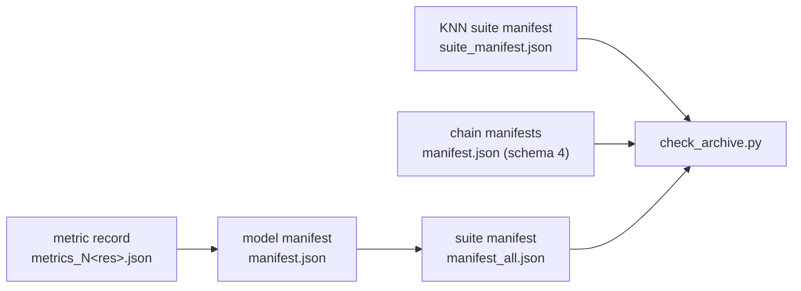

# Validation suites

This guide explains what the two validation suites prove about GameDev's dust models, how each test
works, and when it passes: the swarm suite tests the Lagrangian dust model ([Sections
3–9](#3-swarm-trajectories)) and the fluid suite the Eulerian dust model ([Sections
10–14](#10-fluid-transport)). The equations under test are derived in
[`guide_swarm.md`](guide_swarm.md), including the [collisions](guide_swarm.md#8-collisions)
and [neighbor search](guide_swarm.md#9-nearest-neighbor-search) behind [Sections
6–9](#6-swarm-collision-rates), and in [`guide_fluid.md`](guide_fluid.md), with the shared
disk model in [`guide_basis.md`](guide_basis.md); the commands that run the suites are in
[`val/README.md`](../val/README.md#running-part-of-the-suites). Project terms are defined in the
[glossary](README.md#glossary).

## Contents

**Both suites**

1. [At a glance](#1-at-a-glance)
2. [Shared conventions](#2-shared-conventions)

**Swarm suite**

3. [Swarm trajectories](#3-swarm-trajectories)
4. [Swarm diffusion](#4-swarm-diffusion)
5. [Swarm initialization](#5-swarm-initialization)
6. [Swarm collision rates](#6-swarm-collision-rates)
7. [Swarm neighbor search](#7-swarm-neighbor-search)
8. [Swarm collision chain](#8-swarm-collision-chain)
9. [Swarm coagulation campaigns](#9-swarm-coagulation-campaigns)

**Fluid suite**

10. [Fluid transport](#10-fluid-transport)
11. [Fluid diffusion](#11-fluid-diffusion)
12. [Fluid initialization](#12-fluid-initialization)
13. [Fluid drag and radiation](#13-fluid-drag-and-radiation)
14. [Fluid coupled composition](#14-fluid-coupled-composition)

**Both suites**

15. [Reading the archive](#15-reading-the-archive)
16. [Limits](#16-limits)

## 1. At a glance

### 1.1 What the suites prove

Each suite checks every part of its model against a reference that does not share its code: for the
swarm model a closed-form solution, a probability law, or a brute-force computation; for the fluid
model an exact characteristic solution, a decaying eigenmode, a closed-form response, or an exact
discrete solution. Every test runs the production kernels; only the physical setup is replaced by
test constants.

**Swarm suite.**

| Claim | Tests | Reference | Section |
|---|---|---|---|
| Particles follow exact orbits and drag paths | `test_orbit_*`, `test_drag_path_1d`, `test_prdrag_2d` | closed-form solutions | [3](#3-swarm-trajectories) |
| Diffusion reproduces the law of its stochastic equation | `test_diffusion_*` | mean and variance of the step | [4](#4-swarm-diffusion) |
| Initialization samples the intended mass distribution | `test_initial_3d` | exact CDFs and mass integrals | [5](#5-swarm-initialization) |
| Collision rates follow the published formulas in every regime | `test_colphys_*` | independent Python implementation | [6](#6-swarm-collision-rates) |
| Both neighbor searches return the exact nearest neighbors | `test_knn` | brute-force search | [7](#7-swarm-neighbor-search) |
| The collision chain conserves mass and is reproducible | `test_colchain_*` | invariants and repeated runs | [8](#8-swarm-collision-chain) |
| Coagulation matches the Smoluchowski equation | `val/paper/smoluchowski/` (separate campaign) | analytical solutions | [9](#9-swarm-coagulation-campaigns) |

The routine swarm suite consists of the 15 entries of `SWARM_GROUPS` in `val/val_config.py` (14
models plus the KNN matrix) and the four collision-chain models of `SWARM_CHAIN_MODELS`;
`val/run_all.py` runs both. The groups that `run_suite.py --group` accepts are `transport`
(trajectories), `diffusion`, `initialization`, `collision` (collision rates), `knn`, and `chain`.
CUDA and ROCm run the same model definitions under `val/swarm/mod/` and the same drivers and
validators under `val/swarm/src/`. The Smoluchowski campaigns are CUDA-only scientific runs and are
not part of the routine suite.

**Fluid suite.**

| Claim | Tests | Reference | Section |
|---|---|---|---|
| Transport converges on curvilinear grids and keeps periodic, open, and wall boundaries correct | `test_x_*transport*`, `test_y_transport_*`, `test_y_outflow_2d`, `test_z_*` transport cases | exact characteristic solutions | [10](#10-fluid-transport) |
| Crank–Nicolson diffusion converges, and positivity control keeps its discrete solution | `test_*_diffusion_*`, `test_diffusion_poslimit` | decaying eigenmodes, discrete amplification, invariants | [11](#11-fluid-diffusion) |
| The initialized disk balances polar transport against diffusion | `test_startup_3d` | converging residual of the two production operators | [12](#12-fluid-initialization) |
| Stiff drag follows its closed-form response | `test_source_drag` | closed form in 60-digit arithmetic | [13.1](#131-stiff-drag-response) |
| Optical depth is integrated correctly and attenuates the radiation force | `test_optdepth`, `test_attenuation_2d` | exact integral and same-grid reconstruction | [13.2](#132-optical-depth), [13.3](#133-attenuated-radiation) |
| The production operator composition preserves a known mode | `test_ring_all_2d` | rotating, diffusing Fourier mode | [14](#14-fluid-coupled-composition) |

The canonical fluid matrix is `FLUID_GROUPS` in `val/val_config.py`. It holds 19 models, which
expand to 22 cases because `test_diffusion_poslimit` adds three fixed-grid limiter variants. The
groups that `run_suite.py --group` accepts are `equilibrium` (initialization), `transport`,
`diffusion`, `source` (drag), `radiation`, and `coupled`. CUDA and ROCm build the same model
definitions under `val/fluid/mod/` with the same drivers and validators under `val/fluid/src/`. The
fluid line kernels have two implementations, one thread or one block per grid line (the
[sweep](README.md#glossary), `FLUID_SWEEP`); the matrix runs once for each sweep, `thread` and
`block`, and each sweep must pass on its own.

### 1.2 What passing means

**Swarm suite.** Each analytical validator writes one metric record per resolution with a `passed`
flag. `val/swarm/src/run_model.py` passes a model only if every record passes and, where the model
declares a convergence field, every $L_1$ error of that field is nonzero and the observed order
between the two finest resolutions reaches the declared minimum. A failing model makes the run exit
with an error. The shared validator (Poynting–Robertson drag, diffusion, and initialization) stops
at the first failing resolution; the orbit, drag-path, and collision-rate validators finish every
resolution first. The KNN and collision-chain drivers apply their own criteria and write manifests
instead of metric records.

A complete standard swarm campaign produces:

- 42 passing metric records (`EXPECTED_SWARM_METRICS`): four each for the nine resolution-swept
  models, two for `test_initial_3d`, and one each for the four fixed-input models;
- a passing KNN suite manifest;
- four passing collision-chain manifests.

**Fluid suite.** Each case writes one metric record per resolution, and
`val/fluid/src/run_model.py` passes the case only if its acceptance gate holds across those records.
There are two gates. The shared gate judges the cases without a model-local validator on density
(or optical depth) and the three conserved momentum components. The validator-owned gate applies to
cases whose model directory supplies `validate_case.py`: every record carries its own `passed` flag,
which includes an activation check proving that the tested boundary, limiter, or seam branch was
actually exercised, and the runner adds the declared order and sequence requirements.
[Acceptance gates](#25-fluid-acceptance-gates) gives both in full. A failing case makes its run exit
with an error, and `run_suite.py` stops at the first failing case.

A complete standard fluid campaign produces, for each sweep:

- 76 metric records (`EXPECTED_FLUID_METRICS`): four each for the 18 resolution-swept cases and one
  each for the four fixed-grid cases (the three limiter variants and `test_source_drag`);
- 22 passing model manifests, one per case;
- a passing suite manifest.

## 2. Shared conventions

### 2.1 Error measures

Both suites compare numerical results with their references through the error norms $L_1$, $L_2$,
and $L_\infty$ and an observed convergence order. The norms differ in their weights: each particle
counts equally in the swarm suite, and each cell counts by its volume in the fluid suite.

For two resolutions $N_a\lt N_b$, the observed order is

```math
p=\frac{\log(E_{N_a}/E_{N_b})}{\log(N_b/N_a)}.
```

The swarm suite computes it from the $L_1$ errors of successive factor-of-two refinements. With the
factor-of-two sequence, acceptance uses the order $p$ between the two finest grids.

**Swarm suite.** For a deterministic particle quantity $q_p$ with error
$e_p=q_p^{\rm num}-q_p^{\rm ref}$, the swarm validators report

```math
L_1=\frac{1}{N_P}\sum_p|e_p|,\qquad
L_2=\left(\frac{1}{N_P}\sum_pe_p^2\right)^{1/2},\qquad
L_\infty=\max_p|e_p|.
```

Angle differences are first wrapped into $[-\pi,\pi)$:

```math
\Delta\phi=\bigl[(\phi_{\rm num}-\phi_{\rm ref}+\pi)\bmod 2\pi\bigr]-\pi.
```

Stochastic results are judged statistically: diffusion by sampling limits on the mean and
variance, and initialization by probability-integral transforms and Kolmogorov–Smirnov (KS)
distances. CUDA and ROCm therefore need not produce the same random realization; each must satisfy
the same law.

Collision tests measure mass through the proxy

```math
M_{\rm rep}\propto\sum_p N_p s_p^3,
```

where $N_p$ is the number of physical grains a representative particle stands for and $s_p$ its
grain size. The constant material-density factor cancels in relative errors.

**Fluid suite.** For $e_i=q_i^{\rm num}-q_i^{\rm ref}$, the fluid validators report the
geometry-weighted norms

```math
L_1=\frac{\sum_i V_i|e_i|}{\sum_iV_i},\qquad
L_2=\left(\frac{\sum_iV_i e_i^2}{\sum_iV_i}\right)^{1/2},\qquad
L_\infty=\max_i|e_i|.
```

On the uniform line of the smooth positivity test the weights are equal. Velocity errors exclude
analytically empty cells: a cell enters only when both the analytical and the numerical density
exceed $10^{-12}$ times the largest analytical density, because dividing momentum by an arbitrarily
small density is not a meaningful velocity diagnostic.

An order requirement fails if any error of the sequence is zero, since no order can then be formed.

### 2.2 Swarm setup and resolution

**Default setup.** Unless a swarm test states otherwise, it uses

- radius $0.5\le R\le1.5$ and the full azimuth $-\pi\le\phi\lt\pi$;
- either the midplane or the polar range $0.35\le\theta\le\pi-0.35$;
- gas aspect ratio $0.05$ and midplane Stokes number $0.2$ at unit radius and grain size.

Each model's `const_defs.cuh` selects its `TEST_*` branch of `val/swarm/src/const_defs.cuh`, which
replaces the production physical setup with these test constants. The exception is `test_knn`, a
standalone Makefile suite without `flags.mk` or `const_defs.cuh`.

**Resolution.** The standard resolutions are $N=32,64,128,256$. What $N$ controls depends on the
test:

| Tests | $N$ is |
|---|---|
| trajectories | the number of timesteps over a fixed interval |
| diffusion | the sample size, $N_P=16N^2$ particles |
| `test_initial_3d` | the number of polar cells; only $N=32$ and $256$ are run |
| `test_prdrag_2d`, `test_colphys_*` | not used; one fixed build, since these tests vary a parameter, not a resolution |
| `test_knn`, `test_colchain_*` | not used |

### 2.3 Fluid setup and resolution

**Default setup.** Unless a fluid test states otherwise, it uses

- radius $0.5\le R\le2.5$ on a logarithmic grid and the full azimuth $0\le\phi\lt2\pi$;
- either the midplane, represented by one polar cell, or the polar range $0.35\le\theta\le\pi-0.35$;
- unit $G$, $M_\star$, and $R_0$, gas aspect ratio $0.5$, and Stokes number $0.1$ at unit radius.

Every build defines `DUST_REPR := fluid`. Each model's `const_defs.cuh` defines its `VERIFY_*`
selector and includes `val/fluid/src/const_defs.cuh`, which replaces the production header,
including its grid checks, with test constants. The test header accepts a single radial cell
($N_y\ge1$), a polar range starting at the pole ($\theta_{\min}\ge0$), and a CFL number in
$(0,0.5]$, with default 0.5. Most models compile the shared driver
`val/fluid/src/verification_main.cu`; the initialization, wedge, and polar-boundary tests use
`startup_main.cuh`, `wedge_periodic_main.cuh`, and `polar_boundary_main.cuh` from the same
directory, and `test_diffusion_poslimit` and `test_attenuation_2d` carry their own
`verification_main.cuh`.

`DIFFUSION` appears in several transport builds only because every model with $N_z\gt1$ requires
it; those drivers advance transport alone.

**Resolution.** The fluid suite uses the same standard resolutions, $N=32,64,128,256$. An
isolated-operator test refines only the direction under test. Four cells in an inactive direction
expose indexing mistakes without making every convergence run expensive; a single polar cell
denotes the two-dimensional midplane model.

| Tests | Grid $N_x\times N_y\times N_z$ | $N$ is |
|---|---|---|
| `test_x_transport_2d`, `test_x_wedge_transport_2d`, `test_x_diffusion_2d`, `test_x_wedge_diffusion_2d` | $N\times4\times1$ | the number of azimuthal cells |
| `test_y_transport_cyl`, `test_y_outflow_2d`, `test_y_diffusion_cyl`, `test_optdepth`, `test_attenuation_2d` | $4\times N\times1$ | the number of radial cells |
| `test_y_transport_sph`, `test_y_diffusion_sph` | $4\times N\times4$ | the number of radial cells |
| `test_z_transport_3d`, `test_z_outflow_3d`, `test_z_reflect_3d`, `test_z_diffusion_3d` | $4\times4\times N$ | the number of polar cells |
| `test_startup_3d` | $4\times N\times N$ | the number of radial and polar cells |
| `test_ring_all_2d` | $N\times N\times1$ | the number of azimuthal and radial cells |
| `test_diffusion_poslimit`, smooth branch | $N\times1\times1$ | the number of azimuthal cells |
| `test_diffusion_poslimit`, limiter variants | $8\times1\times1$, $4\times8\times1$, $4\times4\times8$ | not used; one fixed eight-cell line (`--res 8`) |
| `test_source_drag` | $8\times1\times1$ | not used; the eight cells index a parameter (`--res 8`) |

### 2.4 Fluid finite-volume reference

The fluid solver stores cell averages. The fluid validators therefore compare a numerical cell
average $q_i^{\rm num}$ with an analytical cell average

```math
q_i^{\rm ref}=\frac{1}{V_i}\int_{V_i}q(\boldsymbol{x},t)\,dV,
```

not with a point sample at the cell center. The volume $V_i$ is the exact measure of the tested
coordinate system, and the integrals use 16-point (shared validator) or 32-point (model-local
validators) Gauss–Legendre quadrature per cell. The distinction matters on logarithmic radial and
spherical-polar grids. The analytical parameters are written into the validators rather than read
from the simulation output, so an incorrect run cannot redefine its own expected answer.

### 2.5 Fluid acceptance gates

The **shared gate** applies to the eleven models without a model-local validator:
`test_x_transport_2d`, `test_y_transport_cyl`, `test_y_transport_sph`, `test_z_transport_3d`,
`test_x_diffusion_2d`, `test_y_diffusion_cyl`, `test_y_diffusion_sph`, `test_z_diffusion_3d`,
`test_source_drag`, `test_optdepth`, and `test_ring_all_2d`. It requires

- every archived error value and mass change to be finite;
- a relative change of the total mass of at most $10^{-8}$, for cases that report it (all but
  `test_optdepth`);
- a finest-grid $L_1$ error of the primary field (density, or optical depth for `test_optdepth`) of
  at most $2\times10^{-2}$;
- a final observed order of that error of at least 1.5 (0.75 when fewer than four resolutions are
  run);
- the same two conditions for each conserved momentum component `momx`, `momy`, and `momz`, except
  that a component whose finest $L_1$ error is at most $10^{-12}$ is the roundoff of an exactly
  vanishing solution and needs no observed order.

`test_source_drag` replaces the accuracy, order, and momentum conditions by a maximum error of at
most $10^{-12}$ over every compared field. The velocity errors, and the optical depth of
`test_ring_all_2d`, are archived with each record and enter only the finiteness check.

The runner also contains an exact-solution rule, every judged $L_1$ error at most $10^{-10}$ and no
order, for `test_x_transport_2d` with an integer `--shift` and `test_optdepth` with `--power 0`. The
canonical arguments 3.25 and −1.0 do not trigger it.

The **validator-owned gate** applies to the eight models whose directory supplies
`validate_case.py`: `test_startup_3d`, `test_x_wedge_transport_2d`, `test_y_outflow_2d`,
`test_z_outflow_3d`, `test_z_reflect_3d`, `test_x_wedge_diffusion_2d`, `test_diffusion_poslimit`,
and `test_attenuation_2d`. Each metric record carries its own `passed` flag, which combines an
[activation check](README.md#glossary) with case-specific tolerances. The runner additionally
requires

- every archived error value to be finite;
- every record to pass;
- every $L_1$ error of the declared convergence field to be nonzero, with a final observed order of
  at least the declared minimum;
- every declared sequence requirement to hold: a limit on the finest-grid error, a minimum final
  order, or strictly monotonic improvement with resolution.

The tolerances of both gates are listed with each fluid test in
[Sections 10–14](#10-fluid-transport). Open-boundary tests compare the mass remaining in the domain
with the exact remaining mass; they do not demand mass conservation.

## 3. Swarm trajectories

These tests check that particles move along exactly known paths. The orbit and drag-path tests call
the production transport stages `_ssa_advance`
([`guide_swarm.md`](guide_swarm.md#51-staggered-update)) and change only the forcing: the
orbits set the drag to zero, and the drag path prescribes the stopping time, the gas velocity, and a
constant radial force. Comparing the full stored state, position and velocity together, catches
compensating errors that a comparison of radius alone would miss.

### 3.1 Eccentric Kepler orbit

**Test.** `test_orbit_ecc_2d` evolves particles on eccentric planar orbits without drag.

**Reference.** The validator advances the mean anomaly, solves Kepler's equation, and reconstructs
the position:

```math
M(t)=M_0+nt,\qquad n=\sqrt{\frac{GM}{a^3}},\qquad M=E-e\sin E,
```

```math
R=a(1-e\cos E),\qquad
\phi=\mathrm{atan2}\!\left(\sqrt{1-e^2}\sin E,\cos E-e\right).
```

It also records the errors of the specific energy and the specific angular momentum,

```math
\mathcal{E}=\frac{v_R^2+v_\phi^2}{2}-\frac{GM}{R}=-\frac{GM}{2a},
\qquad
\ell=\sqrt{GMa(1-e^2)}.
```

**Passes if** the zero-drag specialization is active, the state is finite, the maximum state error
is below $2\times10^{-2}$, and the final observed order of the state $L_1$ error is at least 1.8.

### 3.2 Radiation-pressure orbit

**Test.** `test_orbit_beta_2d` repeats the Kepler comparison with radiation pressure, which reduces
the effective gravity to

```math
GM_{\rm eff}=GM(1-\beta),
```

for two grain sizes with different $\beta$, at zero optical depth and full radiation strength. It
shows that radiation changes the orbital frequency and the conserved quantities consistently.

**Passes if** the criteria of the eccentric orbit hold and two distinct values $0\lt\beta\lt1$
are active.

### 3.3 Inclined three-dimensional orbit

**Test.** `test_orbit_inc_3d` rotates an eccentric Kepler ellipse by known periapsis, inclination,
and node angles and converts the exact Cartesian orbit into the code's spherical positions and
velocities. It exercises radial, azimuthal, and polar transport at once. The build is a full 3D
model with zero diffusivity; the orbital energy error is recorded.

**Passes if** the zero-drag, zero-diffusivity, and transport-only specializations are active, the
state is finite, the maximum state error is below $3\times10^{-2}$, and the final state order is at
least 1.8.

### 3.4 Drag path

**Test.** `test_drag_path_1d` checks the exponential drag response
([`guide_swarm.md`](guide_swarm.md#61-drag-and-gravity)). It follows three particles with
constant stopping times
$t_s=0.02$, $0.2$, and $2$ in a constant gas velocity $v_g$ under a constant radial force $F$, up to
$t=1$.

**Reference.** With terminal speed $v_\infty=v_g+Ft_s$, the exact velocity and radial path are

```math
v(t)=v_\infty+(v_0-v_\infty)e^{-t/t_s},
\qquad
R(t)=R_0+v_\infty t+(v_0-v_\infty)t_s\left(1-e^{-t/t_s}\right).
```

The azimuthal and polar variables, inactive in this radial-only model, must keep their fixed
values.

**Passes if** the constant-drag specialization is active, the state is finite, the maximum
position error is below $10^{-2}$, the velocity error below $2\times10^{-12}$, the
inactive-variable error below $2\times10^{-14}$, and the final position order at least 1.8.

### 3.5 Poynting–Robertson drag

**Test.** `test_prdrag_2d` checks the combined radiation and drag response of eight grain sizes
over one step $\Delta t=0.1$
([`guide_swarm.md`](guide_swarm.md#63-poyntingrobertson-drag)).

**Reference.** To first order in $v/c$, Poynting–Robertson drag adds to the radial radiation
pressure the acceleration

```math
\boldsymbol{a}_{\rm PR}
=-\beta\frac{GM}{cR^2}
\left(2v_R\,\hat{\boldsymbol{R}}+\boldsymbol{v}_{\perp}\right),
```

where $\boldsymbol{v}_\perp$ is the velocity perpendicular to $\hat{\boldsymbol{R}}$. It damps the
tangential velocity at the rate $\gamma=\beta GM/(cR^2)$ and the radial velocity at $2\gamma$. The
reference applies the exact linear relaxation factors over the step and compares the angular
momentum, the radial velocity, and the time-centered position update.

**Passes if** the maximum response error is below $2\times10^{-13}$.

## 4. Swarm diffusion

These tests check that one production diffusion step draws displacements from the right
distribution. The update represents the Itô process

```math
dX=A(X)\,dt+\sqrt{2D(X)}\,dW,
```

where the drift $A$ contains the diffusivity-gradient and coordinate terms. Each test applies one
production `diffusion_pos` Euler–Maruyama step
([`guide_swarm.md`](guide_swarm.md#72-eulermaruyama-step)) from prescribed positions. With
$D=\nu/(1+{\rm St}^2)$ at the starting position, the displacement variance is

```math
\mathrm{Var}(\Delta X)=2D\Delta t.
```

### 4.1 Point-source diffusion

**Test.** `test_diffusion_1d`, `test_diffusion_2d`, and `test_diffusion_3d` start every particle at
$R=1$ on the midplane, with $\nu=2\times10^{-2}$ (`CONST_NU`) and $\Delta t=0.02$. They activate
radial, azimuthal, and combined cylindrical radial and vertical diffusion, respectively. In the
radial cases the expected mean includes both the cylindrical $D/R$ drift and the drift from the
Stokes-dependent diffusivity gradient.

**Passes if**, for each sampled component (radius, azimuth, or radius and height),

```math
|\bar X-\mu|\le 6\sqrt{\frac{2D\Delta t}{N_P}}
\qquad\text{and}\qquad
|s_X^2-2D\Delta t|\le 6(2D\Delta t)\sqrt{\frac{2}{N_P-1}},
```

and the particle velocities are unchanged to $2\times10^{-12}$.

### 4.2 Diffusion across a periodic wedge

**Test.** `test_diffusion_wedge_2d` and `test_diffusion_wedge_3d` place matched populations
$0.005$ inside both faces of the periodic wedge $-0.1\le\phi\lt0.1$ and take one step with
$\Delta t=0.002$. The 3D population starts one gas scale height above the midplane with nonzero
polar velocity, which exercises the full spherical basis transformation.

**Reference.** A particle that crosses a wedge face reappears at the opposite face, and its velocity
vector must be rotated with it ([`guide_swarm.md`](guide_swarm.md#74-velocity-reprojection)).
For each displacement the validator reconstructs the unique unwrapped endpoint $x_u$ with

```math
|x_u-x_0|\lt\frac{\Delta\phi_w}{2},
```

and independently projects the unchanged initial Cartesian velocity at $x_u$. If a particle moves
so far that the number of wraps is ambiguous, the test fails instead of guessing.

**Passes if** crossings occur in both directions, every stored velocity component matches the
reference to $2\times10^{-12}$, and the azimuthal displacements meet the mean and variance limits of
[Section 4.1](#41-point-source-diffusion), with the variance averaged over the initial Stokes
numbers.

## 5. Swarm initialization

**Test.** `test_initial_3d` checks the initializer used when a vertically settled dust layer is cut
off by the radial and polar domain boundaries. It calls the production host initializer for
65 536 particles in the thin polar range $\vert\theta-\pi/2\vert\le0.01$, in three equal
populations at the grain sizes $s_{\min}$, $\sqrt{s_{\min}s_{\max}}$, and $s_{\max}$.

**Reference.** For grain size $s$, the radial distribution of mass inside the domain
([`guide_swarm.md`](guide_swarm.md#33-dust-mass-in-the-domain)) is

```math
\frac{dI}{dR}
=\Delta\phi\,R\Sigma_{d,\rm conv}(R)
\sum_k\left[
\Phi\!\left(\frac{Z_{k,+}}{H_d(R,s)}\right)
-\Phi\!\left(\frac{Z_{k,-}}{H_d(R,s)}\right)
\right],
\qquad
I(s)=\int \frac{dI}{dR}\,dR,
```

where $\Sigma_{d,\rm conv}$ is the dust surface density after the Gaussian [edge
taper](guide_basis.md#62-edge-taper), which the validator rebuilds independently, $\Phi$ is the
standard normal CDF, and the sum runs over the one or two allowed vertical intervals. The sampler
draws $R$ from the normalized radial CDF and then $Z$ from the matching truncated Gaussian
([`guide_swarm.md`](guide_swarm.md#35-spatial-sampling)). It sets the number of grains each
particle represents so that

```math
\sum_p N_p\,m(s_p)=M_{d,\Omega},
```

the dust mass inside the domain integrated over the size distribution. The validator independently
rebuilds the 128-entry mass table (the "mass bank"), interpolates it logarithmically for the middle
size, and checks the represented mass. It then maps each sampled radius and height through its exact
CDF; for a correct sampler the results are uniform.

**Passes if**

- the output is finite, each population has its expected grain size, and every particle lies inside
  the domain;
- the mass-bank entries are finite and agree to $2\times10^{-12}$ relative error, and the mass
  normalization and represented mass to $5\times10^{-12}$;
- the radial and vertical KS distances of each population are below $6/\sqrt{N_{\rm population}}$;
- the $N=32$ and $N=256$ builds produce identical samples, mass banks, and mass summaries,
  because the sampler does not depend on the polar cells. `mod/test_initial_3d/run.py` records this
  as `polar_resolution_independent`.

## 6. Swarm collision rates

These tests evaluate the production collision-rate code (`COAG_KERNEL = 3`) at fixed inputs and
compare it with an independent Python implementation. They are kept because the published
rate prescription is piecewise, and an error in one regime would be hard to spot in an end-to-end
size distribution.

**Test.** `test_colphys_code`, `test_colphys_cgs`, and `test_colphys_3d` use two particles with
grain sizes $0.5$ and $1.75$ that represent $3$ and $7$ grains. The code-unit models
(`test_colphys_code`, `test_colphys_3d`) prescribe the Reynolds number and have no Brownian motion.
`test_colphys_cgs` omits `CODE_UNIT`, so it also compiles the molecular Reynolds-number closure and
Brownian motion.

### 6.1 Rates under test

The relative speed of a pair
([`guide_swarm.md`](guide_swarm.md#843-relative-velocities)) combines three contributions,

```math
\Delta v_{ij}=
\sqrt{\Delta v_{\rm drift}^2+\Delta v_{\rm turb}^2+\Delta v_{\rm Brown}^2},
```

where the drift term combines the differential radial, azimuthal, and capped settling speeds of the
two grain sizes at the owner's position. The owner is the particle whose collision rate is being
computed; its partners are its retained nearest neighbors $\mathcal N_i$.

Each partner contributes a pair term
([`guide_swarm.md`](guide_swarm.md#841-collision-kernels)), and the owner's total rate
divides their sum by the area or volume that its neighbors occupy (the
[KNN measure](guide_swarm.md#842-knn-measure)). With cross section
$\sigma_{ij}=\frac{\pi}{4}(s_i+s_j)^2$ and $h_i$ the distance to the farthest retained neighbor:

| Model | Pair term | Total rate |
|---|---|---|
| vertically integrated (2D) | $q_{ij}=N_j\sigma_{ij}\Delta v_{ij}\left[2\pi(H_{g,i}^2+H_{g,j}^2)\right]^{-1/2}$ | $\Gamma_i=\dfrac{1}{\pi h_i^2}\sum_{j\in\mathcal N_i}q_{ij}$ |
| volumetric (3D) | $q_{ij}=N_j\sigma_{ij}\Delta v_{ij}$ | $\Gamma_i=\dfrac{3}{4\pi h_i^3}\sum_{j\in\mathcal N_i}q_{ij}$ |

$H_{g,i}$ and $H_{g,j}$ are the gas scale heights at the two particles' cylindrical radii; both
test particles sit at $R=1$, so the two heights are equal here.

### 6.2 Regime coverage

The turbulent relative velocity of Ormel & Cuzzi has six regimes separated by five boundaries. The
tests place one point inside each regime and two points just below and above each boundary, at a
relative offset of $10^{-6}$. All three models also check the drift speed and the complete rate of
the custom kernel. `test_colphys_cgs`, the only model with Brownian motion, additionally checks the
Brownian speed and its sound-speed cap; its pair lies on the midplane. The 3D reference evaluates
the gas stratification, Stokes numbers, and turbulent velocity at the actual position above the
midplane instead of reusing the midplane formulas.

### 6.3 Periodic images

In a periodic wedge a neighbor can be the rotated copy (image) of a particle across the wedge seam
([`guide_swarm.md`](guide_swarm.md#95-periodic-images)). The search returns such a neighbor
as the image code

```math
c=3j+a,
```

which encodes the physical particle index $j$ and the image $a$. The planar and 3D tests place the
same pair once inside the wedge $-0.5\le\phi\lt0.5$ and once across its seam. Because the rate is
evaluated at the owner's position, the seam pair, the interior pair, and the seam pair with a
deliberately wrong image must give the same relative speed to $2\times10^{-11}$. The image code and
its decoded index and image must still be exact, because they determine which neighbor is selected
and at what distance.

### 6.4 From search to collision rate

The last check runs the production chain from neighbor search to collision rate, without inserting
image codes by hand. It places the two particles across the seam and then launches, in order:

1. `col_site_init`, the collision-site initialization;
2. the KD-tree or Morton index build;
3. `col_cache_get`, the neighbor query, with $K=2$;
4. in `test_colphys_cgs` only, `col_env_cache`, which caches each owner's gas environment;
5. `col_bath_rate`, the rate kernel of the collision chain ([Section
   8](#8-swarm-collision-chain)), on both owners.

At these grain sizes a sticking event absorbs a single projectile (a sticking packet of size one),
so each owner's starting rate (result entries 30 and 31) must equal $\Gamma_i$ over its two cached
neighbors: itself and the image of its partner.

The driver aborts if the Morton traversal overflows its stack or a particle is flagged invalid.
Each model is built and validated with both searches and writes one record that passes only if both
searches pass.

**Passes if**, for both searches,

- every activation check holds: six regimes, five straddled boundaries, the Brownian cap in the
  physical-unit model, image invariance and interior equivalence, exact image codes, the expected
  cached images, and positive measures;
- all results are finite and every physical value agrees to a relative error below
  $2\times10^{-11}$, including the cached starting rates against independent pair terms divided by
  the returned measure;
- the returned KNN area or volume agrees with an independent reconstruction to a relative error
  below $2\times10^{-4}$. This looser bound reflects the single-precision coordinates of the search;
  it does not apply to the collision formulas.

## 7. Swarm neighbor search

`test_knn` checks that both collision searches, the KD tree and the Morton index
([`guide_swarm.md`](guide_swarm.md#9-nearest-neighbor-search)), return exactly the same
neighbors as a brute-force search, with $K=200$ and $10^5$ particles. It tests correctness;
timing is recorded for information only.

The reference sorts candidates by the squared distance the collision model uses,

```math
d_{ij}^2=|\boldsymbol{x}_i-\boldsymbol{x}_j|^2,
```

after applying the periodic minimum image or the wedge ghosts, and compares the neighbor identities
and the $`K`$th-neighbor radius. The 48 checks are:

| Group | Count | Configurations (each in 2D and 3D unless noted) |
|---|---|---|
| ordinary | 7 | smooth, ring, and clumped distributions, plus a 1D radial line |
| wedge | 12 | smooth, ring, interior-clump, and seam-clump distributions, and seam-centered clumps in a narrow ($0.2$ rad) and a nearly full ($2\pi-0.1$ rad) wedge |
| periodic | 14 | lower and upper seams, interior queries, a narrow wedge, a full $2\pi$ disk, and two period-limit configurations |
| edge | 15 | distance ties, duplicate points, queries on the search-radius boundary, sparse leaves, split-plane configurations, and inactive-particle filtering, plus a radial line and KD-tree-specific inactive-filter checks |

**Wedges.** The two searches represent a restricted wedge differently: the KD tree stores both
neighboring periodic images of every particle, whereas the Morton index creates a ghost only when
a particle's search ball reaches the seam. Each search is therefore compared with the exact
candidate set of its own representation, and the two may legitimately differ. For every selected
wedge neighbor, the test also rotates the decoded physical particle by the returned image and
requires the result to reproduce the stored search distance. In the nearly full wedge, the first
query must produce such a legitimate difference; it is a fixed, radially isolated case constructed
to do so, so this does not depend on the random sample. The run also fails if the two searches
disagree on whether periodic images need deduplication. Besides a fixed brute-force prefix of
queries, every query on which the two searches disagree is checked against both references, so no
disagreement escapes checking.

**Passes if** every labeled check and every matrix case passes.

[Section 6.4](#64-from-search-to-collision-rate) then covers the step from search result to
collision rate.

### 7.1 Optional topology check

The optional `test_knn` Make target `topology` builds a program that compares the production Morton
hierarchy with an independent serial implementation in 36 cases: 2D and 3D, leaf targets 1 and 128,
depths 1, 5, and 20, mixed random, coincident, and boundary points, all-coincident inputs, and
single-node trees, with the index rebuilt for every case. It checks the point ordering, every node
range and bound, the child links, the leaf statistics, and the empty-index state, allowing different
node numbering. The target only compiles the program; no script runs it. It is not one of the 48
checks and does not replace them.

## 8. Swarm collision chain

These tests run the complete production collision integrator and check that it conserves mass and
reproduces its own results exactly.

**How the integrator works.** The controller divides each collision interval into frozen
[baths](README.md#glossary), during which particle positions and neighbor lists are fixed while an
event chain updates grain sizes and numbers
([`guide_swarm.md`](guide_swarm.md#86-frozen-bath-event-chain)). Spatial groups of particles
whose baths fall due together are advanced in one [refresh wave](README.md#glossary). After each
interval an audit flags baths that changed the particles more than intended (an
[overshoot](README.md#glossary)) and adjusts later refreshes without rejecting or replaying the
random path ([`guide_swarm.md`](guide_swarm.md#87-bath-controller)). An [event
cap](README.md#glossary) limits the events per kernel launch, and an owner that reaches it continues
in a further launch.

**Test.** The four `test_colchain_*` models compile `src/swarm/swarm_runtime.cu` with validation
constants and `COL_DIAGNOSTICS`, and run collisions only, without transport, for one output
interval. Each evolves 2048 representative particles with $K=200$ neighbors and 256 threads per
owner chain, in code units (`CODE_UNIT`), with `COL_BATH_EPS = 0.06`, `COL_BATH_MAX = 0.05`, and
`COL_BATH_ALPHA = 1e-3`.

| Model | Geometry | Kernel | Output interval | Variants |
|---|---|---|---|---|
| `test_colchain_2d` | planar disk, $32\times32$ | normalized synthetic (`COAG_KERNEL = 0`) | $10^{-3}$ | KD tree and Morton, event caps 1 and 32 |
| `test_colchain_frag_2d` | planar disk, $32\times32$ | physical (`COAG_KERNEL = 3`), `V_FRAG = 0` | $1$ | KD tree and Morton, event cap 32 |
| `test_colchain_wedge_2d` | periodic wedge $-0.1\le\phi\lt0.1$, $32\times32$ | physical (`COAG_KERNEL = 3`) | $1$ | KD tree and Morton, event cap 32 |
| `test_colchain_3d` | spherical, $8\times16\times8$ | normalized synthetic (`COAG_KERNEL = 0`) | $10^{-2}$ | KD tree and Morton, event cap 32 |

Each model targets one path: the zero fragmentation threshold forces fragmentation, the narrow wedge
forces periodic images to be deduplicated, the 3D model uses the volume-density rates, and event
cap 1 forces the continuation path. Every variant is built once from clean objects and run twice,
each time into an emptied output directory.

**The first run of each variant passes if** `val/swarm/src/run_chain.py` finds:

- 2048 particle records (required of both runs) with finite state and positive size and number;
- at least one changed particle and, in the fragmentation model, at least one shrunken particle;
- a relative represented-mass error of at most $2\times10^{-12}$;
- run information in `variables.txt` that matches the selected search, event cap, and
  `COAG_KERNEL`, and records the path-integrated controller audit
  (`COL_CONTROLLER_AUDIT = path_integrated`);
- a complete bath archive (controller schema 2): positive bath, operator, and wave counts, one
  record per bath, finite controller extrema, and, for every bath record, positive operator and bath
  indices, a positive number of merged size bins, a nonnegative group, a positive duration, finite
  nonnegative diagnostics, and limit scales in $[0.25,1]$;
- no bath record with a persistent overshoot;
- at least one chain launch at event cap 32, and more chain launches than refresh waves at event
  cap 1. A refresh wave may launch no chain when a quick screen shows that none of its owners
  collides in the interval.

**The second run must reproduce the first:**

- identical final particle and random-number-state hashes;
- matching controller histories: the same keys, identical non-numeric values, and every number equal
  to a relative and absolute tolerance of $10^{-12}$.

**Across variants**, it requires:

- byte-identical initial particles for all variants of a model;
- identical results (particle and random-number-state hashes) at event caps 1 and 32 with the same
  search.

These tests establish conservation, exact continuation, coverage of both searches, and the
integrity of the production path. They do not show that a physical coagulation history has
converged; see [`guide_swarm.md`](guide_swarm.md#112-finite-bath-convergence)
and [Limits](#16-limits).

## 9. Swarm coagulation campaigns

The campaigns under [`val/paper/smoluchowski/`](../val/paper/smoluchowski/README.md) compare
coagulation with analytical solutions of the Smoluchowski equation. They run on CUDA with the KD
tree, outside the routine swarm suite: they are not registered with `val/run_all.py` and do not
enter the archive counts.

| Campaign | Kernel | Initial state | Output times |
|---|---|---|---|
| `const` | constant | unit monomers | up to $10^8$ |
| `linear` | additive | equal-mass representatives sampled from a gamma mass distribution of shape two and scale one, i.e. an exponential number distribution | $t=0,1,2,3,4$ |
| `product` | multiplicative | unit monomers | up to $t=0.9$, before gelation at $t=1$ |

The kernels are normalized and depend on grain mass. A grain material density of
$6/\pi$ makes the production mass formula $m=s^3$. Each campaign uses $10^6$ representatives, ten
seeds, and all 25 combinations of `N_K = 16, 32, 64, 128, 256` and
`COL_BATH_EPS = 0.01, 0.02, 0.04, 0.08, 0.16`: 750 planned runs, not 750 completed or validated
runs.

The campaigns compile the production runtime, collision controller, cached rates, and event
updates. Local overrides supply the normalization, seeded initialization, unit-volume neighbor
measures, and scoring. Positions are fixed, so the neighbor geometry is reused. The product
campaign also reshuffles the cached partners at every refresh and uses a single controller group;
its well-mixed evolution does not show that a small fixed neighbor set is enough for the physical
collision problem.

The scorers record mass-weighted distributions, CDF and histogram distances, the log-mass
Wasserstein distance, and moment errors, without a formal pass threshold. Judge the dependence on
neighbor count and refresh tolerance separately from the scatter between seeds; a small controller
tolerance does not bound the histogram error. Commands and output layout are in the campaign
READMEs.

## 10. Fluid transport

These tests check the directional advection operators: PPM reconstruction, the pressureless HLL
flux, FARGO azimuthal transport, and the SSPRK radial and polar steps
([`guide_fluid.md`](guide_fluid.md#51-directional-finite-volume-update)). Each reduces the
continuity equation to

```math
\frac{\partial\rho_d}{\partial t}+\nabla\!\cdot(\rho_d\boldsymbol{v})=0
```

with a velocity field that gives an exact characteristic solution, and advances only the production
advection operator under test. The momentum components are initialized as fixed multiples of density
(zero in some cases), so their exact values follow from the exact density and show that momentum is
carried consistently with mass.

### 10.1 Periodic azimuthal transport

**Test.** `test_x_transport_2d` (suite argument `--shift 3.25`, no feature flags) advects the smooth
Fourier mode $`\rho_d=1+0.1\,\overline{\sin2\phi}`$, where the overbar denotes the cell average,
with specific angular momentum $R^2$, that is, unit angular speed $\Omega$. Each step moves the
profile by a prescribed noninteger FARGO shift of 3.25 cells, until one full orbit $t=2\pi$; the
last step is shortened to end there. The case tests the FARGO integer shift, residual transport, PPM
reconstruction ([`guide_fluid.md`](guide_fluid.md#55-fargo-azimuthal-transport)), momentum
transport, and the periodic seam in one calculation.

**Reference.** For constant angular speed,

```math
\rho_d(\phi,t)=\rho_d(\phi-\Omega t,0),
```

and the validator integrates the shifted mode over every finite-volume cell.

**Passes if** the shared gate holds: density and each momentum component reach a finest $L_1$ error
of at most $2\times10^{-2}$ with final order at least 1.5 (roundoff components exempt from the
order), and the mass changes by at most $10^{-8}$.

**Test.** `test_x_wedge_transport_2d` (no feature flags) repeats the problem on the periodic wedge
$-0.4\le\phi\lt0.8$. A compact pulse of amplitude 0.5 on a unit background, supported on
$0.45\le\phi\le0.75$, moves at angular speed 0.25 until $t=1$, so its support must cross the outer
seam and reappear at the inner face. Each step moves the pulse by $10/3$ cells, so the standard
grids take 2, 4, 8, and 16 equal steps. The case is kept separately because a wedge seam changes the
periodic image geometry.

**Reference.** The validator wraps the translated pulse into the wedge and forms 32-point cell
averages; the exact momenta are $\rho_dR^2\cdot0.25$, $0.10\rho_d$, and $-0.05\rho_d$.

**Passes if**

- activation holds: the pulse support starts inside the wedge and ends beyond the outer seam, and
  the wrapped part exceeds $0.05$ above the background;
- the state is finite, the density is at least $-2\times10^{-13}$, and the relative mass change is
  at most $2\times10^{-11}$;
- the density $L_1$ error is at most $5\times10^{-3}$, with final order at least 0.75 and monotonic
  improvement;
- the density $L_\infty$ error is at most $6\times10^{-2}$, with monotonic improvement;
- the $L_1$ error of the momentum vector (the magnitude of the three-component error) is at most
  $5\times10^{-3}$, with final order at least 0.75 and monotonic improvement.

### 10.2 Radial transport and outflow

**Test.** `test_y_transport_cyl` (no feature flags) and `test_y_transport_sph` (`DIFFUSION`,
`CONST_NU`) both run with `--cfl 0.05` and test the radial metric term with a ballistic homologous
expansion. Every parcel keeps its initial radial speed $aR_0$ with $a=0.2$, so $R=\lambda R_0$ with
$\lambda=1+at$. The initial profile is a smooth compact bump on $1.0\le R\le1.8$, advanced to
$t=0.25$ with the production CFL timestep at CFL number 0.05 and SSPRK integration
([`guide_fluid.md`](guide_fluid.md#56-radial-and-polar-time-integration)).

**Reference.** In effective radial dimension $d$ (2 for the cylindrical midplane, 3 for the
spherical shell),

```math
\rho_d(R,t)=\lambda^{-d}\rho_d(R/\lambda,0),\qquad
v_R(R,t)=\frac{aR}{\lambda}.
```

The validator integrates density and radial momentum with the exact cylindrical or spherical shell
measures, so these cases test more than Cartesian advection on a relabeled coordinate.

**Passes if** the shared gate holds, as in [Section 10.1](#101-periodic-azimuthal-transport).

**Test.** `test_y_outflow_2d` (no feature flags, default CFL number 0.5) lets part of a compact
profile on $1.7\le R\le2.5$ leave through the outer radial boundary at constant outward speed
$u=0.2$ until $t=1$.

**Reference.** For constant speed in effective radial dimension $d$,

```math
R_0=R-ut,\qquad
\rho_d(R,t)=\rho_d(R_0,0)\left(\frac{R_0}{R}\right)^{d-1}.
```

Gaussian quadrature builds exact cell averages of this solution. The validator also compares the
exact remaining mass

```math
M_{\rm remain}(t)=\int_{\Omega} \rho_d(R,t)\,dV
```

with the numerical mass in the domain, relative to the initial mass. This validates radial outflow
directly rather than checking a zero-flux boundary.

**Passes if**

- activation holds: the run ends at $t=1$ and the exact escaped fraction exceeds 5 percent;
- the density is finite and at least $-2\times10^{-13}$, the radial momentum equals $u\rho_d$ to
  $2\times10^{-11}$, and the transverse momenta stay below $2\times10^{-13}$;
- the density $L_1$ error is at most $2\times10^{-3}$ and the $L_\infty$ error at most
  $3\times10^{-2}$, both improving monotonically, with final density order at least 0.75;
- the relative remaining-mass error is at most $5\times10^{-3}$, with final order at least 0.75 and
  monotonic improvement.

### 10.3 Polar transport, outflow, and the midplane wall

**Test.** `test_z_transport_3d` (`DIFFUSION`, `CONST_NU`, `--cfl 0.05`) transports a smooth polar
profile under the spherical-polar conservation law

```math
\frac{\partial\rho_d}{\partial t}
+\frac{1}{r\sin\theta}\frac{\partial}{\partial\theta}
 \left(\sin\theta\,\rho_d v_\theta\right)=0.
```

The initial profile is a compact bump in $\rho_d\sin\theta$ on $0.80\le\theta\le1.30$ with constant
angular rate $\omega=v_\theta/r=0.15$, advanced to $t=0.3$ with the production CFL timestep at CFL
number 0.05. The polar momentum of each radial shell is chosen so that the exact integrated
face-area-to-volume factor gives the same angular rate in every shell.

**Reference.** The polar line density $\rho_d\sin\theta$ is translated rigidly, so

```math
\rho_d(\theta,t)=\rho_d(\theta-\omega t,0)\,\frac{\sin(\theta-\omega t)}{\sin\theta},
```

integrated with the $\sin\theta$ cell measure.

**Passes if** the shared gate holds, as in [Section 10.1](#101-periodic-azimuthal-transport).

**Test.** `test_z_outflow_3d` (`DIFFUSION`, `CONST_NU`) translates a compact profile on
$2.45\le\theta\le2.75$ at angular rate 0.15 across the outer polar face $\theta=\pi-0.35$ until
$t=1$. The production kernel lets flux leave through that face and suppresses inflow
([`guide_fluid.md`](guide_fluid.md#83-boundary-conditions)).

**Test.** `test_z_reflect_3d` (`DIFFUSION`, `CONST_NU`, `HALF_DISK`) uses the polar domain
$0.35\le\theta\le\pi/2$, which ends at the midplane, where the production kernel imposes zero flux.
The flow is a reflection-symmetric compression toward the midplane,
$v_\theta\propto(\pi/2-\theta)/(1-at)$ with $a=0.2$, applied to a profile on
$0.70\le\theta\le\pi-0.70$ that covers the midplane, until $t=1$.

Both polar-boundary tests take fixed steps that move the flow a quarter of a polar cell at its
largest angular rate.

**Reference.** For outflow, $\rho_d\sin\theta$ translates rigidly as in `test_z_transport_3d`, and
the validator compares the field and the remaining mass with the exact open-boundary solution. For
the wall, the characteristics converge linearly,

```math
\theta_0=\frac{\pi}{2}-\frac{\pi/2-\theta}{1-at},\qquad
\rho_d(\theta,t)\sin\theta=\frac{\rho_d(\theta_0,0)\sin\theta_0}{1-at}.
```

The analytical polar speed and wall flux vanish at the midplane, so the exact solution conserves
mass, and the case tests whether the discrete wall preserves the symmetric solution.

**Passes if**, for both tests,

- activation holds: for outflow, the pulse support starts inside and ends beyond the outer face and
  the exact escaped fraction exceeds 5 percent; for the wall, the domain ends at the midplane, the
  compression factor $1-at$ is below 0.9, and the initial profile at the midplane exceeds 0.1;
- the state is finite, the density is at least $-2\times10^{-13}$, and the transverse momenta stay
  below $2\times10^{-13}$;
- the density $L_1$ error is at most $4\times10^{-3}$, with final order at least 0.75 and monotonic
  improvement, and the density $L_\infty$ error at most $5\times10^{-2}$, with monotonic
  improvement;
- the polar-momentum $L_1$ error, with final order at least 0.75 and monotonic improvement, is at
  most $4\times10^{-3}$ for outflow and $10^{-2}$ for the wall;
- the remaining-mass error, relative to the initial mass, is at most $5\times10^{-3}$ with monotonic
  improvement for outflow and at most $2\times10^{-11}$ for the wall.

## 11. Fluid diffusion

These tests check the Crank–Nicolson diffusion solve
([`guide_fluid.md`](guide_fluid.md#72-cranknicolson-solve)) and the donor-momentum closure
([`guide_fluid.md`](guide_fluid.md#74-donor-momentum-closure)). They solve

```math
\frac{\partial\rho_d}{\partial t}=\nabla\!\cdot(D\nabla\rho_d)
```

with constant $D=5\times10^{-2}$ from `CONST_NU` in the tracer limit (`STOKES_0 = 0`) and no bulk
transport. Every build uses `DIFFUSION` and `CONST_NU`. The Schmidt number is one in the tested
direction and $10^{300}$ in the others, which makes diffusion negligible there while keeping the
same kernel interface.

### 11.1 Smooth eigenmodes

**Test.** Five cases start from a smooth eigenmode of amplitude $\epsilon=0.1$ on a unit background:

- `test_x_diffusion_2d`: the periodic Fourier mode $\sin2\phi$;
- `test_x_wedge_diffusion_2d`: the fundamental mode of the wedge $-0.4\le\phi\lt0.8$, so the cyclic
  Crank–Nicolson coupling closes across a seam that is not $2\pi$;
- `test_y_diffusion_cyl` and `test_y_diffusion_sph`: radial Neumann eigenfunctions for the
  cylindrical and spherical metric, which the driver builds from ordinary and spherical Bessel
  functions;
- `test_z_diffusion_3d` (also `HALF_DISK`): the Legendre mode $P_2(\cos\theta)$ on the hemisphere
  $0\le\theta\le\pi/2$, whose natural zero-flux boundaries match the domain.

The four full-domain cases advance to $t=0.5$ with a timestep of one quarter of the smallest cell
length, so temporal and spatial errors are refined together. The wedge case advances to $t=0.2$ with
a quarter of the azimuthal cell length at the inner radius. The initial momenta are fixed multiples
of density, so the cases jointly exercise the Crank–Nicolson coefficients, cyclic or boundary
closure, metric factors, density fluxes, and the donor-momentum closure.

**Reference.** For constant $D$, smooth eigenmodes decay as

```math
\rho_d(\boldsymbol{x},t)=\rho_0+\epsilon q(\boldsymbol{x})e^{-D\lambda t},
\qquad -\nabla^2q=\lambda q.
```

The azimuthal decay rate is $4D/R^2$ for $\sin2\phi$ and depends on radius; the Legendre mode decays
at $6D/R^2$. For the radial modes the validator does not reuse the driver's Bessel functions: it
integrates the radial eigenvalue problem independently with a dense fourth-order Runge–Kutta table
and forms exact cell averages. The exact momenta are the same multiples of the exact density.

**Passes if**

- for `test_x_diffusion_2d`, `test_y_diffusion_cyl`, `test_y_diffusion_sph`, and
  `test_z_diffusion_3d`, the shared gate holds on density and the three momentum components, as in
  [Section 10.1](#101-periodic-azimuthal-transport);
- for `test_x_wedge_diffusion_2d`:
  - activation holds: the period differs from $2\pi$ by more than one, the mode gradient at the seam
    exceeds 0.05, and the decay factor varies across radius by more than 0.1;
  - the state is finite, the density is at least $-2\times10^{-13}$, and the relative mass change is
    at most $2\times10^{-11}$;
  - the density $L_1$ error is at most $2\times10^{-3}$, with final order at least 0.75 and
    monotonic improvement, and the density $L_\infty$ error at most $2\times10^{-2}$, with monotonic
    improvement;
  - the momentum-vector $L_1$ error is at most $2\times10^{-3}$, with final order at least 0.75 and
    monotonic improvement.

### 11.2 Positivity-controlled diffusion

`test_diffusion_poslimit` has a smooth branch and three limiter variants, all built with
`POS_LIMIT = 0.9` on the radial range $0.9\le R\le1.1$.

**Test.** The smooth branch (no suite arguments) takes one step $\Delta t=1$ from the high-contrast
azimuthal mode $`1+0.9\,\overline{\sin2\phi}`$ on an $N\times1\times1$ line, which makes the solver
split the step into several positivity substeps automatically. The driver also applies the same
substeps manually.

**Reference.** The exact same-grid reference applies the Crank–Nicolson amplification factor of
each substep with the eigenvalue of the discrete second-difference operator,

```math
\lambda_h=\frac{4}{\Delta x^2}\sin^2\!\left(\frac{k\Delta x}{2}\right),
```

and a continuum reference measures spatial convergence. Together they show that the positivity
controller neither changes the intended Crank–Nicolson solution nor creates negative density.

**Passes if**

- activation holds: constant diffusivity, automatic subcycling, and more than one substep;
- the output is finite and agrees with the discrete amplification and with the manual substep
  sequence to $5\times10^{-11}$;
- every substep minimum is at least $-5\times10^{-14}$, and the initial state equals the prescribed
  mode to $5\times10^{-15}$;
- the continuum-reference $L_1$ error has a final observed order of at least 1.8.

**Test.** The three limiter variants, `--direction x --res 8`, `--direction y --res 8`, and
`--direction z --res 8`, exercise the donor-outflow limiter of the azimuthal, radial, and polar
production kernels on the fixed lines $8\times1\times1$, $4\times8\times1$, and $4\times4\times8$
([`guide_fluid.md`](guide_fluid.md#72-cranknicolson-solve)). Each starts from a $20{:}1$
density front and nonuniform values of all three stored primitives, and takes one step of 0.89 times
the inverse of the largest sum of Crank–Nicolson coefficients.

**Reference.** The validator independently reconstructs the unlimited Crank–Nicolson trial and its
face fluxes, and requires at least one donor to export a larger fraction of its old mass than
`POS_LIMIT` allows. The line geometries weight cells by $V_i\propto\Delta x$,
$V_i\propto\Delta V_{y,i}$, and $V_i\propto y\Delta V_{z,i}$ respectively. These variants test the
nonlinear correction that the smooth eigenmodes leave inactive.

**Passes if**

- activation holds: a raw donor-outflow fraction above 0.9 and a limited density that differs from
  the unlimited trial by more than $10^{-10}$;
- the output is finite and the density at least $-5\times10^{-13}$;
- mass and all three stored momenta are conserved, geometry-weighted, to $5\times10^{-12}$;
- every recovered primitive stays within the range of its initial values to $5\times10^{-12}$;
- the geometry-weighted convex quadratic $\sum_iM_iq_i^2$ of each primitive, where $M_i$ is the cell
  mass, grows by no more than $5\times10^{-12}$ relative.

## 12. Fluid initialization

**Test.** `test_startup_3d` (`DIFFUSION`) initializes the three-dimensional dust density, its
balancing polar velocity ([`guide_fluid.md`](guide_fluid.md#32-initial-velocity)), and the
conserved momenta through the production initialization kernels. From two identical copies of that
state it applies the production polar-advection operator to one and the production polar-diffusion
operator to the other over the probe interval $\Delta t=\Delta\theta/4$. The model uses a narrow
disk, $0.8\le R\le1.2$ and $\vert\theta-\pi/2\vert\le0.4$, with gas indices $p=3/2$ and $q=0$ that
remove pressure-supported radial drift, and a finite Stokes number, so the balance tested is the
production vertical settling–diffusion equilibrium.

**Reference.** A balanced initial state makes the two tendencies cancel. With $\rho^A$ and $\rho^D$
the advected and diffused densities, the validator forms the residual and the combined magnitude of
the two tendencies,

```math
\mathcal{R}_i=\frac{\rho_i^A-\rho_i^0}{\Delta t}+\frac{\rho_i^D-\rho_i^0}{\Delta t},
\qquad
s_i=\frac{\vert\rho_i^A-\rho_i^0\vert}{\Delta t}+\frac{\vert\rho_i^D-\rho_i^0\vert}{\Delta t}.
```

Each residual norm is divided by the same norm of $s_i$, so the test measures cancellation of polar
transport and diffusion rather than the smallness of an unevolved state. It also checks the
volume-integrated residual mass rate,

```math
\epsilon_M=\frac{\left|\sum_iV_i\mathcal{R}_i\right|}{\sum_iV_is_i}.
```

Resolution convergence distinguishes a genuinely balanced discretization from an accidentally small
coarse-grid residual.

**Passes if**

- the initialized, advected, and diffused states and the residual are finite, and the three states
  are nonnegative;
- the initialized mass is positive;
- $\epsilon_M\lt10^{-6}$ at every resolution;
- the normalized $L_1$ residual has a final observed order of at least 1.5.

The production initializer multiplies the density by an azimuthal perturbation drawn from the native
vendor random-number generator (cuRAND or hipRAND), and the two do not produce the same realization.
The absolute initialized mass is therefore only a native positive-and-finite check and is excluded
from the cross-backend comparison ([Section 15.3](#153-comparing-cuda-and-rocm)).

## 13. Fluid drag and radiation

### 13.1 Stiff drag response

**Test.** `test_source_drag` (no feature flags, `--res 8`) checks the stiff source equation

```math
\frac{d\boldsymbol{v}}{dt}
=-\frac{\boldsymbol{v}-\boldsymbol{v}_g}{t_s}+\boldsymbol{a}(t)
```

over one step $\Delta t=1$ with a force that varies linearly over the step. The eight cells are a
parameter index rather than a spatial grid: they carry $\Delta t/t_s=10^{-6}$, $10^{-3}$, $0.1$,
$1$, $10$, $10^2$, $10^4$, and $10^6$, so the test covers weak through strongly stiff drag. The
model replaces `source_update` with a test-local kernel that prescribes the gas velocity, stopping
times, and force endpoints and calls the production quadrature `_get_drag_weights`
([`guide_fluid.md`](guide_fluid.md#61-drag-and-gravity)). It validates that stiff response,
not the disk-dependent production source integration, which the attenuation and coupled ring tests
exercise.

**Reference.** The validator evaluates the closed-form exponential integral for all three velocity
components in 60-digit decimal arithmetic, independently of the device's small-argument series.

**Passes if** the shared gate holds in its drag form: finite output, a relative mass change of at
most $10^{-8}$, and a maximum error of at most $10^{-12}$ over every compared field.

### 13.2 Optical depth

**Test.** `test_optdepth` (`RADIATION`, `--power -1.0`) builds the cumulative radial optical depth
once, with unit opacity and a midplane density $\rho_d\propto R^{-1}$ reconstructed by the
two-dimensional well-mixed closure
([`guide_basis.md`](guide_basis.md#82-radial-optical-depth),
[`guide_fluid.md`](guide_fluid.md#62-radiation-pressure-and-optical-depth)).

**Reference.** The radial accumulation

```math
\tau(R)=\int_{R_{\min}}^R\kappa\rho_d(R')\,dR'
```

becomes, for unit opacity and $\rho_d\propto R^{-1}$,

```math
\tau(R)=\ln\!\left(\frac{R}{R_{\min}}\right).
```

The comparison evaluates the production inclusive radial scan at each cell's outer face against the
exact integral to that face, so it checks both the local extinction increment and the cumulative
scan.

**Passes if** the shared gate holds with optical depth as the primary field: a finest $L_1$ error of
at most $2\times10^{-2}$ with final order at least 1.5. The case reports no mass change or momentum.

### 13.3 Attenuated radiation

**Test.** `test_attenuation_2d` (`RADIATION`, `--power -1.0`) couples the computed optical depth to
the radiation force

```math
a_{\rm rad}(R)=\beta\frac{GM}{R^2}e^{-\tau(R)}
```

for one source step $\Delta t=0.2$ with $\beta=1$ and unit opacity. Transport and diffusion are
absent, so their errors cannot obscure whether attenuation reaches `source_update` correctly.

**Reference.** The validator reconstructs the discrete inclusive scan, interpolates the cell-center
optical depth that the source update uses, and evaluates the exact frozen-coefficient drag weights
independently. It compares the optical depth, the unchanged density, the angular-momentum
relaxation, the radial velocity, and the time-centered source response with this same-grid exact
reference. A separate continuum optical-depth integral supplies a refinement-order check, so the
test does not validate only a duplicated discrete prefix sum.

**Passes if**

- activation holds: the model is the well-mixed 2D case with unit radiation taper;
- the source response is finite;
- the density error is below $5\times10^{-14}$, the discrete optical-depth error below
  $5\times10^{-12}$, and the source-response error below $2\times10^{-11}$;
- the continuum optical-depth $L_1$ error has a final observed order of at least 1.8.

## 14. Fluid coupled composition

**Test.** `test_ring_all_2d` (`DIFFUSION`, `RADIATION`, `CONST_NU`) evolves an azimuthal Fourier
mode on the power-law gas background $\Sigma_g\propto R^{1.2}$, chosen to be consistent with the
radiation strength, through the palindromic composition of diffusion, transport, optical depth,
drag and source terms, and radiation pressure
([`guide_fluid.md`](guide_fluid.md#81-operator-composition)). It runs to $t=1$ with a timestep
of one quarter of an azimuthal cell at the fastest orbit. Radiation uses $\beta=0.2$ with zero
opacity, so the force is known and unattenuated and the exact optical depth is zero. The test finds
ordering, buffer, and conserved-to-primitive conversion errors that isolated operator tests cannot
expose.

**Reference.** The mode rotates at the radiation-reduced Keplerian rate
$\Omega=\sqrt{(1-\beta)GM/R^3}$ and decays by azimuthal diffusion with the finite-Stokes diffusivity
$D/(1+{\rm St}^2)$, where ${\rm St}=0.1R^{-1.2}$. The reference combines this decay with the exact
equilibrium angular momentum $\sqrt{(1-\beta)GMR}$ and zero radial motion.

**Passes if** the shared gate holds on density and the three momentum components, as in
[Section 10.1](#101-periodic-azimuthal-transport); the velocity and optical-depth errors are
archived.

The driver reproduces the operator composition but replaces the production runtime, so a pass does
not qualify every production-runtime branch or the output and restart paths; see
[Limits](#16-limits).

## 15. Reading the archive

A run of either suite leaves a hierarchy of JSON files in which each level summarizes the one below
it; the fluid suite writes one such hierarchy for each sweep. Both suites have metric records,
model manifests, and a suite manifest, and the swarm suite adds the KNN suite manifest and the
collision-chain manifests. The diagram shows the swarm hierarchy; the fluid hierarchy is its upper
branch, with the file names of [Section 15.2](#152-fluid-archive):



Every record currently has the tier `publication`, the only tier defined. The archive rules shared
by both suites are in [`val/README.md`](../val/README.md#archive-acceptance).

### 15.1 Swarm archive

| File | Contents |
|---|---|
| metric record, `metrics_N<res>.json` | one analytical model at one resolution: error norms, statistical ratios, activation values, the evidence tier, and `passed`; for a collision-rate model, both searches combined |
| model manifest, `manifest.json` | one analytical model across its resolutions: metric files, environment record, resolution tiers, convergence assessment, and `passed` |
| KNN suite manifest, `suite_manifest.json` | the ordinary, wedge, periodic, and edge groups with their case counts and `passed` |
| chain manifest, `manifest.json` under `groups/chain/` (schema 4) | for every search and event-cap variant, both runs with their hashes, mass error, run information, and controller summary; the equalities across variants; the mass tolerance; and `passed` |
| suite manifest, `manifest_all.json` with `environment_all.json` | the canonical models, their resolutions and tiers, the record counts per tier, and the overall status |

The chain group writes its manifests, and its own suite manifest counting the four models, under
`groups/chain/`, separately from `manifest_all.json`.

**When the archive is accepted.** `val/check_archive.py` accepts the swarm archive only if

- the suite manifest and `environment_all.json` exist, and the suite manifest passes for the
  complete canonical model list, with the publication tier and a nonempty resolution list;
- every model manifest exists, passes, matches the suite manifest in identity and tiers, and has its
  metric files and environment record;
- all 42 metric records exist and pass, and the tier counts add up to the records;
- the KNN suite manifest passes;
- all four chain manifests pass for the right model, backend, and tier, with every variant
  passing.

### 15.2 Fluid archive

The metric records and model manifests of a fluid case live in
`val/fluid/out/<model>/<backend>/<sweep>/`, and the suite manifest in
`val/fluid/out/_suite/<backend>/<sweep>/`. CUDA archives use the sweep directories
`thread_precise` and `block_precise`.

| File | Contents |
|---|---|
| metric record, `metrics_N<res>.json` or `metrics_N<res>_<variant>.json` | one case at one resolution: error norms per field, activation and diagnostic values, the evidence tier, and, for validator-owned cases, the record's own `passed` |
| model manifest, `manifest_default.json` or `manifest_<variant>.json` | one case across its resolutions: metric files, environment record, the gate assessment (finiteness, observed orders, sequence and momentum checks), and `passed` |
| suite manifest, `manifest_all.json` | every case of the canonical matrix with its arguments, tier, and status; the effective resolutions; the sweep; the record counts per tier; and the overall status |

The variant names the suite argument: `shift3.25`, `cfl0.05`, `p-1`, or the limiter direction `x`,
`y`, or `z`.

**When the archive is accepted.** `val/check_archive.py` accepts a fluid sweep only if

- the suite manifest passes for the complete canonical list of 22 cases, each with status `passed`
  and a valid tier, with a nonempty list of effective resolutions;
- every model manifest exists, passes, matches the suite manifest in backend, model, and tier, and
  has its environment record and metric files;
- exactly 76 metric records exist, each finite and with a valid tier, and the tier counts add up to
  the records, all 76 at the publication tier.

The check runs once per sweep, and each sweep must pass.

### 15.3 Comparing CUDA and ROCm

`val/compare_backends.py` compares the metric records of the two backends field by field, under the
rules in [`val/README.md`](../val/README.md#comparison-rules): the deterministic swarm metric
records, and the fluid metric records of one CUDA sweep with those of one ROCm sweep.

**Swarm suite.**

- **Excluded fields.** The KNN-measure diagnostics of the collision-rate tests
  (`maximum_measure_relative_error` and `errors.knn_measure`) carry single-precision search rounding
  and have been observed to differ between backends by about $10^{-5}$ relative. Each backend judges
  them against its own $2\times10^{-4}$ bound ([Section 6.4](#64-from-search-to-collision-rate))
  instead.
- **Stochastic records.** The diffusion values need not agree between backends; the records must
  match in case and resolution, and both must pass their own statistical checks.
- **Manifests.** The KNN suite manifests must both pass with equal case counts and tiers, and each
  chain model must pass on both backends with the same variants. Chain hashes are compared only
  within one backend.

**Fluid suite.**

- **Excluded field.** The initialized mass (`initial_mass`) of `test_startup_3d` depends on the
  vendor random-number generator ([Section 12](#12-fluid-initialization)), so it is judged only
  natively. The normalized residual, the mass-balance error, and the convergence order are compared.

## 16. Limits

**What qualifies a result.** Only a fresh native campaign on matching source qualifies the CUDA or
ROCm swarm or fluid code; the rule is in
[`val/README.md`](../val/README.md#what-qualifies-a-result).

**What the suites do not establish.**

- *Both suites:* there is no exhaustive flag coverage, restart guarantee, or hardware-performance
  claim. The fluid suite also claims no bitwise CUDA/ROCm identity and no recovery after
  deliberately injected NaN or Inf values.
- *Swarm diffusion:* the one-step cases do not test concentration-mode equilibria, long-time
  behavior, or imported gas fields.
- *Swarm collision chain:* the chain tests do not show that a size distribution is accurate or that
  a coagulation history has converged. A publication that relies on such a history must add its own
  refinement of the bath tolerance and comparisons of independent seeds at equal physical time;
  those runs are scientific results, not validation records.
- *Analytical coagulation:* the Smoluchowski campaigns do not establish convergence with the number
  of representatives, Morton or ROCm accuracy, behavior after gelation, physical-kernel accuracy,
  restarts, or performance scaling.
- *Fluid diffusion:* the isolated cases use constant $D$ in the tracer limit and do not test
  concentration-mode diffusion, general variable-coefficient accuracy, or imported gas fields.
- *Fluid coupled composition:* the ring test is a short controlled run, not a claim that an
  arbitrary nonlinear disk has a closed-form solution, and its driver replaces the production
  runtime.
- *Fluid three dimensions:* there is no manufactured full-3D solution, since none has a natural
  closed-form reference.

**What gets a test.** A swarm case belongs in the suite only if it checks a scientific algorithm or
a physically relevant configuration not already covered, and a fluid case only if it supports a
distinct scientific or numerical claim the fluid matrix does not already establish; the criteria
are in [`val/README.md`](../val/README.md#adding-a-validation-case).
