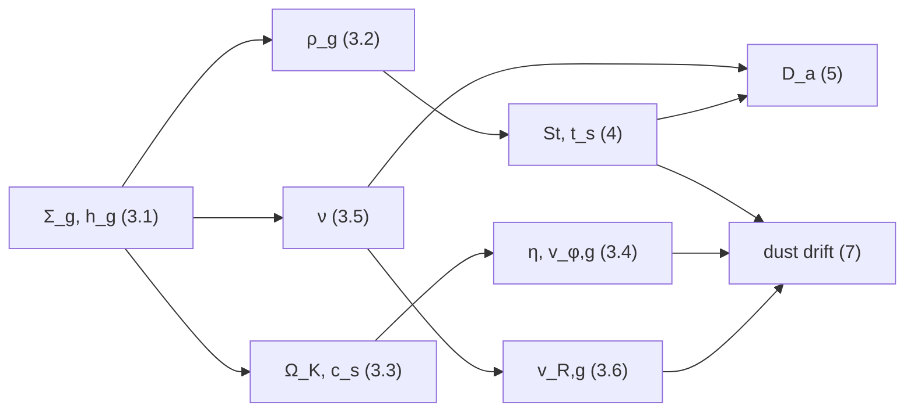

# Shared disk model

This guide defines the parts of the model that the Lagrangian swarm and the Eulerian fluid share:
the grid, the prescribed gas disk, the drag and diffusion coefficients, the initial dust profile
and drift, and the radiation definitions. Each definition appears here once, and both numeric
guides, [`numerics_swarm.md`](numerics_swarm.md) and [`numerics_fluid.md`](numerics_fluid.md), build
on it. Project terms are collected in the [glossary](README.md#glossary).

## Contents

1. [Scope and notation](#1-scope-and-notation)
2. [Coordinates and grid](#2-coordinates-and-grid)
3. [Gas disk](#3-gas-disk)
4. [Stopping time and Stokes number](#4-stopping-time-and-stokes-number)
5. [Turbulent diffusivity](#5-turbulent-diffusivity)
6. [Dust surface density](#6-dust-surface-density)
7. [Steady drift velocity](#7-steady-drift-velocity)
8. [Radiation pressure and optical depth](#8-radiation-pressure-and-optical-depth)
9. [Dust distribution and its moments](#9-dust-distribution-and-its-moments)
10. [References](#10-references)

## 1. Scope and notation

### 1.1 What this guide covers

Both representations evolve dust around one central star in the same prescribed, vertically
isothermal gas disk, and the gas does not respond to the dust. Everything that follows from that
shared disk is defined here; how each representation moves its dust is defined in its own guide.

| Topic | Defined here | Defined in the numeric guides |
|---|---|---|
| grid and geometry | coordinates, faces, cell measures, supported geometries | where cell values sit; swarm axisymmetric cells |
| gas | $\Sigma_g$, $h_g$, $\rho_g$, $\Omega_K$, $c_s$, $\eta$, $\nu$, viscous flow | swarm imported gas |
| coupling | Stokes number, stopping time, diffusivity | drag integration, diffusion schemes |
| initial state | dust surface density, edge taper, steady drift | vertical dust layer, vertical velocity, mass normalization |
| radiation | startup ramp, optical depth, 2D closure | size dependence, interpolation to particles or cells |

Constant defaults differ between the representations (for example, the default `ALPHA`), so this
guide gives none; each guide lists its own in §2.4 ([swarm](numerics_swarm.md#24-parameters),
[fluid](numerics_fluid.md#24-parameters)). Which geometries and flags each representation accepts is
summarized in [Section 2.4](#24-supported-geometries) and in the user guide's flag tables
([swarm](../README.md#swarm-feature-flags), [fluid](../README.md#fluid-feature-flags)).

The shared quantities depend on each other as follows; the numbers are sections of this guide.



### 1.2 Units and scales

All dynamics uses orbital code units. The default constants set

$$
G=M_\star=R_0=1,
$$

and the conversion to a chosen physical stellar mass $M_\star$ and reference radius $R_0$ uses the
scales

$$
t_0=\sqrt{\frac{R_0^3}{GM_\star}},
\qquad
v_0=\sqrt{\frac{GM_\star}{R_0}},
\qquad
\Omega_0=t_0^{-1}.
$$

Lengths are in units of $R_0$, times in units of $t_0$, and angles in radians. With the defaults,
one orbit at $R_0$ lasts $2\pi$ code time units. Setting the constants to one does not remove the
need for dimensional consistency: a physical interpretation must convert every quantity in one
formula with the same scales.

The shared quantities have the dimensions below. Swarm-only quantities (represented mass, grain
count, grain size, material density) are in
[`numerics_swarm.md`](numerics_swarm.md#23-units-and-dimensions), and collision parameters in
[swarm parameters](numerics_swarm.md#24-parameters).

| Quantity | Symbol | Dimension |
|---|---|---|
| surface density | $\Sigma$ | $M L^{-2}$ |
| volume density | $\rho$ | $M L^{-3}$ |
| linear velocity | $v$ | $L T^{-1}$ |
| specific angular momentum | $\ell$ | $L^2T^{-1}$ |
| kinematic viscosity or diffusivity | $\nu$, $D$ | $L^2T^{-1}$ |
| opacity | $\kappa$ | $L^2M^{-1}$ |
| stopping time | $t_s$ | $T$ |

### 1.3 Dimensionless parameters

Six dimensionless numbers control the coupling between dust and gas: the Stokes number, the gas
aspect ratio, the radiation ratio, the metallicity, the viscosity parameter, and the Schmidt
numbers. They are defined as

$$
\mathrm{St}=\Omega_Kt_s,
\qquad
h_g=\frac{H_g}{R}=\frac{c_s}{R\Omega_K},
\qquad
\beta=\frac{|a_{\rm rad}|}{|a_{\rm grav}|},
$$

$$
Z_{\rm metal}=\frac{\Sigma_d}{\Sigma_g},
\qquad
\alpha=\frac{\nu}{H_g^2\Omega_K},
\qquad
\mathrm{Sc}_a=\frac{\nu}{D_a(1+\mathrm{St}^2)}.
$$

$H_g$ is the gas scale height, $t_s$ the drag stopping time ([Section
4](#4-stopping-time-and-stokes-number)), and $D_a$ the dust diffusivity along direction $a$
([Section 5.1](#51-directional-diffusivities)). The metallicity $Z_{\rm metal}$ is unrelated to
the cylindrical height $Z$.

### 1.4 Notation

The symbols below are used in the same sense in all three numeric guides.

- $r$ is the spherical radius, $R=r\sin\theta$ the cylindrical radius, and $Z=r\cos\theta$ the
  cylindrical height above the midplane.
- $\varrho_d$ is the evolved dust density ([glossary](README.md#glossary)): the surface density
  $\Sigma_d$ when `N_Z == 1` and the volume density $\rho_d$ when `N_Z > 1`. $\varrho_g$ is the gas
  density of the same kind.
- $(i,j,k)$ index complete grid cells in the $(x,y,z)=(\phi,r,\theta)$ directions, and arrays are
  stored with $i$ varying fastest. A guide that uses $i$ locally for another index (a particle
  label, a line index in a one-dimensional solve) says so where it does.
- Half-integer indices denote cell faces: $y_{j-1/2}$ is the inner radial face of radial cell $j$.
- Both representations store the velocity as $(\ell_\phi,v_r,\ell_\theta)=(Rv_\phi,v_r,rv_\theta)$
  ([swarm](numerics_swarm.md#21-stored-state), [fluid](numerics_fluid.md#21-stored-state)). A
  subscript $g$ marks the gas value of a quantity, $d$ the dust value.
- $u=R/\sqrt{R^2+Z^2}$ is a scalar ([Section 3.4](#34-rotation-support)); the bold
  $\boldsymbol u_d$ is the mean dust velocity ([Section 9](#9-dust-distribution-and-its-moments)).

## 2. Coordinates and grid

### 2.1 Computational coordinates

Both representations work in spherical coordinates centered on the star, so that the radial grid
can be logarithmic and the polar grid can follow the disk's flaring. The computational coordinates
and their cylindrical counterparts are

$$
(x,y,z)=(\phi,r,\theta),
\qquad
R=y\sin z,
\qquad
Z=y\cos z.
$$

When `N_Z == 1`, the polar coordinate is fixed at the midplane $z=\pi/2$, so $R=y$ and $Z=0$.

### 2.2 Mesh

The mesh is uniform in azimuth and polar angle and logarithmic in radius, so that every radial cell
spans the same fraction of its radius. With the domain $[X_{\min},X_{\max}]\times
[Y_{\min},Y_{\max}]\times[Z_{\min},Z_{\max}]$ and $N_X\times N_Y\times N_Z$ cells, the spacings
are

$$
\Delta x=\frac{X_{\max}-X_{\min}}{N_X},
\qquad
a_y=\left(\frac{Y_{\max}}{Y_{\min}}\right)^{1/N_Y},
\qquad
\Delta z=\frac{Z_{\max}-Z_{\min}}{N_Z},
$$

and the radial and polar faces are

$$
y_{j-1/2}=Y_{\min}a_y^j,
\qquad
z_{k-1/2}=Z_{\min}+k\Delta z,
$$

for $j=0,\dots,N_Y$ and $k=0,\dots,N_Z$. The ratio $a_y$ of neighboring radial faces is the
code's `_get_dy()`. Where each representation places the value of a cell differs: the fluid uses
the logarithmic center ([`numerics_fluid.md`](numerics_fluid.md#22-mesh-measures-and-face-areas)),
and the swarm interpolates between measure centroids
([`numerics_swarm.md`](numerics_swarm.md#22-mesh-measures-and-particlemesh-transfer)).

### 2.3 Cell measure

The cell measure converts a mass in a cell into a density, so it decides whether the grid holds a
surface or a volume density. The radial measure uses the power $d=2$ for a vertically integrated
disk and $d=3$ when the polar dimension is active,

```math
\Delta V_y=\frac{y_{\rm out}^d-y_{\rm in}^d}{d},
\qquad
d=
\left\lbrace\begin{array}{ll}
2,&N_Z=1,\\
3,&N_Z>1,
\end{array}\right.
```

and the polar measure is $\Delta V_z=\cos z_{\rm in}-\cos z_{\rm out}$ when the polar dimension is
active. With an active azimuth, the complete cell measure is

```math
V_{ijk}=\Delta x\,
\frac{y_{j+1/2}^{d}-y_{j-1/2}^{d}}{d}
\left\lbrace\begin{array}{ll}
1,&N_Z=1,\\
\cos z_{k-1/2}-\cos z_{k+1/2},&N_Z>1.
\end{array}\right.
```

Consequently a grid with `N_Z == 1` holds the surface density $\Sigma_d$, and a grid with
`N_Z > 1` the volume density $\rho_d$. The swarm also supports an inactive azimuth (`N_X == 1`), in
which one cell stands for the complete ring and $\Delta x$ is replaced by $2\pi$
([`numerics_swarm.md`](numerics_swarm.md#22-mesh-measures-and-particlemesh-transfer)).

### 2.4 Supported geometries

The grid dimensions select the geometry and with it the evolved density; no separate flag is
needed. The geometry names are used throughout the documentation
([glossary](README.md#glossary)).

| Geometry | Grid condition | Evolved density | Supported by |
|---|---|---|---|
| radial-only | `N_X == 1`, `N_Z == 1` | $\Sigma_d(R)$ | swarm |
| radial–azimuthal | `N_X > 1`, `N_Z == 1` | $\Sigma_d(R,\phi)$ | swarm, fluid |
| radial–polar | `N_X == 1`, `N_Z > 1` | $\rho_d(r,\theta)$ | swarm |
| full 3D | `N_X > 1`, `N_Z > 1` | $\rho_d(r,\theta,\phi)$ | swarm, fluid |

The two `N_Z == 1` geometries are vertically integrated: gas drag, gravity, and radiation act at
the midplane $Z=0$, and the unresolved dust column is assumed to share the gas vertical profile
where a volume density is needed ([Section 8.2](#82-radial-optical-depth)). The two `N_Z > 1`
geometries resolve the vertical structure. Both representations require `DIFFUSION` when
`N_Z > 1`, so that turbulent mixing holds up the settling dust layer. The swarm's radial-only
model keeps $v_R$ and $\ell_\phi$ as dynamical variables
([`numerics_swarm.md`](numerics_swarm.md#25-radial-only-closure)); which configurations each
representation accepts is listed in
[`numerics_swarm.md`](numerics_swarm.md#12-supported-configurations) and
[`numerics_fluid.md`](numerics_fluid.md#12-supported-configurations).

In a resolved volume the dust mass obeys the continuity equation

$$
\frac{\partial\rho_d}{\partial t}
+\frac{1}{r^2}\frac{\partial}{\partial r}(r^2\rho_d u_r)
+\frac{1}{r\sin\theta}\frac{\partial}{\partial\theta}
 (\sin\theta\rho_d u_\theta)
+\frac{1}{r\sin\theta}\frac{\partial}{\partial\phi}(\rho_d u_\phi)
=\mathcal D_{3D}[\rho_d],
$$

and vertical integration gives

$$
\frac{\partial\Sigma_d}{\partial t}
+\frac{1}{R}\frac{\partial}{\partial R}(R\Sigma_d u_R)
+\frac{1}{R}\frac{\partial}{\partial\phi}(\Sigma_d u_\phi)
=\mathcal D_{2D}[\Sigma_d].
$$

Here $(u_r,u_\theta,u_\phi)$ and $(u_R,u_\phi)$ are components of the mean dust velocity
$\boldsymbol u_d$ ([Section 9](#9-dust-distribution-and-its-moments)), which the fluid writes as
$\boldsymbol v_d$. The right-hand sides are the diffusion terms of
[Section 5.2](#52-density-and-concentration-diffusion) in each geometry; each guide expands them in
its §7.1 ([swarm](numerics_swarm.md#71-target-equation),
[fluid](numerics_fluid.md#71-target-equation)). The radial–polar model drops the $\phi$ derivative
from the first equation, and the radial-only model drops it from the second.

**Limits.** One pair of continuity equations covers all four geometries, but the reductions are not
the same physics: vertical integration changes the evolved density and needs a midplane closure.
The fluid has no radial-only or radial–polar model, because its azimuthal dimension is always
active.

## 3. Gas disk

The gas is prescribed, not evolved. This section defines the analytic disk that sets the drag
target, the stopping time, and the turbulent viscosity in both representations. The swarm can
instead import gridded gas density and velocity (`IMPORTGAS`,
[`numerics_swarm.md`](numerics_swarm.md#36-imported-gas)); the orbital frequency and aspect ratio
below stay analytic in that case.

### 3.1 Surface density and temperature

The disk is described by two power laws: the gas surface density and the aspect ratio, which
follows from the temperature. They are

$$
\Sigma_g(R)=\Sigma_0\left(\frac{R}{R_0}\right)^p,
\qquad
h_g(R)=h_0\left(\frac{R}{R_0}\right)^{(q+1)/2},
$$

with $p=d\ln\Sigma_g/d\ln R$ (`IDX_P`) and $q=d\ln T/d\ln R$ (`IDX_Q`), and with $\Sigma_0$
(`SIGMA_0`) and $h_0$ (`ASPR_0`) the values at $R_0$. Because the disk is vertically isothermal,

$$
c_s\propto T^{1/2}\propto R^{q/2},
\qquad
h_g=\frac{c_s}{v_K}\propto R^{(q+1)/2}.
$$

### 3.2 Vertical structure

The gas density off the midplane sets the local drag strength, so the model uses the exact
hydrostatic profile around a point mass rather than the usual Gaussian approximation. The
stratification relative to the midplane is

$$
\mathcal G(R,Z)
=\frac{\rho_g(R,Z)}{\rho_g(R,0)}
=\exp\left[
\frac{R/\sqrt{R^2+Z^2}-1}{h_g(R)^2}
\right],
$$

and the gas volume density is

$$
\rho_g(R,Z)=\frac{\Sigma_g(R)}{\sqrt{2\pi}H_g(R)}\mathcal G(R,Z),
\qquad H_g=h_gR.
$$

The Gaussian prefactor fixes the reference midplane density. Because $\mathcal G$ is the exact
profile and not its Gaussian approximation, integrating $\rho_g$ over $Z$ does not return
$\Sigma_g$ exactly. The [containment factor](README.md#glossary) $\mathcal C_g$ measures the
fraction of the nominal column that lies inside a finite resolved domain. If the domain meets the
vertical line at cylindrical radius $R$ in the intervals $[Z_{k,a},Z_{k,b}]$, the implied column is

$$
\Sigma_{g,\mathcal D}(R)=\Sigma_g(R)\,\mathcal C_g(R),
$$

$$
\mathcal C_g(R)=\frac{1}{\sqrt{2\pi}H_g(R)}
\sum_k\int_{Z_{k,a}}^{Z_{k,b}}\mathcal G(R,Z)\,dZ.
$$

A vertically integrated model uses $\Sigma_g$ directly and has no containment factor.

For comparison, on an untruncated vertical line with $\zeta=Z/H_g$, the thin-disk expansion of the
exact profile is

$$
\mathcal G(R,Z)
=e^{-\zeta^2/2}
\left[1+\frac{3}{8}h_g^2\zeta^4+O(h_g^4)\right],
$$

and the Gaussian fourth moment gives

$$
\mathcal C_{g,\infty}=1+\frac{9}{8}h_g^2+O(h_g^4).
$$

**Limits.** $\mathcal C_g$ depends on the finite spherical radial and polar domain and need not
equal one. Near a radial or polar edge, the exact containment factor can differ from the
asymptotic $\mathcal C_{g,\infty}$ by much more than the $h_g^2$ correction.

### 3.3 Orbital and sound-speed scales

The Keplerian frequency sets the time scale of every drag and diffusion coefficient. The local
orbital and sound-speed scales are

$$
\Omega_K(R)=\sqrt{\frac{GM_\star}{R^3}},
\qquad
v_K=R\Omega_K,
\qquad
c_s=h_gR\Omega_K.
$$

All three are evaluated at the cylindrical radius $R$, so $H_g=c_s/\Omega_K$ at every height.

### 3.4 Rotation support

Gas pressure makes the gas orbit slightly slower than the Keplerian speed, and the dust drifts
because of that difference. The [rotation-support parameter](README.md#glossary) $\eta$ measures
it. At the midplane, for the vertically isothermal pressure $P_g=\rho_gc_s^2$, it is the usual
pressure-support parameter

$$
\eta_{\rm mid}=-\frac{1}{2\rho_gR\Omega_K^2}\frac{\partial P_g}{\partial R}\bigg|_{Z=0},
\qquad
\eta_{\rm mid}
=-\frac{h_g^2}{2}\left(p+\frac q2-\frac32\right).
$$

Away from the midplane, the code's `eta` (`_get_eta`) is the effective rotation-support parameter
that combines the cylindrical stellar gravity with the pressure gradient, following the vertically
structured force balance of [Takeuchi & Lin (2002)](https://arxiv.org/abs/astro-ph/0208552).
Define

$$
u=\frac{R}{\sqrt{R^2+Z^2}},
\qquad
A=p+\frac q2-\frac32.
$$

At fixed cylindrical height, differentiating the exact hydrostatic profile gives

$$
h_g^2\frac{\partial\ln P_g}{\partial\ln R}
=Ah_g^2+q(1-u)+(1-u^3).
$$

The cylindrical component of the stellar gravity is $u^3$ times its midplane value, so radial force
balance becomes

$$
\frac{v_{\phi,g}^2}{v_K^2}
=u^3+h_g^2\frac{\partial\ln P_g}{\partial\ln R}
=1+Ah_g^2+q(1-u)
=1-2\eta(R,Z),
$$

with

$$
\eta(R,Z)=-\frac12\left[Ah_g^2+q(1-u)\right].
$$

The $(1-u^3)$ pressure term cancels the off-midplane weakening of cylindrical gravity exactly. At
$Z=0$, $u=1$ and $\eta$ reduces to $\eta_{\rm mid}$. The gas azimuthal velocity used for the
initial drift and as the drag target is

$$
v_{\phi,g}=v_K\sqrt{\max(1-2\eta,0)},
\qquad
\ell_{\phi,g}=Rv_{\phi,g}.
$$

**Limits.** The $\max(\cdot,0)$ guard sets $v_{\phi,g}=0$ wherever $1-2\eta$ would be negative,
instead of stopping the run.

### 3.5 Viscosity

The turbulent viscosity $\nu$ sets the dust diffusivity, the viscous gas inflow, and, in the swarm,
the turbulent collision velocity. For constant `ALPHA` it follows the $\alpha$ prescription of
[Shakura & Sunyaev (1973)](https://ui.adsabs.harvard.edu/abs/1973A%26A....24..337S); with
`CONST_NU` it is the constant `NU`:

```math
\nu(R)=
\left\lbrace\begin{array}{ll}
\alpha h_g^2R^2\Omega_K,&\text{constant }\mathtt{ALPHA},\\
\mathrm{NU},&\text{constant }\mathtt{NU}.
\end{array}\right.
```

For constant $\nu$, the equivalent local turbulence parameter is

$$
\alpha(R)=\frac{\nu}{h_g^2R^2\Omega_K}.
$$

The flags that define $\nu$ differ between the representations and are listed in each guide's
§2.4 ([swarm](numerics_swarm.md#24-parameters), [fluid](numerics_fluid.md#24-parameters)).

### 3.6 Viscous radial flow

A viscous disk accretes, so its gas has a slow inward radial velocity that drags the dust along.
Without `VISC_FLOW` the gas radial velocity is zero. With `VISC_FLOW`, the cylindrical gas radial
velocity $v_{R,g}$ follows the steady viscous expression of
[Kanagawa et al. (2017)](https://arxiv.org/abs/1706.08975). `VISC_FLOW` requires `DIFFUSION` in
both representations ([swarm flags](../README.md#swarm-feature-flags),
[fluid flags](../README.md#fluid-feature-flags)).

In a vertically integrated disk,

```math
v_{R,g}=-\frac{3\nu}{R}
\left(g_\nu+p+\frac12\right),
\qquad
g_\nu=\frac{d\ln\nu}{d\ln R}
=\left\lbrace\begin{array}{ll}
0,&\nu=\mathrm{constant},\\
q+\frac32,&\alpha=\mathrm{constant}.
\end{array}\right.
```

In a resolved vertical domain, with $u=R/\sqrt{R^2+Z^2}$ as in
[Section 3.4](#34-rotation-support), define

$$
S=\frac{u-1}{h_g^2},
$$

$$
g_{\rho R}=p-\frac{q+3}{2}
+\frac{u(1-u^2)}{h_g^2}-(q+1)S,
\qquad
g_{\rho Z}=-\frac{u(1-u^2)}{h_g^2}.
$$

The implemented velocity is

$$
v_{R,g}=-\frac{\nu}{R}
\left[3\left(g_\nu+g_{\rho R}+\frac12\right)-q(1+g_{\rho Z})\right].
$$

It enters the spherical drag targets through the projections

$$
v_{r,g}=v_{R,g}\sin z,
\qquad
\ell_{\theta,g}=yv_{R,g}\cos z,
$$

and $\ell_{\theta,g}=0$ when `N_Z == 1`.

### 3.7 One-way coupling

The dust never acts back on the gas. In the gas equations, which this code does not evolve, the
dust contributions are

$$
\left.\frac{\partial\rho_g}{\partial t}\right|_{\rm dust}=0,
\qquad
\left.\frac{\partial(\rho_g\boldsymbol v_g)}{\partial t}\right|_{\rm dust}=0.
$$

Drag changes the dust momentum but applies no equal and opposite force to the gas, and swarm
collisions do not change the gas either. Gas viscosity enters only through the viscous target
velocity of [Section 3.6](#36-viscous-radial-flow), the dust diffusivity of
[Section 5](#5-turbulent-diffusivity), and the swarm's turbulent collision velocity; the code does
not solve a viscous gas evolution equation.

## 4. Stopping time and Stokes number

The stopping time $t_s$ is how long drag takes to bring a grain to the gas velocity; the
[Stokes number](README.md#glossary) $\mathrm{St}=\Omega_Kt_s$ compares it with the orbital time and
decides how strongly the dust follows the gas. Both representations use linear, subsonic Epstein
drag, $t_s\propto s/(\rho_gc_s)$ for grain size $s$, after
[Epstein (1924)](https://doi.org/10.1103/PhysRev.23.710). Anchored to the reference Stokes number
$\mathrm{St}_0$ (`STOKES_0`) of a grain of reference size $S_0$ at the midplane of $R_0$, this
gives

$$
\mathrm{St}(R,Z,s)
=\mathrm{St}_0\frac{s}{S_0}
\left(\frac{R}{R_0}\right)^{-p}
\mathcal G(R,Z)^{-1},
$$

and the stopping time used by the drag update is

$$
t_s(R,Z,s)=\frac{\mathrm{St}(R,Z,s)}{\Omega_K(R)}.
$$

The swarm evaluates the size factor for each particle's grain size; its `CONST_ST` option and its
Stokes number for imported gas are in [`numerics_swarm.md`](numerics_swarm.md#61-drag-and-gravity)
and [`numerics_swarm.md`](numerics_swarm.md#36-imported-gas). The fluid is monodisperse at $s=S_0$,
so its size factor is one.

## 5. Turbulent diffusivity

Turbulence in the gas spreads the dust. Both representations model this as diffusion of the dust
density, or of the dust-to-gas ratio, with a diffusivity that weakens for weakly coupled grains.

### 5.1 Directional diffusivities

The diffusivity along each direction $a$ is the gas viscosity divided by a directional
[Schmidt number](README.md#glossary) and reduced for finite Stokes number:

$$
D_a=\frac{\nu}{\mathrm{Sc}_a(1+\mathrm{St}^2)}.
$$

The Schmidt numbers describe the gas mixing before the Stokes suppression, and the local Stokes
number of [Section 4](#4-stopping-time-and-stokes-number) enters in both diffusion modes. The two
representations use this definition in different bases:

- The swarm diffuses along cylindrical directions, $a=\phi,R,Z$, with `SCHMIDT_X`, `SCHMIDT_R`, and
  `SCHMIDT_Z` ([`numerics_swarm.md`](numerics_swarm.md#71-target-equation)).
- The fluid diffuses along spherical grid directions, $a=x,y,z$, with `SCHMIDT_X`, `SCHMIDT_Y`,
  and `SCHMIDT_Z` ([`numerics_fluid.md`](numerics_fluid.md#71-target-equation)).

### 5.2 Density and concentration diffusion

The target equation says what is being mixed: either the dust density itself or the dust-to-gas
concentration ([glossary](README.md#glossary)). Let $w=1$ for density diffusion and $w=\varrho_g$
for concentration diffusion, selected by `DIFFUSE_CONCENTRATION`. The target equation is

$$
\partial_t\varrho_d=\nabla\cdot\left[w\boldsymbol D\nabla(\varrho_d/w)\right],
$$

with the diagonal tensor $\boldsymbol D=\mathrm{diag}(D_a)$ in the representation's basis. Density
diffusion therefore reads $\partial_t\varrho_d=\nabla\cdot(\boldsymbol D\nabla\varrho_d)$, and
concentration diffusion relaxes $\varrho_d/\varrho_g$ toward a uniform value. The gas weight is the
analytic surface density when `N_Z == 1` and the volume density otherwise; its normalization
cancels.

### 5.3 Why the diffusion bases differ

The basis is part of the physics, not only of the implementation. Each representation diffuses
along the directions its method handles naturally: the fluid's directional solves run along the
lines of the spherical grid, whereas the swarm moves particles in continuous cylindrical
coordinates. In a resolved vertical domain, swarm $D_R$ therefore diffuses along the cylindrical
radius $R$, whereas fluid $D_y$ diffuses along the spherical radius $r$. Equal scalar coefficients
need not produce the same radial equilibrium away from the midplane; the two closures coincide
radially only where $r=R$, which includes every vertically integrated model. The disk profiles that
set $\nu$ depend on $R$ in both representations; that does not change the basis of the diffusion
operator.

## 6. Dust surface density

Both representations start from the same dust surface-density profile. It fixes where the dust mass
lies initially; how that mass is spread vertically and normalized is representation-specific
([swarm](numerics_swarm.md#31-dust-density-profile),
[fluid](numerics_fluid.md#31-dust-density-profile)).

### 6.1 Metallicity profile

The dust follows the gas with a constant dust-to-gas ratio, the metallicity $Z_{\rm metal}$
(`METAL_Z`):

$$
\Sigma_d(R)=Z_{\rm metal}\Sigma_g(R).
$$

### 6.2 Edge taper

A power law cut off sharply at the domain edges would start the run with a density jump at each
radial boundary. The [edge taper](README.md#glossary) instead convolves the profile with a Gaussian
whose source is restricted to lie at least $2L_s$ inside the edges:

$$
\Sigma_{d,\rm conv}(R)
=\int_{Y_{\min}+2L_s}^{Y_{\max}-2L_s}
\Sigma_d(R')
\frac{\exp[-(R-R')^2/(2\sigma_s^2)]}{\sqrt{2\pi}\sigma_s}\,dR',
\qquad
L_s=0.05R_0,\qquad \sigma_s=\frac{L_s}{2}.
$$

The code evaluates the convolution on a uniform cylindrical-radius axis. Its lower end is the
smallest cylindrical radius the spherical domain covers (`_get_init_Rmin()`),

$$
R_{\min,\mathrm{init}}
=Y_{\min}\min[\sin(Z_{\min}),\sin(Z_{\max})],
$$

and $R_{\min,\mathrm{init}}=Y_{\min}$ when `N_Z == 1`. Starting there, and not at $Y_{\min}$, keeps
high-latitude cells with $R\lt Y_{\min}$ from being clipped to an unrelated profile value. The axis
has `N_Y + 1` points $R_m=R_{\min,\rm init}+m\Delta R$ with
$\Delta R=(Y_{\max}-R_{\min,\rm init})/N_Y$, which serve as both source and destination points.
The implemented rectangular sum is

$$
\Sigma_{d,\rm conv}(R_m)
\approx\sum_{n\in\mathcal S}
\Sigma_d(R_n)
\frac{\exp[-(R_m-R_n)^2/(2\sigma_s^2)]}{\sqrt{2\pi}\sigma_s}
\Delta R,
$$

where $\mathcal S$ holds the source points in $[Y_{\min}+2L_s,Y_{\max}-2L_s]$. Both representations
read this table by linear interpolation in $R$, with zero outside
$[R_{\min,\rm init},Y_{\max}]$. The swarm and the fluid host code (`initdens_calc` in
`inc/swarm/swarm_host.cuh` and `inc/fluid/fluid_host.cuh`) compute the same table.

**Limits.** The taper is not renormalized, so it removes mass near both edges; the initial dust
mass is not $\int Z_{\rm metal}\Sigma_g$ over the domain. The swarm normalizes its represented mass
from this tapered profile ([`numerics_swarm.md`](numerics_swarm.md#33-dust-mass-in-the-domain)); the
fluid's mass is the integral of its initialized field.

## 7. Steady drift velocity

Both representations start the dust at the steady drift it would reach under drag in the
pressure-supported gas, so that the run does not begin with a large drag transient. The drift is
the test-particle limit, without backreaction, of
[Nakagawa, Sekiya & Hayashi (1986)](<https://doi.org/10.1016/0019-1035(86)90121-1>). With the gas
azimuthal velocity $v_{\phi,g}$ of [Section 3.4](#34-rotation-support) and the gas radial velocity
$v_{R,g}$ of [Section 3.6](#36-viscous-radial-flow) (zero without `VISC_FLOW`), the cylindrical
dust drift is

$$
v_{R,d}
=\frac{v_{R,g}+2\mathrm{St}(v_{\phi,g}-v_K)}{1+\mathrm{St}^2},
\qquad
v_{\phi,d}=v_{\phi,g}-\frac{\mathrm{St}}{2}v_{R,d}.
$$

The vertical part of the initial velocity differs by design: the swarm adds terminal settling,
the fluid a polar velocity that balances its diffusive flux. Each guide gives its vertical term and
how the velocity is stored ([swarm](numerics_swarm.md#32-initial-velocity),
[fluid](numerics_fluid.md#32-initial-velocity)).

## 8. Radiation pressure and optical depth

With `RADIATION`, stellar radiation pushes grains outward and partly cancels gravity. The push is
switched on gradually and attenuated by the dust between the star and the grain.

### 8.1 Radiation ratio and startup ramp

The radiation ratio $\beta$ of [Section 1.3](#13-dimensionless-parameters) is the outward radiation
acceleration in units of the stellar gravity. The [radiation ramp](README.md#glossary) raises it
smoothly from zero over the time `T_BETA`, so that a run does not start with a sudden force:

$$
f_\beta=s_t^2(3-2s_t),
\qquad
s_t=\mathrm{clip}(t/T_\beta,0,1).
$$

The ramp is evaluated at the midpoint time $t^n+\Delta t/2$ of each step, and a value
$T_\beta\le0$ disables it ($f_\beta=1$). Both representations write the radiation ratio as
$\beta=\beta_0f_\beta(t)e^{-\tau}$ times a size factor: $S_0/s$ in the swarm and one in the
monodisperse fluid ([swarm](numerics_swarm.md#62-radiation-pressure-and-optical-depth),
[fluid](numerics_fluid.md#62-radiation-pressure-and-optical-depth)). The radial acceleration is

$$
\boldsymbol a_{\rm rad}
=\beta\frac{GM_\star}{r^2}\boldsymbol e_r,
$$

so gravity and radiation combine to

$$
\boldsymbol a_{\rm grav+rad}
=-(1-\beta)\frac{GM_\star}{r^2}\boldsymbol e_r.
$$

The swarm's optional Poynting–Robertson drag adds velocity-dependent terms to this acceleration
([`numerics_swarm.md`](numerics_swarm.md#63-poyntingrobertson-drag)).

### 8.2 Radial optical depth

The optical depth $\tau$ measures how much dust lies between the star and a point along the radial
ray; it attenuates radiation by $e^{-\tau}$. In continuum form,

$$
\tau(\phi,r,\theta)
=\int_{Y_{\min}}^r\kappa_0\rho_{\rm ext}(\phi,r',\theta)\,dr',
$$

where $\kappa_0$ is the opacity (`KAPPA_0`) and $\rho_{\rm ext}$ the extinction density. In cell
$(i,j,k)$ the local radial increment is

$$
\Delta\tau_{ijk}=\kappa_0\rho_{{\rm ext},ijk}\Delta r_j,
\qquad
\Delta r_j=y_{j-1/2}(a_y-1),
$$

where $\Delta r_j=y_{j+1/2}-y_{j-1/2}$ is the radial width of the cell and

```math
\rho_{\rm ext}=
\left\lbrace\begin{array}{ll}
\Sigma_d/(\sqrt{2\pi}H_g),&N_Z=1,\\
\rho_d,&N_Z>1.
\end{array}\right.
```

The swarm deposits per-particle extinction weights that already include $\kappa_0$ and its size
factor, so its deposited cell value plays the role of $\kappa_0\rho_{\rm ext}$
([`numerics_swarm.md`](numerics_swarm.md#62-radiation-pressure-and-optical-depth)).

When `N_Z == 1`, the [well-mixed closure](README.md#glossary) converts surface density to a
midplane extinction density by assuming that the dust shares the gas vertical profile. The closure
uses the gas scale height $H_g$, not a Stokes-dependent dust scale height, so it is independent of
grain size. The swarm evaluates $H_g$ at each particle's radius and the fluid at the cell center.
Models with `N_Z > 1` resolve the vertical structure and settling and do not use the closure.

The [outer-face optical depth](README.md#glossary) is the inclusive radial prefix sum, stored at the
outer radial face of each cell:

$$
\tau_{i,j+1/2,k}=\sum_{m=0}^{j}\Delta\tau_{imk},
\qquad
\tau_{i,-1/2,k}=0.
$$

The zero at the inner face assumes that no material lies inside the domain,

$$
\tau(Y_{\min})=0.
$$

Each representation interpolates the stored face values to where it needs them, particles or cell
centers ([swarm](numerics_swarm.md#62-radiation-pressure-and-optical-depth),
[fluid](numerics_fluid.md#62-radiation-pressure-and-optical-depth)).

**Limits.** Because no material is assumed inside `Y_MIN`, the shielding near the inner edge
depends on the chosen radial domain. In vertically integrated models the well-mixed closure ignores
dust settling in the extinction density.

## 9. Dust distribution and its moments

The two representations approximate the same underlying dust distribution in different ways, and
its velocity moments connect them. Let $f_d(\boldsymbol x,\boldsymbol v,s,t)$ be the dust mass
distribution over position, velocity, and grain size. Its moments are the dust density, the mass
flux, and the momentum flux:

$$
\rho_d=\int f_d\,d^3v\,ds,
\qquad
\rho_d\boldsymbol u_d=\int\boldsymbol v f_d\,d^3v\,ds,
$$

$$
\int\boldsymbol v\boldsymbol v f_d\,d^3v\,ds
=\rho_d\boldsymbol u_d\boldsymbol u_d+\boldsymbol P_d.
$$

Here $\boldsymbol u_d$ is the mass-weighted mean dust velocity and $\boldsymbol P_d$ the
velocity-dispersion tensor. The swarm samples $f_d$ itself with weighted particles, so it keeps a
nonzero $\boldsymbol P_d$ where dust streams cross
([`numerics_swarm.md`](numerics_swarm.md#13-relation-to-the-fluid-model)). The fluid closes this
hierarchy with $\boldsymbol P_d=0$ and a single velocity at each point
([`numerics_fluid.md`](numerics_fluid.md#13-relation-to-the-swarm-model)).

## 10. References

- Epstein (1924), [drag on small spheres in a dilute gas](https://doi.org/10.1103/PhysRev.23.710)
- Kanagawa et al. (2017), [viscous disk velocity](https://arxiv.org/abs/1706.08975)
- Nakagawa, Sekiya & Hayashi (1986),
  [steady dust–gas drift](<https://doi.org/10.1016/0019-1035(86)90121-1>)
- Shakura & Sunyaev (1973),
  [$\alpha$ viscosity](https://ui.adsabs.harvard.edu/abs/1973A%26A....24..337S)
- Takeuchi & Lin (2002),
  [vertically structured gas and dust drift](https://arxiv.org/abs/astro-ph/0208552)
