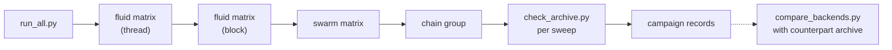

# Numerical validation

The validation suites compile the current production kernels with test-specific constants and
drivers and judge them against analytical, statistical, and invariant references. This file
explains how to run, archive, check, and compare them, and it owns the rules that apply to every
suite: when an archive is accepted, how CUDA and ROCm archives are compared, what qualifies a
result, and when a new case belongs in the suites. What each case establishes, and its acceptance
criteria, are in [`doc/testsets.md`](../doc/testsets.md); project terms are defined in the
[glossary](../doc/README.md#glossary).

## Contents

- [Requirements](#requirements)
- [Layout](#layout)
- [Running a complete campaign](#running-a-complete-campaign)
- [Running part of the suites](#running-part-of-the-suites)
- [Archive acceptance](#archive-acceptance)
- [Comparing CUDA and ROCm](#comparing-cuda-and-rocm)
- [What qualifies a result](#what-qualifies-a-result)
- [Adding a validation case](#adding-a-validation-case)

## Requirements

- the GPU toolchain and GPU of the backend under test (see the top-level
  [`README.md`](../README.md#requirements)); the default targets are `sm_80` and `gfx942`, so pass
  `--target` for other GPUs
- Python 3.10 or later with NumPy
- one GPU allocation per backend; a complete campaign takes several hours

Run every command from the repository root. The validation scripts disable Python bytecode
generation, so no `__pycache__` directories are written.

## Layout

| Path | Contents |
|---|---|
| `swarm/mod/`, `fluid/mod/` | validation models: `flags.mk`, constants, drivers, and per-model runners and validators |
| `swarm/src/`, `fluid/src/` | shared drivers, suite runners, and validators |
| `val_config.py` | case lists, groups, expected record counts, output paths, and the source fingerprint |
| `run_all.py` | complete native campaign for one backend |
| `check_archive.py` | require a complete, passing native archive |
| `compare_backends.py` | compare a CUDA archive with a ROCm archive |
| `paper/` | scientific campaigns with their own READMEs; not part of `run_all.py` |

Results go to `swarm/out/<model>/<backend>/` and `fluid/out/<model>/<backend>/<sweep>/`, and builds
to `swarm/obj/` and `fluid/obj/`. The fluid sweep directories are `thread_precise` and
`block_precise` on CUDA and `thread` and `block` on ROCm; the `_precise` suffix marks CUDA archives
built without fast-math (`math_mode = precise` in the suite manifest), which keeps them apart from
fast-math CUDA archives. Suite manifests are under `swarm/out/_suite/<backend>/` and
`fluid/out/_suite/<backend>/<sweep>/`.

Each run writes into a scope. A complete campaign or `run_suite.py --group all` writes the
full-suite archive directly below these directories; a smaller group writes below
`groups/<group>/`, and a single model run writes below `groups/manual/`. The collision-chain group
therefore always lives under `groups/chain/`. A rerun replaces the results of that model, backend,
sweep, and scope. The campaign records `run_all_<backend>_<sweep>.json`, the archive-check reports
`check_archive_<backend>_<sweep>.json`, and the comparison report `backend_comparison.json` are
written to `val/` itself.

## Running a complete campaign

On each system, inside a GPU job:

```bash
python3 -B val/run_all.py --backend cuda
```

```bash
python3 -B val/run_all.py --backend rocm
```

A campaign runs, in this order, the fluid matrix with the thread sweep and then with the block
sweep, the swarm matrix, the swarm collision-chain group, and an archive check for each sweep:



It writes one **campaign record** per sweep, `val/run_all_<backend>_thread.json` and
`val/run_all_<backend>_block.json`, each holding the backend and target, the source fingerprint
([What qualifies a result](#what-qualifies-a-result)), every stage's command, output, and status,
and the overall result; the shared swarm stages appear in both. The fingerprint is computed again
at the end, and the campaign fails if the source changed while it ran. The run prints
`COMPLETE VALIDATION: PASS` and exits with status zero only when every stage passes; it stops at
the first failing stage.

The runners clean each build configuration before compiling it, so campaigns for different
backends can share one checkout. Do not run `make clean` while a campaign is building.

### Campaign options

| Option | Effect |
|---|---|
| `--backend cuda` or `rocm` | backend to validate (required) |
| `--fluid-sweep thread`, `block`, or `both` | fluid sweeps to validate (default `both`); the swarm stages run once in any case |
| `--target TARGET` | GPU architecture for other GPUs (default `sm_80` or `gfx942`) |
| `--res N ...` | resolution ladder (default `32 64 128 256`) |
| `--quick` | only the two coarsest resolutions; the archive check and comparison then accept a partial archive. A workflow check, not qualification |
| `--compare` | also require and compare a counterpart archive copied into this `val/` directory ([Comparison workflow](#comparison-workflow)) |

## Running part of the suites

The suite runners run one group; set the backend, and for the fluid the sweep, in the environment:

```bash
GPU_BACKEND=cuda python3 -B val/swarm/src/run_suite.py --group chain --target sm_80
```

```bash
GPU_BACKEND=rocm FLUID_SWEEP=block python3 -B val/fluid/src/run_suite.py --group diffusion --target gfx942
```

| Runner | Groups |
|---|---|
| `val/swarm/src/run_suite.py` | `all`, `transport`, `diffusion`, `initialization`, `collision`, `knn`, `chain` |
| `val/fluid/src/run_suite.py` | `all`, `equilibrium`, `transport`, `diffusion`, `source`, `radiation`, `coupled` |

`GPU_BACKEND` defaults to `cuda` and `FLUID_SWEEP` to `thread`, whatever the backend. Both runners
accept `--res` and `--quick` as in [Campaign options](#campaign-options); the swarm runner also
accepts `--build-only`. The swarm `all` group does not include `chain`; `run_all.py` runs both. A
single model runs through its own runner, for example
`GPU_BACKEND=cuda python3 -B val/swarm/mod/test_diffusion_2d/run.py`.

A group other than `all` writes to its own scope ([Layout](#layout)), which the archive check and
the comparison do not read. `run_suite.py --group all` writes the full-suite archive but no
campaign record, so a comparison of such archives needs `--ignore-source-fingerprint` and does not
certify a common source.

### Checking or rebuilding an archive

```bash
python3 -B val/check_archive.py --backend cuda --component all --fluid-sweep thread
```

`--component` is `swarm`, `fluid`, or `all`, and `--fluid-sweep thread` or `block` maps to the
backend's archive directory (`thread_precise` or `block_precise` on CUDA). `--allow-partial`
accepts a passed quick archive. The check prints each problem, writes its report to `val/`, and
exits with status zero only when the archive is accepted ([Archive
acceptance](#archive-acceptance)).

`val/swarm/src/run_suite.py --rebuild-manifest` rebuilds the swarm suite manifest from
downloaded component manifests without rerunning; it fails if any component manifest is missing or
did not pass.

## Archive acceptance

A run of a suite leaves a hierarchy of JSON files, each level summarizing the one below it:

- a **metric record** (`metrics_N<res>.json`) holds one model or case at one resolution: error
  norms, statistical or activation values, the evidence tier, and, where the validator decides
  per record, `passed`;
- a **model manifest** covers one model or case across its resolutions: its metric files, its
  environment record, its tiers, the convergence assessment, and `passed`;
- the **suite manifest** (`manifest_all.json`) lists the canonical cases with their arguments,
  resolutions, tiers, and status, the effective resolutions, the record counts per tier, and the
  overall status.

The swarm suite adds a KNN suite manifest and four collision-chain manifests. The files of each
suite are listed in [swarm archive](../doc/testsets.md#15-reading-the-archive) and [fluid
archive](../doc/testsets.md#15-reading-the-archive).

Every record and manifest carries an evidence **tier**. Only one tier, `publication`, is defined
(`VAL_TIERS` in `val_config.py`), and the suite manifest records `campaign_tier`,
`included_tiers`, and the per-tier record counts `metric_tiers`. Each model's `environment.json`
records the compiler version, GPU, driver, and target (on CUDA also `cuda_math = precise`); the
swarm suite adds `environment_all.json`.

`val/check_archive.py` accepts an archive of one backend, and for the fluid one sweep, only if

- the suite manifest exists and reports the right suite and backend, group `all`, and
  `passed = true`, for the complete canonical case list with every case passed and a valid tier,
  a valid campaign tier and included tiers, and a nonempty resolution list;
- every model manifest named by the suite manifest exists, passes, matches it in identity and tier,
  and has its referenced metric files and environment record;
- the number of metric records equals the expected count of the suite, and the tier counts are
  nonnegative integers that add up to exactly that number;
- every metric record has a valid tier; swarm records must also pass, and fluid records must hold
  only finite numbers (their pass decision lives in the model manifest);
- the suite-specific manifests pass (swarm: the KNN suite manifest and all four chain manifests).

Only the full-suite scope is read. The expected counts and the suite-specific conditions are in
[swarm acceptance](../doc/testsets.md#151-swarm-archive) and [fluid
acceptance](../doc/testsets.md#152-fluid-archive). A passing archive means that
every case met its criteria at the recorded resolutions, on one backend and, for the fluid, one
sweep.

## Comparing CUDA and ROCm

### Comparison workflow

Run the two native campaigns concurrently from the same commit. Afterwards, copy one system's
`val/swarm/out/`, `val/fluid/out/`, and `val/*.json`, excluding `obj/` directories, into a separate
directory on the other system and compare each sweep, for example on the ROCm system:

```bash
python3 -B val/compare_backends.py --cuda-root CUDA_VAL_COPY --cuda-sweep thread_precise --rocm-sweep thread
```

```bash
python3 -B val/compare_backends.py --cuda-root CUDA_VAL_COPY --cuda-sweep block_precise --rocm-sweep block
```

`CUDA_VAL_COPY` is the directory that received the copy; `--rocm-root` defaults to this checkout's
`val/`. `--cuda-sweep` names the CUDA archive directory, so it takes the `_precise` name.
`--component` restricts the comparison to `swarm`, `fluid`, or `knn`, and `--allow-partial`
compares a quick archive: every CUDA record present needs a ROCm counterpart. The comparison
writes `backend_comparison.json` and exits with status zero only when every component passes.

Alternatively, copy the counterpart into this checkout's own `val/` directory, where the
backend-separated paths let both archives coexist, and rerun the native campaign with
`run_all.py --compare`. It first requires each copied counterpart campaign record to report the
right backend and sweep, `passed = true`, and the same source fingerprint as this checkout, and it
checks the copied archive; after the native stages it runs the comparison for each sweep.

### Comparison rules

`val/compare_backends.py` passes only if all of the following hold:

- **Deterministic records.** Every common metric record agrees field by field: the same keys, equal
  list lengths, identical booleans and strings, and every number within a relative tolerance of
  $10^{-5}$ or an absolute tolerance of $10^{-11}$ (`--relative-tolerance`,
  `--absolute-tolerance`). Bitwise identity is not required.
- **Completeness.** Both backends hold the expected number of records with identical names, and both
  suite manifests pass at the publication tier with equal per-tier counts.
- **Stochastic records judged natively.** Records of stochastic cases are not compared by value;
  they must match in case and resolution, and each must pass its own statistical checks.
- **Source fingerprint.** The two campaign records `run_all_cuda_<sweep>.json` and
  `run_all_rocm_<sweep>.json` must carry the same source fingerprint. `--ignore-source-fingerprint`
  disables this check for an explicitly exploratory comparison, which then certifies no common
  source.

A few fields and manifests are judged differently, for the reasons given in each test set:

- swarm collision-rate KNN-measure diagnostics are bounded natively, not compared ([swarm
  comparison](../doc/testsets.md#153-comparing-cuda-and-rocm));
- swarm diffusion records are the stochastic records above ([swarm
  comparison](../doc/testsets.md#153-comparing-cuda-and-rocm));
- swarm KNN and collision-chain manifests are compared by coverage, and chain hashes only within one
  backend ([swarm comparison](../doc/testsets.md#153-comparing-cuda-and-rocm));
- the vendor-dependent initialized mass of the fluid `test_startup_3d` is excluded ([fluid
  comparison](../doc/testsets.md#153-comparing-cuda-and-rocm)).

## What qualifies a result

A validation result qualifies only the source it was produced from. The **source fingerprint** is a
SHA-256 hash over the relative path and contents of the `Makefile` and of every file with a C, C++,
CUDA, HIP, make-fragment, or Python suffix (`.c`, `.cc`, `.cpp`, `.cu`, `.cuh`, `.h`, `.hip`,
`.hpp`, `.inl`, `.mk`, `.py`) under `inc/`, `src/`, and `val/`. It excludes `val/tools/` and any
path through a directory named `out`, `obj`, `logs`, `temp`, or `__pycache__`. Any other such file
present in the checkout, tracked or not, changes it, including the campaign sources under
`val/paper/`.

Qualification requires fresh native CUDA and ROCm campaigns with matching source fingerprints and
a passing comparison of each sweep. A cross-backend comparison needs matching fingerprints unless
it is explicitly exploratory. Reading the source, build routing, Makefile dry runs, static checks,
local builds, import checks, and host arithmetic show how the code is structured and built, not
that it computes correctly on a GPU. A single model run or a scientific campaign under `paper/`
does not qualify the suites, and results from earlier sources are not evidence for the current
one. Where statements disagree, the [authority order](../doc/README.md#authority-order) applies.

## Adding a validation case

A case belongs in the suites only if it establishes a scientific or numerical claim, about an
algorithm or a physically relevant configuration, that the retained cases do not already cover.
Compilation, grid and index checks, flag guards, finite-value guards, deliberate failure injection,
restart plumbing, helper return values, thread-versus-block equivalence, and performance
measurements are not kept as separate cases unless a claim depends on them.

To add one:

1. Create `val/<swarm|fluid>/mod/<model>/` with a `flags.mk`, a `const_defs.cuh` that selects the
   model's branch of the shared `val/<swarm|fluid>/src/const_defs.cuh`, a `run.py` that calls the
   shared driver, and, when the shared validator does not fit, a `validate_case.py` defining
   `analyze`.
2. Register the model in `SWARM_GROUPS`, `SWARM_CHAIN_MODELS`, or `FLUID_GROUPS` in
   `val_config.py`, together with its resolution handling (`SWARM_FIXED_RESOLUTION`,
   `SWARM_ENDPOINT_RESOLUTION`, or a fixed `--res` argument) and the expected record count
   `EXPECTED_SWARM_METRICS` or `EXPECTED_FLUID_METRICS`. A fluid parameter variant also needs its
   manifest name in `variant_from_arguments` of `check_archive.py`.
3. Document the claim, the reference, and the pass criteria in the test-set guide, and rerun both
   native campaigns: the change alters the source fingerprint.
